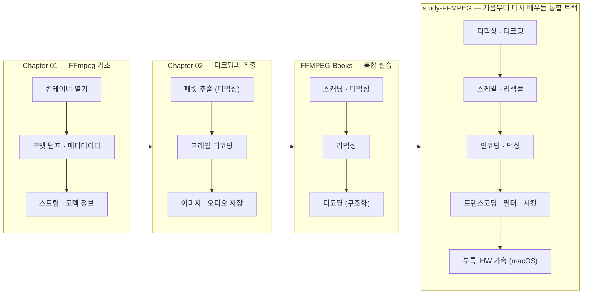

# FFmpeg 학습 문서

이 저장소의 43개 레슨 코드를 단계별로 학습할 수 있도록 정리한 문서 모음이다. 각 레슨은 **기본 문서**(학습 목표 · 핵심 개념 · 프로그램 흐름 mermaid · 핵심 API)와 **딥다이브 문서**(`-deep-dive.md`, 코드 블록별 상세 해설)로 구성된다.

빌드/실행 공통 안내는 저장소 루트의 [CLAUDE.md](../CLAUDE.md)를 참고한다.

## 학습 로드맵

## 트랙 구성

| 트랙 | 주제 | 레슨 수 | 개요 문서 |
|------|------|---------|-----------|
| Chapter 01 | 컨테이너 열기, 메타데이터, 스트림/코덱 정보 조회 | 7 | [chapter01/README.md](chapter01/README.md) |
| Chapter 02 | 패킷 추출, 프레임 디코딩, 이미지(PPM/JPEG)·오디오(PCM) 저장 | 15 | [chapter02/README.md](chapter02/README.md) |
| FFMPEG-Books | 스캐닝·디먹싱·리먹싱·디코딩을 구조화된 코드로 재정리 | 4 | [ffmpeg-books/README.md](ffmpeg-books/README.md) |
| study-FFMPEG | 기초→디코딩→변환→인코딩→먹싱→트랜스코딩→필터→시킹 완주 트랙 + HW 가속 부록 | 14+3 | [study-FFMPEG/README.md](study-FFMPEG/README.md) |

## 전체 레슨 인덱스

### Chapter 01 — FFmpeg 기초: 컨테이너 열기와 메타데이터

| # | 레슨 | 핵심 주제 | 문서 |
|---|------|-----------|------|
| 01 | 컴파일 확인 | FFmpeg 링크/빌드 검증 | [기본](chapter01/01-compile-ffmpeg.md) · [해설](chapter01/01-compile-ffmpeg-deep-dive.md) |
| 02 | 리소스 로드 | `avformat_open_input` | [기본](chapter01/02-load-resource.md) · [해설](chapter01/02-load-resource-deep-dive.md) |
| 03 | 포맷 덤프 | `av_dump_format` (`ffmpeg -i` 동등) | [기본](chapter01/03-dump-format.md) · [해설](chapter01/03-dump-format-deep-dive.md) |
| 04 | 메타데이터 순회 | `AVDictionary` / `av_dict_get` | [기본](chapter01/04-av-dictionary.md) · [해설](chapter01/04-av-dictionary-deep-dive.md) |
| 05 | TimeBase와 재생시간 | `avformat_find_stream_info`, `AV_TIME_BASE` | [기본](chapter01/05-timebase-av-time.md) · [해설](chapter01/05-timebase-av-time-deep-dive.md) |
| 06 | 함수·매크로 리팩터링 | 에러 매크로, 헬퍼 함수 분리 | [기본](chapter01/06-function-macro.md) · [해설](chapter01/06-function-macro-deep-dive.md) |
| 07 | 스트림 정보 조회 | `AVStream`/`AVCodecParameters`, `avcodec_find_decoder` | [기본](chapter01/07-video-stream.md) · [해설](chapter01/07-video-stream-deep-dive.md) |

### Chapter 02 — 디코딩과 이미지/오디오 추출

| # | 레슨 | 핵심 주제 | 문서 |
|---|------|-----------|------|
| 01 | 프로젝트 셋업 | FFmpeg + stb 링크 확인 | [기본](chapter02/01-project-setting.md) · [해설](chapter02/01-project-setting-deep-dive.md) |
| 02 | 컨테이너 열기/닫기 | `AVFormatContext` 수명 | [기본](chapter02/02-counting-data-stream.md) · [해설](chapter02/02-counting-data-stream-deep-dive.md) |
| 03 | 핵심 구조체 소개 | `AVPacket`/`AVFrame`/`AVCodecContext` | [기본](chapter02/03-advanced-data-structure.md) · [해설](chapter02/03-advanced-data-structure-deep-dive.md) |
| 04 | 메모리 할당 | `av_packet_alloc`/`av_frame_alloc` | [기본](chapter02/04-allocated-memory.md) · [해설](chapter02/04-allocated-memory-deep-dive.md) |
| 05 | 비디오 스트림 찾기 | 스트림 분류, `av_q2d` | [기본](chapter02/05-find-video-stream.md) · [해설](chapter02/05-find-video-stream-deep-dive.md) |
| 06 | 비디오 패킷 추출 | `AVCodecContext` 생성, `av_read_frame` | [기본](chapter02/06-extracting-video-packets.md) · [해설](chapter02/06-extracting-video-packets-deep-dive.md) |
| 07 | 오디오 스트림/패킷 | 오디오용 두 번째 codec context | [기본](chapter02/07-find-audio-stream.md) · [해설](chapter02/07-find-audio-stream-deep-dive.md) |
| 08 | 올바른 메모리 해제 | `av_packet_unref`, 해제 순서 | [기본](chapter02/08-freeing-memory.md) · [해설](chapter02/08-freeing-memory-deep-dive.md) |
| 09 | 비디오 프레임 디코딩 | `avcodec_send_packet`/`receive_frame` | [기본](chapter02/09-decoding-video-frame.md) · [해설](chapter02/09-decoding-video-frame-deep-dive.md) |
| 10 | 그레이스케일 이미지 | Y 평면 → PPM(P5) 저장 | [기본](chapter02/10-grayscale-image.md) · [해설](chapter02/10-grayscale-image-deep-dive.md) |
| 11 | RGB 버퍼 준비 | `av_image_get_buffer_size`/`fill_arrays` | [기본](chapter02/11-color-image.md) · [해설](chapter02/11-color-image-deep-dive.md) |
| 12 | SwsContext 설정 | `sws_getContext` | [기본](chapter02/12-swscale-setting.md) · [해설](chapter02/12-swscale-setting-deep-dive.md) |
| 13 | 컬러 이미지 저장 | `sws_scale` YUV→RGB, PPM(P6) | [기본](chapter02/13-color-image-swscale.md) · [해설](chapter02/13-color-image-swscale-deep-dive.md) |
| 14 | 오디오 데이터 추출 | 오디오 디코딩, 샘플 포맷, float PCM | [기본](chapter02/14-audio-data.md) · [해설](chapter02/14-audio-data-deep-dive.md) |
| 15 | JPEG 저장 | stb_image: PPM → JPEG | [기본](chapter02/15-jpeg-support.md) · [해설](chapter02/15-jpeg-support-deep-dive.md) |

### FFMPEG-Books — 디먹싱·리먹싱·디코딩 통합 실습

| # | 레슨 | 핵심 주제 | 문서 |
|---|------|-----------|------|
| 01 | Scanning | 컨테이너 스캔, 스트림 분류 | [기본](ffmpeg-books/01-scanning.md) · [해설](ffmpeg-books/01-scanning-deep-dive.md) |
| 02 | Demuxing | 패킷 읽기 루프, `VideoContext` 구조화 | [기본](ffmpeg-books/02-demuxing.md) · [해설](ffmpeg-books/02-demuxing-deep-dive.md) |
| 03 | Remuxing | 재인코딩 없는 컨테이너 변환, `av_packet_rescale_ts` | [기본](ffmpeg-books/03-remuxing.md) · [해설](ffmpeg-books/03-remuxing-deep-dive.md) |
| 04 | Decoding | 스트림별 디코더, 함수 포인터 디스패치 | [기본](ffmpeg-books/04-decoding.md) · [해설](ffmpeg-books/04-decoding-deep-dive.md) |

### study-FFMPEG — 처음부터 다시 배우는 통합 트랙 (본편)

| # | 레슨 | 핵심 주제 | 문서 |
|---|------|-----------|------|
| 01 | 파일 열기 | `avformat_open_input`, 메타데이터, `av_dump_format` | [기본](study-FFMPEG/01-open-file.md) · [해설](study-FFMPEG/01-open-file-deep-dive.md) |
| 02 | 스트림 정보 | `AVCodecParameters`, time_base, `AVChannelLayout` | [기본](study-FFMPEG/02-stream-info.md) · [해설](study-FFMPEG/02-stream-info-deep-dive.md) |
| 03 | 디먹싱 | `av_read_frame`, pts/dts, 키프레임 | [기본](study-FFMPEG/03-demuxing-packets.md) · [해설](study-FFMPEG/03-demuxing-packets-deep-dive.md) |
| 04 | 비디오 디코딩 | `avcodec_send_packet`/`receive_frame`, flush | [기본](study-FFMPEG/04-decode-video.md) · [해설](study-FFMPEG/04-decode-video-deep-dive.md) |
| 05 | 오디오 디코딩 | 샘플 포맷, planar, `ch_layout` | [기본](study-FFMPEG/05-decode-audio.md) · [해설](study-FFMPEG/05-decode-audio-deep-dive.md) |
| 06 | 스케일링 | `sws_scale` YUV→RGB + 리사이즈 | [기본](study-FFMPEG/06-scaling-video.md) · [해설](study-FFMPEG/06-scaling-video-deep-dive.md) |
| 07 | 리샘플링 | `swr_convert` fltp→s16 44.1kHz | [기본](study-FFMPEG/07-resampling-audio.md) · [해설](study-FFMPEG/07-resampling-audio-deep-dive.md) |
| 08 | 비디오 인코딩 | `avcodec_send_frame`/`receive_packet` | [기본](study-FFMPEG/08-encode-video.md) · [해설](study-FFMPEG/08-encode-video-deep-dive.md) |
| 09 | 오디오 인코딩 | AAC, `frame_size`, ADTS | [기본](study-FFMPEG/09-encode-audio.md) · [해설](study-FFMPEG/09-encode-audio-deep-dive.md) |
| 10 | 리먹싱 | mp4→mkv 스트림 카피 | [기본](study-FFMPEG/10-remuxing.md) · [해설](study-FFMPEG/10-remuxing-deep-dive.md) |
| 11 | 먹싱 | 비디오+오디오 → mp4, `av_compare_ts` | [기본](study-FFMPEG/11-muxing.md) · [해설](study-FFMPEG/11-muxing-deep-dive.md) |
| 12 | 트랜스코딩 | 디코드→스케일→재인코딩→먹싱 통합 | [기본](study-FFMPEG/12-transcoding.md) · [해설](study-FFMPEG/12-transcoding-deep-dive.md) |
| 13 | 필터링 | libavfilter 그래프(hflip, drawbox) | [기본](study-FFMPEG/13-filtering-video.md) · [해설](study-FFMPEG/13-filtering-video-deep-dive.md) |
| 14 | 시킹 | `av_seek_frame`, `avcodec_flush_buffers` | [기본](study-FFMPEG/14-seeking.md) · [해설](study-FFMPEG/14-seeking-deep-dive.md) |

### study-FFMPEG — 부록: 하드웨어 가속 (macOS VideoToolbox)

| # | 레슨 | 핵심 주제 | 문서 |
|---|------|-----------|------|
| HW-01 | HW 디바이스 열거 | `av_hwdevice_iterate_types`, `avcodec_get_hw_config` | [기본](study-FFMPEG/hw-accel/01-list-hw-devices.md) · [해설](study-FFMPEG/hw-accel/01-list-hw-devices-deep-dive.md) |
| HW-02 | HW 디코딩 | `hw_device_ctx`, `av_hwframe_transfer_data` | [기본](study-FFMPEG/hw-accel/02-hw-decode.md) · [해설](study-FFMPEG/hw-accel/02-hw-decode-deep-dive.md) |
| HW-03 | HW 인코딩 | `h264_videotoolbox` | [기본](study-FFMPEG/hw-accel/03-hw-encode.md) · [해설](study-FFMPEG/hw-accel/03-hw-encode-deep-dive.md) |

## 읽는 방법

1. 순서대로: Chapter 01 → Chapter 02 → FFMPEG-Books → study-FFMPEG 순으로 각 레슨의 **기본 문서**를 먼저 읽는다. FFmpeg를 처음부터 다시 정리하고 싶다면 study-FFMPEG 트랙만 완주해도 된다.
2. 코드가 궁금할 때: 각 기본 문서 하단의 **딥다이브** 링크로 이동해 `main.c`를 블록별로 따라간다.
3. 실습: 각 문서의 "실행 방법" 섹션대로 해당 타겟만 빌드해 실행한다. Chapter 01과 study-FFMPEG 입력은 `resources/murage.mp4`, Chapter 02와 FFMPEG-Books 입력은 `resources/out.mp4`다. study-FFMPEG 생성물은 `resources/GeneratedStudy/`에 저장된다.
4. ⚠️ **알아두기** 노트는 강의 코드에 존재하는 사소한 버그/특이점 설명이다. 결과가 이상할 때 먼저 확인한다.
