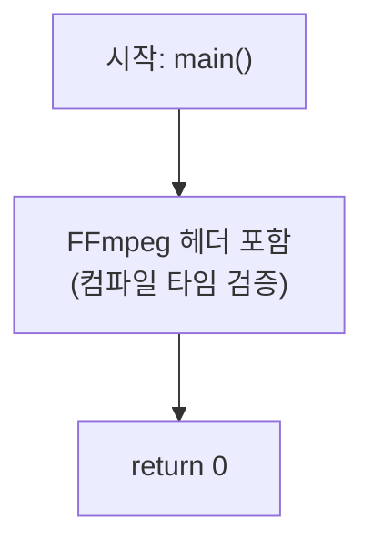

# 01. FFmpeg 빌드 환경 검증

> 소스: `chapter01/01_compile-ffmpeg/main.c` · 타겟: `chapter0101CompileFFMPEG` · [← 챕터 개요](README.md)

## 학습 목표

FFmpeg 개발 환경이 올바르게 구성되었는지 확인한다. FFmpeg의 주요 라이브러리 헤더를 모두 포함한 최소 프로그램을 컴파일·링크해서, 이후 레슨에서 사용할 툴체인(vcpkg + CMake + FFmpeg)이 동작함을 검증한다.

## 핵심 개념

### FFmpeg 라이브러리 구성

FFmpeg은 하나의 라이브러리가 아니라 역할별로 나뉜 여러 라이브러리의 묶음이다. 이 레슨에서 포함하는 헤더가 각 라이브러리의 진입점이다.

| 라이브러리 | 헤더 | 역할 |
|---|---|---|
| libavformat | `libavformat/avformat.h` | 컨테이너(muxing/demuxing) — MP4, MKV 등 파일 포맷 처리 |
| libavcodec | `libavcodec/avcodec.h` | 코덱 — H.264, AAC 등 인코딩/디코딩 |
| libavutil | `libavutil/avutil.h`, `libavutil/imgutils.h` | 공용 유틸리티 — 로그, 시간, 픽셀 포맷, 이미지 버퍼 |
| libswscale | `libswscale/swscale.h` | 픽셀 포맷 변환과 스케일링 |

### CMake + vcpkg 연동

`find_package(FFMPEG REQUIRED)`가 vcpkg가 설치한 FFmpeg을 찾아 `FFMPEG_INCLUDE_DIRS`, `FFMPEG_LIBRARY_DIRS`, `FFMPEG_LIBRARIES` 변수를 제공한다. 이 세 변수를 타겟에 연결하는 패턴이 챕터 전체에서 반복된다.

## 프로그램 흐름



`main`은 아무 일도 하지 않는다. 검증은 런타임이 아니라 **컴파일과 링크 단계**에서 일어난다.

## 핵심 API

| API / 구조체 | 역할 |
|---|---|
| `libavcodec/avcodec.h` 등 헤더 | 컴파일러가 FFmpeg 헤더 경로를 찾는지 검증 |
| `find_package(FFMPEG REQUIRED)` | vcpkg FFmpeg 패키지 탐색 (CMake) |
| `target_link_libraries(... ${FFMPEG_LIBRARIES})` | FFmpeg 라이브러리 링크 검증 (CMake) |

## 이전 레슨과의 차이

챕터의 학습 시작점이다. FFmpeg API는 아직 호출하지 않고, 이후 모든 레슨의 전제인 빌드 환경만 확보한다.

## 실행 방법

```bash
# 빌드
cmake --build cmake-build-debug --target chapter0101CompileFFMPEG

# 실행 (아무 출력 없이 0으로 종료하면 성공)
./cmake-build-debug/chapter01/01_compile-ffmpeg/chapter0101CompileFFMPEG
```

입력 파일은 사용하지 않는다. 빌드가 성공하고 실행이 종료 코드 0을 반환하면 환경 검증 완료다.

---
→ 자세한 코드 해설: [코드 상세 해설](01-compile-ffmpeg-deep-dive.md)
