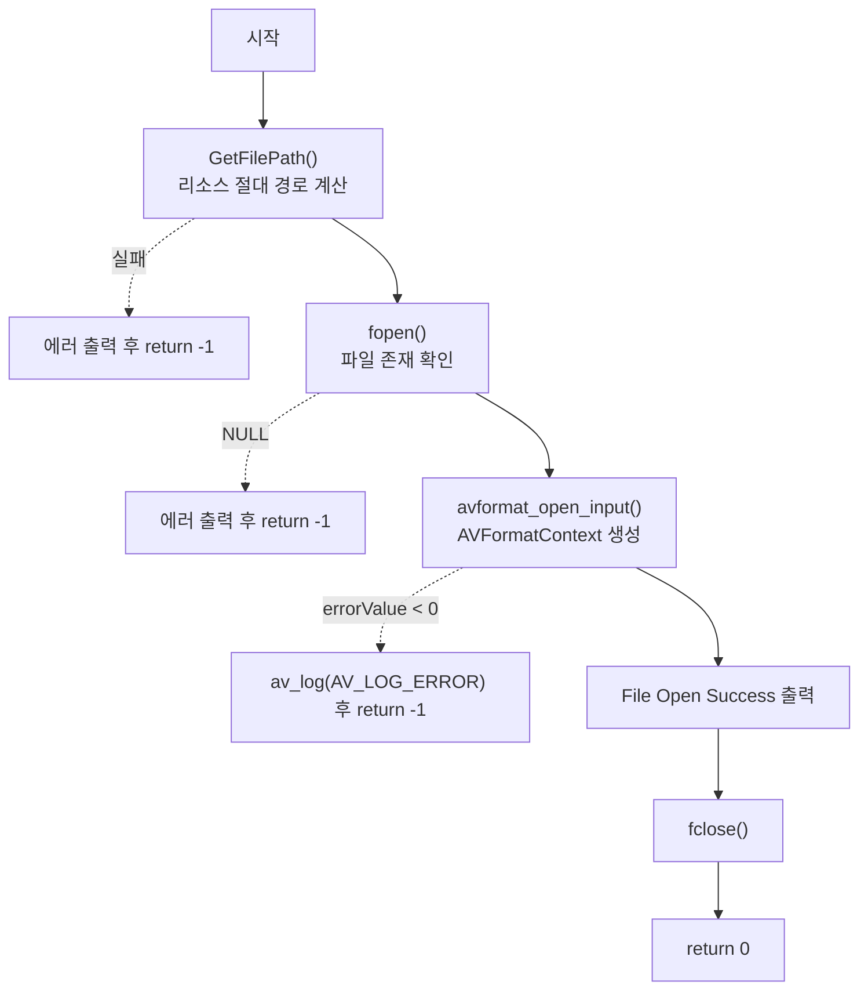

# 02. 컨테이너 파일 열기 — avformat_open_input

> 소스: `chapter01/02_load-resource-ffmpeg/main.c` · 타겟: `chapter0102LoadResource` · [← 챕터 개요](README.md)

## 학습 목표

FFmpeg으로 미디어 파일을 여는 첫 단계인 `avformat_open_input`을 호출해 본다. 컨테이너를 대표하는 구조체 `AVFormatContext`가 만들어지는 과정과, 실행 위치에 따라 리소스 경로를 계산하는 헬퍼(`GetFilePath`)의 동작을 이해한다.

## 핵심 개념

### AVFormatContext

컨테이너(MP4, MKV 등) 하나를 표현하는 최상위 구조체다. 파일 포맷, 스트림 목록, 메타데이터, 재생 시간 등 demuxing에 필요한 모든 상태가 여기에 담긴다. 사용자는 `NULL` 포인터를 넘기고, `avformat_open_input`이 내부에서 할당해 채워 준다.

### avformat_open_input

```c
int avformat_open_input(AVFormatContext **ps, const char *url,
                        const AVInputFormat *fmt, AVDictionary **options);
```

- 파일을 열고 헤더를 파싱해 컨테이너 포맷을 식별한다.
- `fmt`, `options`에 `NULL`을 주면 포맷 자동 감지 + 기본 옵션으로 동작한다.
- 성공 시 0, 실패 시 음수(AVERROR 코드)를 반환한다. FFmpeg API 전반의 공통 규약이다.

### 리소스 경로 계산 (GetFilePath)

실행 파일은 `cmake-build-debug/chapter01/02_load-resource-ffmpeg/` 아래에 생성되므로, 현재 작업 디렉터리 경로에서 `/cmake` 이후를 잘라내 저장소 루트를 얻고 `resources/murage.mp4`를 이어 붙인다. Windows(`GetCurrentDirectory`)와 POSIX(`realpath`)를 조건부 컴파일로 분기한다.

## 프로그램 흐름



## 핵심 API

| API / 구조체 | 역할 |
|---|---|
| `AVFormatContext` | 컨테이너 상태를 담는 최상위 구조체 |
| `avformat_open_input()` | 파일을 열고 헤더를 파싱해 컨텍스트를 할당·초기화 |
| `av_log()` | FFmpeg 로그 시스템으로 메시지 출력 (`AV_LOG_ERROR` 레벨) |
| `realpath()` / `GetCurrentDirectory()` | 플랫폼별 현재 작업 디렉터리 절대 경로 획득 |

## 이전 레슨과의 차이

01번은 빌드만 검증했다면, 이 레슨에서 처음으로 FFmpeg API(`avformat_open_input`, `av_log`)를 실제 호출한다. 리소스 경로 헬퍼도 여기서 처음 등장해 챕터 끝까지 재사용된다.

## ⚠️ 알아두기

- **`avformat_close_input`을 호출하지 않는다.** `avformat_open_input`이 할당한 `formatContext`가 해제되지 않은 채 프로그램이 끝난다(리소스 정리는 03번에서 도입). 프로세스 종료로 회수되긴 하지만 API 사용 규약상 누수다.
- `fopen`/`fclose`는 FFmpeg 동작에 필요 없다. `avformat_open_input`이 파일을 직접 열기 때문에, 여기서는 "파일이 존재하는가"를 미리 확인하는 용도로만 쓰인다.
- 경로 헬퍼 이름이 이 레슨에서는 `GetFilePath`이고, 05번부터는 `GetResourcePath`로 바뀐다.

## 실행 방법

```bash
# 빌드
cmake --build cmake-build-debug --target chapter0102LoadResource

# 실행 — 경로 계산이 CWD 기반이므로 빌드 디렉터리 안에서 실행해야 한다
cd cmake-build-debug/chapter01/02_load-resource-ffmpeg
./chapter0102LoadResource
```

입력: `resources/murage.mp4`. 성공 시 `File Open Success`가 출력된다.

---
→ 자세한 코드 해설: [코드 상세 해설](02-load-resource-deep-dive.md)
