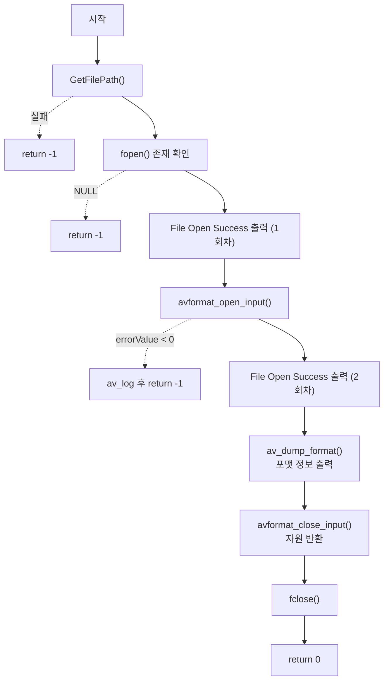

# 03. 포맷 정보 덤프와 자원 반환 — av_dump_format

> 소스: `chapter01/03_dump-format-ffmpeg/main.c` · 타겟: `chapter0103DumpFormatFFMPEG` · [← 챕터 개요](README.md)

## 학습 목표

`ffmpeg -i <파일>` 명령이 보여주는 것과 같은 컨테이너·스트림 요약 정보를 `av_dump_format`으로 출력한다. 그리고 02번에서 빠져 있던 `avformat_close_input`으로 컨텍스트 자원을 올바르게 반환하는 패턴을 익힌다.

## 핵심 개념

### av_dump_format

```c
void av_dump_format(AVFormatContext *ic, int index, const char *url, int is_output);
```

컨테이너 포맷 이름, 메타데이터, duration, 비트레이트, 각 스트림의 코덱/해상도/샘플레이트를 stderr에 사람이 읽기 좋은 형태로 출력하는 디버깅용 함수다. `is_output`이 0이면 입력(demuxer) 컨텍스트로 해석한다. CLI에서 `ffmpeg -i input.mp4`를 쳤을 때 나오는 `Input #0, mov,mp4,...` 블록이 바로 이 함수의 출력이다.

### avformat_close_input

`avformat_open_input`과 짝을 이루는 정리 함수다. demuxer 내부 상태, 스트림, 메타데이터, avio 핸들까지 모두 해제하고 포인터를 `NULL`로 만들어 준다. "열었으면 닫는다"는 FFmpeg 자원 관리의 기본 규약이 이 레슨에서 처음 완성된다.

## 프로그램 흐름



## 핵심 API

| API / 구조체 | 역할 |
|---|---|
| `av_dump_format()` | 컨테이너·스트림 요약 정보를 stderr로 덤프 |
| `avformat_close_input()` | `AVFormatContext`와 관련 자원을 해제하고 포인터를 `NULL`로 설정 |
| `avformat_open_input()` | (02번과 동일) 컨테이너 열기 |

## 이전 레슨과의 차이

02번 코드에 두 가지가 추가됐다.

- `av_dump_format` 호출 — 열어 둔 컨텍스트에서 실제 정보를 처음으로 꺼내 본다.
- `avformat_close_input` 호출 — 02번에서 누락됐던 자원 반환이 도입되어 열기/닫기 짝이 완성된다.

## ⚠️ 알아두기

- **`File Open Success`가 두 번 출력된다.** `fopen` 성공 직후 한 번, `avformat_open_input` 성공 후 또 한 번 같은 문자열을 출력한다(복사 과정에서 남은 중복으로 보인다).
- `av_dump_format`은 stdout이 아니라 **stderr**로 출력하므로, 셸에서 리다이렉션할 때 유의한다.
- 이 레슨 디렉터리에는 `REAME.md`(오타, `README.md`가 아님) 파일이 함께 들어 있다.

## 실행 방법

```bash
# 빌드
cmake --build cmake-build-debug --target chapter0103DumpFormatFFMPEG

# 실행 — 빌드 디렉터리 안에서 실행해야 한다
cd cmake-build-debug/chapter01/03_dump-format-ffmpeg
./chapter0103DumpFormatFFMPEG
```

입력: `resources/murage.mp4`. `Input #0, mov,mp4,m4a,3gp,3g2,mj2, from '...'` 형식의 포맷 덤프가 출력된다.

---
→ 자세한 코드 해설: [코드 상세 해설](03-dump-format-deep-dive.md)
