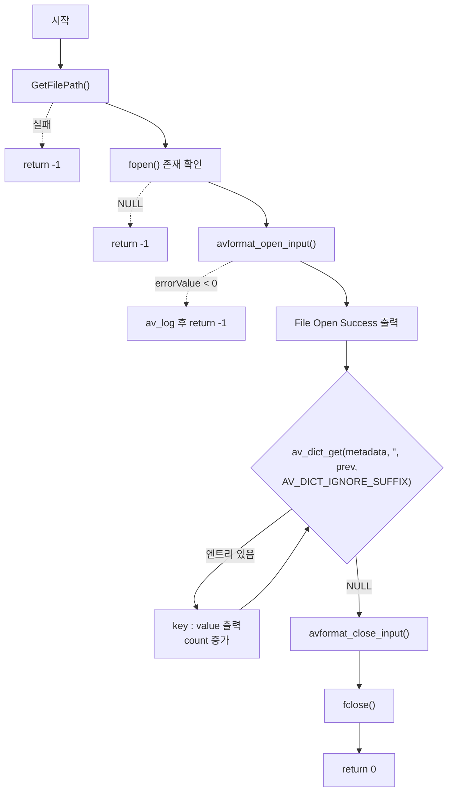

# 04. 컨테이너 메타데이터 순회 — AVDictionary

> 소스: `chapter01/04_AvDictionaryStruct-ffmpeg/main.c` · 타겟: `chapter0104AvDictionaryStructFFMPEG` · [← 챕터 개요](README.md)

## 학습 목표

FFmpeg이 key-value 데이터를 담는 범용 구조체 `AVDictionary`를 이해하고, `av_dict_get`과 `AV_DICT_IGNORE_SUFFIX` 플래그를 이용해 컨테이너 메타데이터(`formatContext->metadata`)의 모든 항목을 순회 출력한다.

## 핵심 개념

### AVDictionary와 AVDictionaryEntry

`AVDictionary`는 FFmpeg 전역에서 옵션 전달과 메타데이터 저장에 쓰이는 불투명(opaque) key-value 컨테이너다. 내부 구조에 직접 접근할 수 없고, 항목 하나는 `AVDictionaryEntry`로 받는다.

```c
typedef struct AVDictionaryEntry {
    char *key;
    char *value;
} AVDictionaryEntry;
```

컨테이너 메타데이터(제목, 인코더, major_brand 등)는 `AVFormatContext->metadata`에 이 형태로 저장돼 있다.

### av_dict_get으로 전체 순회하기

```c
AVDictionaryEntry *av_dict_get(const AVDictionary *m, const char *key,
                               const AVDictionaryEntry *prev, int flags);
```

- `key`에 빈 문자열 `""`, `flags`에 `AV_DICT_IGNORE_SUFFIX`를 주면 "빈 문자열을 접두사로 갖는 모든 키" 즉 **모든 항목**이 매칭된다.
- `prev`에 직전 반환값을 넘기면 그 다음 항목을 반환하고, 끝에 도달하면 `NULL`을 반환한다.
- 따라서 `while ((entry = av_dict_get(dict, "", entry, AV_DICT_IGNORE_SUFFIX)))` 패턴이 FFmpeg의 표준 메타데이터 순회 관용구다.

## 프로그램 흐름



## 핵심 API

| API / 구조체 | 역할 |
|---|---|
| `AVDictionary` | key-value 저장용 불투명 구조체 (메타데이터/옵션) |
| `AVDictionaryEntry` | 순회 시 항목 하나(key, value 문자열)를 가리키는 구조체 |
| `av_dict_get()` | 키 검색 및 순회 — `prev` 인자로 이어서 탐색 |
| `AV_DICT_IGNORE_SUFFIX` | 키를 접두사로 취급해 매칭 (빈 키 + 이 플래그 = 전체 순회) |
| `AVFormatContext->metadata` | 컨테이너 수준 메타데이터 딕셔너리 |

## 이전 레슨과의 차이

03번의 `av_dump_format`은 정보를 화면에 출력만 해 줄 뿐 코드에서 값을 쓸 수 없었다. 이 레슨에서는 처음으로 **구조체 필드(`formatContext->metadata`)에서 데이터를 직접 꺼내** 프로그램이 다룰 수 있는 형태(key/value 문자열)로 얻는다. `av_dump_format` 호출은 제거됐다.

## ⚠️ 알아두기

- 이 레슨의 `CMakeLists.txt`에 있는 `message("chapter01-03 av dictionary struct ffmpeg")`는 레슨 번호가 `03`으로 잘못 적혀 있다(04가 맞음). 빌드 로그 표시용이라 동작에는 영향이 없다.
- `av_dict_get`이 반환하는 `AVDictionaryEntry` 포인터는 딕셔너리 내부를 가리키므로 해제하면 안 되고, `avformat_close_input` 이후에는 사용할 수 없다.

## 실행 방법

```bash
# 빌드
cmake --build cmake-build-debug --target chapter0104AvDictionaryStructFFMPEG

# 실행 — 빌드 디렉터리 안에서 실행해야 한다
cd cmake-build-debug/chapter01/04_AvDictionaryStruct-ffmpeg
./chapter0104AvDictionaryStructFFMPEG
```

입력: `resources/murage.mp4`. `[0]major_brand : isom` 같은 형식으로 메타데이터 항목이 번호와 함께 출력된다.

---
→ 자세한 코드 해설: [코드 상세 해설](04-av-dictionary-deep-dive.md)
