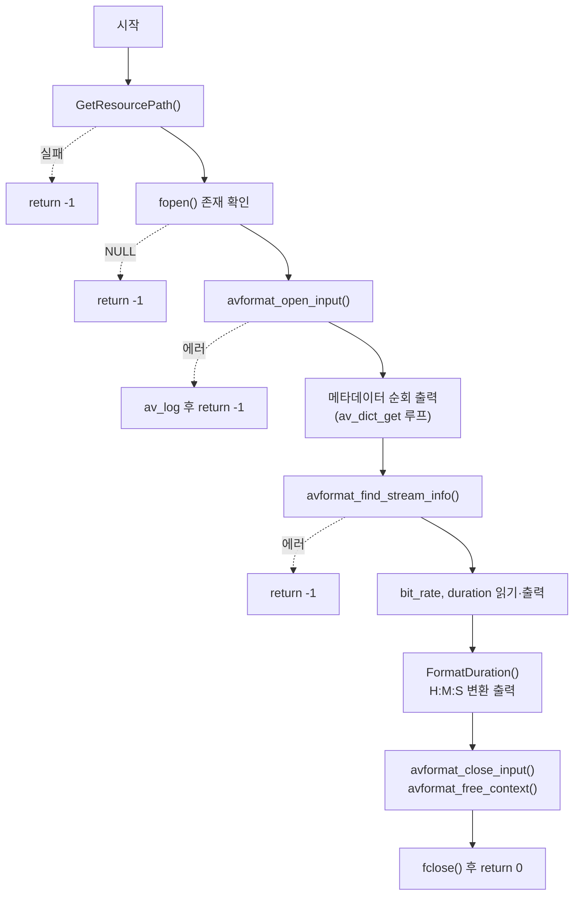

# 05. 스트림 정보와 시간 단위 — TimeBase, AV_TIME_BASE

> 소스: `chapter01/05_TimeBase-AV-Time/main.c` · 타겟: `chapter0105TimeBaseAVTime` · [← 챕터 개요](README.md)

## 학습 목표

`avformat_find_stream_info`로 스트림 정보를 채운 뒤 `AVFormatContext`에서 `bit_rate`와 `duration`을 읽는다. FFmpeg의 시간 표현 단위인 `AV_TIME_BASE`(마이크로초)를 이해하고, `duration`을 시:분:초 형태로 변환하는 함수를 작성한다.

## 핵심 개념

### avformat_find_stream_info

`avformat_open_input`은 헤더만 파싱하므로, 컨테이너에 따라 duration·비트레이트·코덱 세부 정보가 비어 있거나 부정확할 수 있다. `avformat_find_stream_info`는 **패킷을 실제로 몇 개 읽고 디코딩해 보면서** 각 스트림의 정보를 확정한다. 주석에 적힌 대로 "duration과 bit rate에 대한 정보를 가져오기 위해서는 스트림에 대한 정보를 가져와야" 한다.

### AV_TIME_BASE와 duration

`AVFormatContext->duration`은 초가 아니라 `AV_TIME_BASE` 단위의 정수다.

```c
#define AV_TIME_BASE 1000000   // 1초 = 1,000,000 (마이크로초)
```

따라서 초 단위 값은 `duration / AV_TIME_BASE`로 얻는다. 이 레슨의 `FormatDuration`은 이 값을 다시 60으로 나누어 시:분:초로 분해한다. 참고로 **스트림별** 시간 값(`AVStream->duration` 등)은 이 단위가 아니라 스트림마다 다른 `time_base`를 쓴다 — 이 구분은 딥다이브에서 다룬다.

### bit_rate

`AVFormatContext->bit_rate`는 컨테이너 전체의 비트레이트(bit/s)다. 파일 크기와 duration로부터 계산되거나 헤더 값에서 온다.

## 프로그램 흐름



## 핵심 API

| API / 구조체 | 역할 |
|---|---|
| `avformat_find_stream_info()` | 패킷을 읽어 스트림 정보(duration, 코덱 파라미터 등)를 확정 |
| `AVFormatContext->duration` | 전체 재생 시간 (`AV_TIME_BASE` 단위 int64) |
| `AVFormatContext->bit_rate` | 전체 비트레이트 (bit/s, int64) |
| `AV_TIME_BASE` | FFmpeg 기준 시간 단위 상수 (1초 = 1,000,000) |
| `PRId64` | `int64_t`를 이식성 있게 printf 하기 위한 포맷 매크로 |

## 이전 레슨과의 차이

- `avformat_find_stream_info`가 처음 등장한다. 04번까지는 헤더 파싱만으로 충분했지만, 신뢰할 수 있는 duration/bit_rate를 읽으려면 이 단계가 필요하다.
- 시간 단위 변환 함수 `FormatDuration`이 추가된다.
- 경로 헬퍼 이름이 `GetFilePath` → `GetResourcePath`로 바뀌고, 출력 버퍼에 직접 쓰는 방식으로 내부가 정리됐다.
- 04번의 메타데이터 순회 루프는 그대로 유지된다(번호 없이 key : value만 출력).

## ⚠️ 알아두기

- `avformat_close_input` 직후에 `avformat_free_context(pAvContext)`를 또 호출한다. `avformat_close_input`이 이미 컨텍스트를 해제하고 포인터를 `NULL`로 만들기 때문에 이 호출은 `NULL`에 대한 no-op이다. 불필요한 중복 호출이며, 포인터가 `NULL`로 초기화되지 않는 경로였다면 이중 해제 버그가 됐을 패턴이다.
- `videoPath`를 `"../../resources/murage.mp4"` 리터럴로 초기화하지만, 곧바로 `GetResourcePath`가 값을 덮어쓰므로 초기값은 사용되지 않는다.
- `FormatDuration`이 `int64_t` 출력에 `PRId64` 대신 `%lld`를 사용한다. macOS/리눅스 64비트에서는 동작하지만 이식성이 떨어진다(바로 위의 `printf`에서는 `PRId64`를 사용해 혼재).

## 실행 방법

```bash
# 빌드
cmake --build cmake-build-debug --target chapter0105TimeBaseAVTime

# 실행 — 빌드 디렉터리 안에서 실행해야 한다
cd cmake-build-debug/chapter01/05_TimeBase-AV-Time
./chapter0105TimeBaseAVTime
```

입력: `resources/murage.mp4`. 메타데이터 목록에 이어 `bit rate : ...`, `duration : ...`(마이크로초), `duration H:M:S` 가 출력된다.

---
→ 자세한 코드 해설: [코드 상세 해설](05-timebase-av-time-deep-dive.md)
