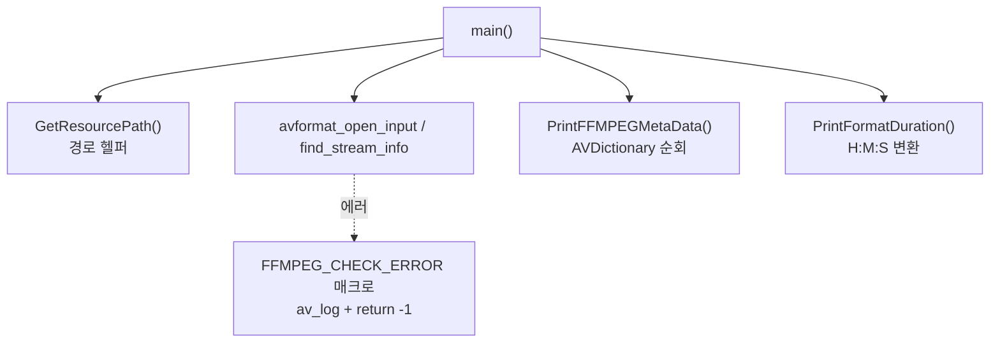

# 06. 함수와 매크로로 리팩터링 — 코드 상세 해설

> [← 기본 문서](06-function-macro.md)

## 전체 구조



05번의 코드가 역할별 함수로 재배치된 구조다.

## 코드 블록별 해설

### FFMPEG_CHECK_ERROR 매크로

```c
/** Custom FFMPEG Error MACRO */
#define FFMPEG_CHECK_ERROR(errorNo, errorMsg)                                               \
({                                                                                          \
    if((errorNo) < 0){                                                                      \
        av_log(NULL, AV_LOG_ERROR, (errorMsg));                                             \
        return -1;                                                                          \
    }else{                                                                                  \
     }                                               \
})
```

- `({ ... })`는 **GNU statement expression**이다. 복합문을 식(expression)처럼 쓸 수 있게 하는 GCC/Clang 확장으로, 표준 C가 아니다. 여기서는 표현식으로서의 값은 쓰지 않으므로 사실상 `do { ... } while(0)` 관용구의 자리에 GNU 확장이 들어간 셈이다.
- 매크로 인자를 `(errorNo)`, `(errorMsg)`처럼 괄호로 감싼 것은 연산자 우선순위 문제를 막는 올바른 습관이다.
- `return -1`이 매크로 안에 있으므로 이 매크로는 **int를 반환하는 함수 안에서만** 쓸 수 있고, 호출 코드만 봐서는 함수가 종료될 수 있다는 것이 보이지 않는다.
- 빈 `else` 블록은 아무 의미가 없다(작성 중 남은 골격).

### main — 리팩터링된 절차

```c
int main(void) {
    char pathBuffer[BUFFER_MAX] = {0};
    AVFormatContext *pContent;
    int ffmpegErrorCode = 0;

    if (!GetResourcePath("murage.mp4", pathBuffer)) {
        printf("Get Resource Path... murage.mp4\r\n");
        return -1;
    }

    ffmpegErrorCode = avformat_open_input(&pContent, pathBuffer, NULL, NULL);
    if (ffmpegErrorCode < 0) {
        printf("Get FFMPEG Get Resource... %s\r\n", pathBuffer);
        FFMPEG_CHECK_ERROR(ffmpegErrorCode, "Error FFMPEG Open Resource File...\r\n");
    }

    PrintFFMPEGMetaData(pContent->metadata);

    ffmpegErrorCode = avformat_find_stream_info(pContent, NULL);
    if (ffmpegErrorCode < 0) {
        FFMPEG_CHECK_ERROR(ffmpegErrorCode, "Error find stream information ...\r\n");
    }

    PrintFormatDuration(pContent->duration);

    avformat_close_input(&pContent);
    return 0;
}
```

- `AVFormatContext *pContent;` — **NULL 초기화 누락**. 이 레슨의 가장 중요한 특이점이다(아래 상세).
- 이전 레슨의 `fopen` 존재 확인이 사라졌다. 파일이 없으면 `avformat_open_input`이 `AVERROR(ENOENT)`를 반환하므로 에러 경로가 하나로 합쳐진 것이며, 이쪽이 더 정석적인 구성이다.
- `if (ffmpegErrorCode < 0) { ...; FFMPEG_CHECK_ERROR(...); }` — 매크로가 내부에서 같은 조건을 다시 검사하므로 검사가 이중이다. 바깥 `if`는 `printf` 부가 출력용이고, 두 번째 사용처처럼 바깥 `if` 없이 `FFMPEG_CHECK_ERROR(ffmpegErrorCode, ...)`만 써도 동작은 같다.

### PrintFFMPEGMetaData

```c
void PrintFFMPEGMetaData(AVDictionary *pMetaData) {
    /** meta data를 tuple 형태로 값을 가지고 오기 위한 구조체 */
    AVDictionaryEntry *pEntry = NULL;
    while ((pEntry = av_dict_get(pMetaData, "", pEntry, AV_DICT_IGNORE_SUFFIX))) {
        printf("key : %s, value: %s\r\n", pEntry->key, pEntry->value);
    }
}
```

04번의 순회 루프를 함수로 뽑아낸 것이다. 매개변수가 `AVFormatContext *`가 아니라 `AVDictionary *`인 점이 좋은 설계다 — 컨테이너 메타데이터든 스트림 메타데이터든 딕셔너리면 무엇이든 출력할 수 있어, 07번에서 `pStream->metadata`에 그대로 재사용된다.

### PrintFormatDuration

```c
void PrintFormatDuration(int64_t duration) {
    int64_t hours = 0;
    int64_t minutes = 0;
    int64_t seconds = 0;

    /** get video duration time -> make seconds */
    seconds = duration / AV_TIME_BASE;

    minutes = seconds / 60;
    seconds %= 60;
    hours = minutes / 60;
    minutes %= 60;

    printf("duration %lld:%lld:%lld\r\n", hours, minutes, seconds);
}
```

05번의 `FormatDuration`과 동일한 로직이다(이름만 변경). `%lld` 사용에 대한 이식성 문제는 [05번 딥다이브](05-timebase-av-time-deep-dive.md) 참고.

### GetResourcePath

05번의 것과 거의 같다. 상세 동작은 [02번 딥다이브](02-load-resource-deep-dive.md) 참고. 05번에 있던 `memset(pathBuffer, ...)`이 이 버전에는 없지만, `main`에서 `pathBuffer`를 `{0}`으로 초기화해 넘기므로 결과는 같다.

## 심화

### 에러 매크로 설계 — FFmpeg 생태계의 관용구

FFmpeg 예제 코드나 실무 코드에서 흔히 보는 패턴은 두 가지다.

```c
/* 1. do-while(0) — 표준 C, 이 레슨 매크로의 이식성 문제를 해결한 형태 */
#define CHECK(err, msg) do {                       \
    if ((err) < 0) {                               \
        av_log(NULL, AV_LOG_ERROR, "%s", (msg));   \
        return -1;                                 \
    }                                              \
} while (0)

/* 2. goto cleanup — 자원 해제가 필요한 경우 FFmpeg 공식 예제가 쓰는 방식 */
ret = avformat_open_input(&ctx, path, NULL, NULL);
if (ret < 0)
    goto end;
...
end:
    avformat_close_input(&ctx);
    return ret;
```

매크로 안 `return`의 함정은 **자원 해제를 건너뛴다**는 점이다. 이 레슨에서도 `avformat_find_stream_info` 실패 시 매크로가 `return -1` 하면서 이미 열린 `pContent`를 닫지 않는다. 그래서 실전 코드는 `goto cleanup` 스타일을 선호한다.

### av_log에 서식 문자열을 직접 넘길 때의 주의

`av_log(NULL, AV_LOG_ERROR, (errorMsg))`는 `errorMsg`를 printf 서식 문자열 자리에 그대로 넣는다. 이 레슨처럼 리터럴만 넘기면 안전하지만, 외부 입력이 들어갈 수 있는 자리라면 `av_log(NULL, AV_LOG_ERROR, "%s", msg)` 형태가 안전하다(format string 취약점 예방).

## ⚠️ 코드 특이점 상세

- **`pContent` NULL 초기화 누락 (미정의 동작)**: `AVFormatContext *pContent;`는 초기화되지 않은 스택 값이다. `avformat_open_input`은 `*ps == NULL`이면 컨텍스트를 새로 할당하고, `NULL`이 아니면 호출자가 `avformat_alloc_context()`로 만들어 둔 컨텍스트로 간주해 그대로 사용한다. 쓰레기 값이 들어가면 후자로 오인되어 임의 메모리에 접근할 수 있다. 실행 시 스택이 우연히 0이면 정상 동작하는 것처럼 보이므로 발견하기 어려운 유형의 버그다. 올바른 형태는 `AVFormatContext *pContent = NULL;`이다.
- **매크로의 비표준 문법**: `({ ... })` statement expression은 GCC/Clang 전용이다. 값으로 쓰지 않으므로 `do { ... } while (0)`로 바꾸면 표준 C가 된다.
- **이중 에러 검사**: 매크로 호출을 다시 `if (ffmpegErrorCode < 0)`로 감싸고 있어 조건 검사가 중복된다. 매크로만 단독 호출해도 동일하게 동작한다.
- **에러 경로에서 자원 누수**: `avformat_find_stream_info` 실패 시 매크로의 `return -1`이 `avformat_close_input`을 건너뛴다.
- 빈 `else {}` 블록, 매크로 정의 끝의 들쭉날쭉한 백슬래시 정렬은 기능에는 영향 없는 잔재다.
