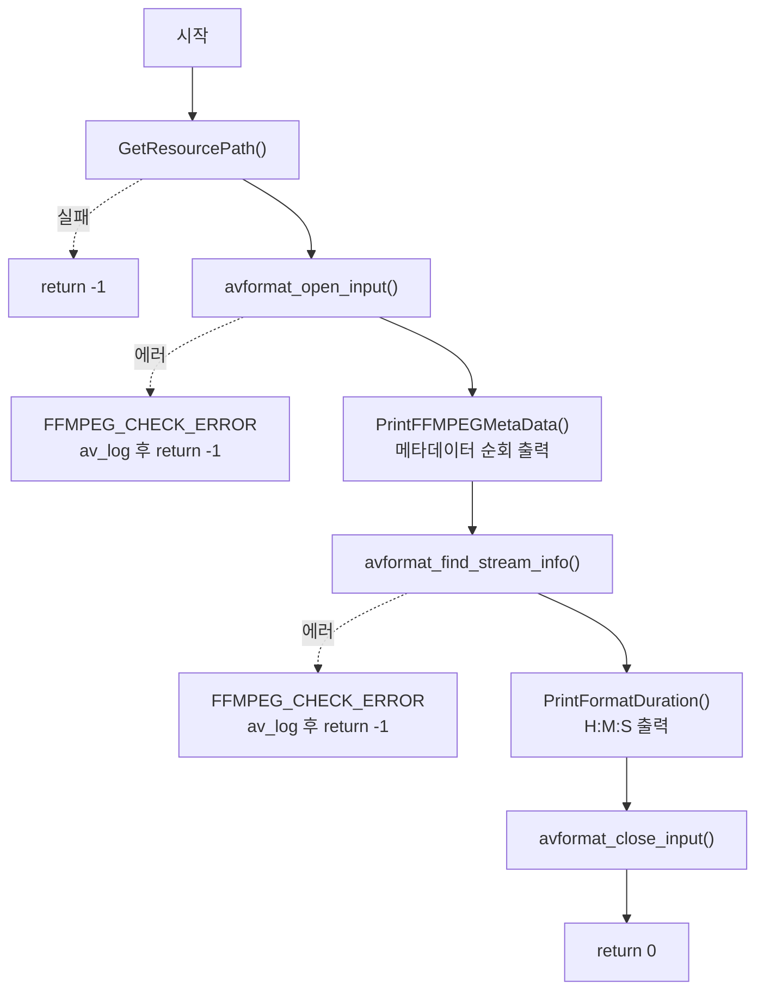

# 06. 함수와 매크로로 리팩터링 — FFMPEG_CHECK_ERROR

> 소스: `chapter01/06_function-macro-avDictionaryStruct/main.c` · 타겟: `chapter0106FunctionMacroAvDictionaryStruct` · [← 챕터 개요](README.md)

## 학습 목표

04~05번에서 반복되던 코드(메타데이터 순회, duration 변환, 에러 검사)를 함수와 매크로로 분리해 `main`을 간결하게 만든다. FFmpeg의 "음수 = 에러" 반환 규약을 매크로 하나(`FFMPEG_CHECK_ERROR`)로 처리하는 패턴을 익힌다.

## 핵심 개념

### 에러 검사 매크로

FFmpeg API는 거의 모든 함수가 `int`를 반환하고 음수를 에러로 쓴다. 매번 `if (ret < 0) { av_log(...); return -1; }`를 쓰는 대신 매크로로 묶는다.

```c
/** Custom FFMPEG Error MACRO */
#define FFMPEG_CHECK_ERROR(errorNo, errorMsg)                                               \
({                                                                                          \
    if((errorNo) < 0){                                                                      \
        av_log(NULL, AV_LOG_ERROR, (errorMsg));                                             \
        return -1;                                                                          \
    }else{                                                                                  \
     }                                               \
})
```

매크로 안의 `return -1`은 매크로를 호출한 **함수(main)를** 종료시킨다. GNU 확장인 statement expression(`({ ... })`) 문법을 사용한다(딥다이브 참고).

### 헬퍼 함수 분리

| 함수 | 이전 레슨의 원형 |
|---|---|
| `PrintFFMPEGMetaData(AVDictionary *)` | 04·05번 main 안의 `av_dict_get` while 루프 |
| `PrintFormatDuration(int64_t)` | 05번 `FormatDuration` |
| `GetResourcePath(...)` | 05번과 동일 |

로직이 바뀐 것이 아니라 **위치**가 바뀌었다. main은 "열기 → 메타데이터 출력 → 스트림 정보 → duration 출력 → 닫기"라는 절차만 남는다.

## 프로그램 흐름



## 핵심 API

| API / 구조체 | 역할 |
|---|---|
| `FFMPEG_CHECK_ERROR` (자작 매크로) | 음수 에러 코드 검사 + `av_log` + `return -1` 일괄 처리 |
| `PrintFFMPEGMetaData()` (자작 함수) | `AVDictionary` 전체 순회 출력 |
| `PrintFormatDuration()` (자작 함수) | `AV_TIME_BASE` 단위 duration을 H:M:S로 출력 |
| `avformat_open_input()` / `avformat_find_stream_info()` / `avformat_close_input()` | 05번과 동일한 FFmpeg 호출 골격 |

## 이전 레슨과의 차이

- 새 FFmpeg API는 없다. 05번과 동일한 동작을 **구조만 리팩터링**했다.
- 처음으로 `fopen` 존재 확인 단계가 사라졌다 — 파일 부재는 `avformat_open_input`의 에러 코드로 처리한다.
- 메타데이터 출력 함수가 `AVFormatContext`가 아닌 `AVDictionary *`를 받도록 일반화되어, 07번에서 스트림 메타데이터에도 재사용된다.

## ⚠️ 알아두기

- **`pContent`가 `NULL`로 초기화되지 않는다.** `AVFormatContext *pContent;`는 쓰레기 값을 가진 채 `avformat_open_input(&pContent, ...)`에 전달된다. `avformat_open_input`은 `*ps`가 `NULL`이 아니면 "이미 할당된 컨텍스트"로 취급하므로 이는 미정의 동작이다(스택 상태에 따라 우연히 동작할 수 있을 뿐). `= NULL` 초기화가 올바른 형태다.
- `FFMPEG_CHECK_ERROR`는 GNU statement expression(`({...})`)을 사용해 MSVC 등 비-GNU 컴파일러에서는 컴파일되지 않으며, 매크로 안에 `return`이 숨어 있어 호출 지점에서 제어 흐름이 끝난다는 사실이 드러나지 않는다.
- 두 에러 처리 지점 모두 `if (ffmpegErrorCode < 0) { ... FFMPEG_CHECK_ERROR(...); }` 형태라 **음수 검사가 이중**으로 일어난다. 매크로가 이미 검사하므로 바깥 `if`는 부가 `printf`를 위한 것이다.

## 실행 방법

```bash
# 빌드
cmake --build cmake-build-debug --target chapter0106FunctionMacroAvDictionaryStruct

# 실행 — 빌드 디렉터리 안에서 실행해야 한다
cd cmake-build-debug/chapter01/06_function-macro-avDictionaryStruct
./chapter0106FunctionMacroAvDictionaryStruct
```

입력: `resources/murage.mp4`. `key : ..., value: ...` 형식의 메타데이터와 `duration H:M:S`가 출력된다.

---
→ 자세한 코드 해설: [코드 상세 해설](06-function-macro-deep-dive.md)
