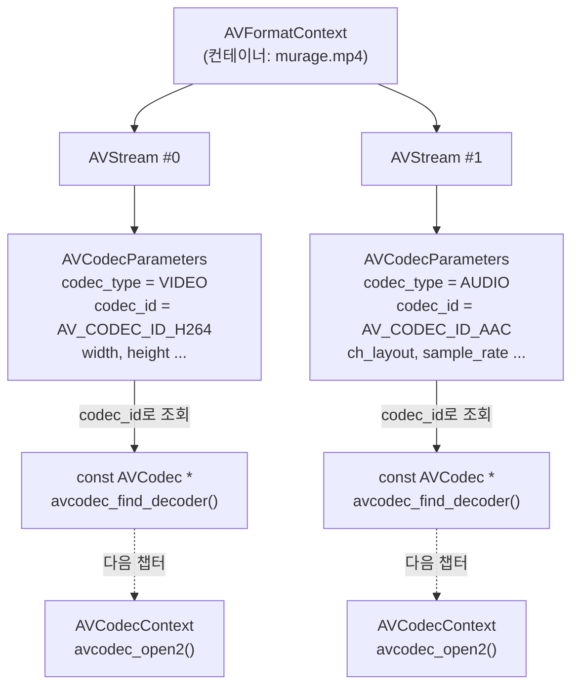

# 07. 스트림 순회와 디코더 탐색 — 코드 상세 해설

> [← 기본 문서](07-video-stream.md)

## 전체 구조

| 구성 요소 | 역할 |
|---|---|
| `FFMPEG_ERROR` 매크로 | 에러 코드 검사 + `av_log` + `return -1` (06번 매크로의 개정판) |
| `main()` | 열기 → 컨테이너 정보 → 스트림 루프(분류·디코더 탐색) → 닫기 |
| `GetResourcePath()` | 리소스 경로 헬퍼 (챕터 공통, [02번 딥다이브](02-load-resource-deep-dive.md) 참고) |
| `VideoDurationPrint()` | duration H:M:S 출력 (05번 `FormatDuration` 계열) |
| `FFMPEGMetaDataPrint()` | `AVDictionary` 순회 출력 (06번 헬퍼 계열) |

## 코드 블록별 해설

### FFMPEG_ERROR 매크로

```c
#define FFMPEG_ERROR(errorCode, msg)    \
{                                       \
if((errorCode) < (0)){                  \
av_log(NULL, AV_LOG_ERROR, (msg));      \
return -1;                              \
}else{                                  \
}                                       \
}
```

06번의 `FFMPEG_CHECK_ERROR`와 같은 역할이지만 GNU statement expression(`({...})`) 대신 일반 복합문 블록 `{...}`을 쓴다. 표준 C 범위 안이라 이식성은 나아졌지만, `do { } while(0)`가 아니어서 `if (x) FFMPEG_ERROR(...); else ...` 같은 자리에서는 세미콜론 문제로 컴파일 오류가 날 수 있는 고전적인 매크로 함정은 남아 있다. `return -1` 내장이라는 특성도 그대로다.

### 열기와 컨테이너 수준 정보

```c
    ffmpegErrorCode = avformat_open_input(&pContent, pathBuffer, NULL, NULL);
    if (ffmpegErrorCode < 0) {
        FFMPEG_ERROR(ffmpegErrorCode, "Failed AVFormat Open...\r\n");
    }
    /** get stream information */
    avformat_find_stream_info(pContent, NULL);

    VideoDurationPrint(pContent->duration);
    FFMPEGMetaDataPrint(pContent->metadata);
```

- 이번에는 `AVFormatContext *pContent = NULL;`로 올바르게 초기화되어 있다(06번의 누락이 수정됨).
- `avformat_find_stream_info`의 **반환값을 검사하지 않는다**. 실패해도 그대로 진행되어 이후 필드들이 불완전할 수 있다.
- `pContent->duration`은 `AV_TIME_BASE` 단위이므로 `VideoDurationPrint`의 나눗셈이 여기서는 올바르다.

### 스트림 루프 — 순회와 분류

```c
    unsigned int numberOfStream = pContent->nb_streams;
    printf("number of Stream : %d\r\n", numberOfStream);
    printf("\r\n-------Stream Meta Data-------\r\n");
    /** get stream */
    for (int i = 0; i < numberOfStream; i++) {
        printf("\r\nStream[%d]\r\n", i);
        /** stream을 구조체로 가져오기 */
        AVStream *pStream = pContent->streams[i];

        /** codec에 대한 파라미터 값을 가져오기 -> parameter에 codec에 대한 정보를 가져오기 위한 정보들이 담겨져 있다. */
        AVCodecParameters *pParameters = pStream->codecpar;
```

`nb_streams`는 `unsigned int`인데 루프 변수 `i`는 `int`라서 `i < numberOfStream` 비교에서 signed/unsigned 비교 경고가 나올 수 있다(실제 스트림 수가 작으므로 동작에는 문제 없음). `%d`로 unsigned를 출력하는 것도 같은 결이다.

### 비디오 스트림 분기

```c
        /** Video Codec 일 경우 */
        if (AVMEDIA_TYPE_VIDEO == pParameters->codec_type) {
            printf("Found a Video Stream\r\n");
            /** video에세만 동영상에 대한 높이, 너비를 가져올 수 있다. */
            int videoWidth = pParameters->width;
            int videoHeight = pParameters->height;
            printf("video [%dx%d]\r\n", videoWidth, videoHeight);
            /** frame rate에 대한 정보를 가져오기 위해서는 av_q2d를 이용해서 가져올 수 있다.*/
            double realFrameRate = av_q2d(pStream->r_frame_rate);
            double avgFrameRate = av_q2d(pStream->avg_frame_rate);
            printf("real frame rate : %lffps, average frame rate : %lffps\r\n", realFrameRate, avgFrameRate);
        }
```

- `width`/`height`는 `AVCodecParameters`에서, 프레임레이트는 `AVStream`에서 읽는 점을 구분해야 한다.
- `r_frame_rate`는 "타임스탬프들을 표현할 수 있는 가장 낮은 프레임레이트"(실측 기반 추정), `avg_frame_rate`는 전체 프레임 수/시간의 평균이다. CFR(고정 프레임레이트) 영상이면 둘이 같고, VFR이면 다를 수 있다.
- `AVMEDIA_TYPE_VIDEO == pParameters->codec_type`처럼 상수를 왼쪽에 두는 것은 `=` 오타를 컴파일 에러로 만드는 방어적 스타일(요다 조건문)이다.

### 오디오 스트림 분기

```c
            /** Audio Codec 일 경우 */
        else if (AVMEDIA_TYPE_AUDIO == pParameters->codec_type) {
            printf("Found an Audio Stream\r\n");
            /** audio channel 에 대닿 넞오블 담고 있는 부분이 cb_layout에 정의가 되어 있다.*/
            AVChannelLayout channelLayout = pParameters->ch_layout;

            int audioChannels = channelLayout.nb_channels;
            printf("audio number of channel : %d, audio sample Rate : %dHz \r\n", audioChannels,
                   pParameters->sample_rate);
        }
```

`ch_layout`은 FFmpeg 5.1에서 도입된 `AVChannelLayout` API다. 과거의 `int channels` / `uint64_t channel_layout` 필드를 대체한다. 구조체를 값 복사해서 `nb_channels`만 읽는데, 읽기 전용 접근이라 문제는 없다(소유권을 갖는 복사가 필요하면 `av_channel_layout_copy`를 써야 한다).

### 디코더 탐색과 스트림별 마무리 출력

```c
        /** codec에 대한 정보를 가져오는 것 -> decoder */
        const AVCodec *pCodec = avcodec_find_decoder(pParameters->codec_id);
        printf("codec ID : %d,codec name : %s, Bit Rate : %lldHz\r\n", pCodec->id, pCodec->name, pParameters->bit_rate);

        FFMPEGMetaDataPrint(pStream->metadata);

        printf("Stream Duration : ");
        VideoDurationPrint(pStream->duration);
```

- `avcodec_find_decoder`는 전역 코덱 레지스트리에서 `codec_id`에 맞는 디코더를 찾는다. 파일을 여는 것도, 컨텍스트를 만드는 것도 아니고 **구현체 디스크립터를 조회**할 뿐이다. 실제 디코딩은 `avcodec_alloc_context3(pCodec)` → `avcodec_parameters_to_context` → `avcodec_open2`로 이어진다(다음 챕터).
- `pCodec`이 `NULL`일 수 있는데 검사 없이 역참조한다(특이점 참고).
- `FFMPEGMetaDataPrint(pStream->metadata)` — 06번에서 함수를 `AVDictionary *`로 일반화해 둔 덕분에 스트림 메타데이터(`language`, `handler_name` 등)에 그대로 재사용된다.
- `VideoDurationPrint(pStream->duration)` — 단위가 맞지 않는 호출이다(특이점 참고).

### 헬퍼 함수들

`GetResourcePath`, `VideoDurationPrint`, `FFMPEGMetaDataPrint`는 05·06번의 헬퍼와 로직이 같고 이름과 출력 포맷만 다르다. `FFMPEGMetaDataPrint`는 `key : [%s], VALUE : [%s]` 형식으로 출력한다.

## 심화

### 컨테이너 – 스트림 – 코덱의 관계



- **AVFormatContext**: 컨테이너 파일 1개. demuxing의 단위.
- **AVStream**: 컨테이너 안의 트랙 1개. 타임베이스·duration·메타데이터를 가진다.
- **AVCodecParameters**: 스트림에 담긴 데이터가 "무엇으로 어떻게 인코딩됐는지"의 서술. 디코딩 능력은 없다.
- **AVCodec**: 특정 코덱의 인코더/디코더 구현 디스크립터(전역, 읽기 전용).
- **AVCodecContext**: `AVCodec`을 실제로 구동하는 인스턴스. 여기서부터가 디코딩이다.

과거에는 `AVStream->codec`(AVCodecContext)을 직접 썼지만 deprecated 되었고, 현재는 이 레슨처럼 `codecpar`를 읽어 별도의 `AVCodecContext`로 복사하는 것이 표준 경로다.

### AVStream->duration의 올바른 변환

`AVStream->duration`은 그 스트림의 `time_base` 단위다. 초로 바꾸려면 다음 중 하나가 맞다.

```c
/* 방법 1: time_base를 곱해 초로 */
double seconds = pStream->duration * av_q2d(pStream->time_base);

/* 방법 2: AV_TIME_BASE 단위로 리스케일 후 기존 함수 재사용 */
int64_t us = av_rescale_q(pStream->duration, pStream->time_base, AV_TIME_BASE_Q);
VideoDurationPrint(us);
```

예를 들어 비디오 스트림의 `time_base`가 1/15360이고 `duration`이 460800이면 실제 길이는 30초지만, 이 코드처럼 `460800 / 1000000`으로 나누면 0초로 출력된다. 반대로 `time_base`의 분모가 1,000,000보다 크거나 작으면 과대/과소 값이 나온다.

## ⚠️ 코드 특이점 상세

- **스트림 duration의 단위 오류**: `VideoDurationPrint(pStream->duration)`은 내부에서 `duration / AV_TIME_BASE`로 나누지만 `AVStream->duration`은 `pStream->time_base` 단위다. 컨테이너 duration(마이크로초)에는 맞는 함수를 스트림 duration에 그대로 재사용하면서 생긴 단위 불일치로, 스트림별 duration 출력값은 신뢰할 수 없다. 올바른 형태는 위 심화 절의 `av_rescale_q` 또는 `av_q2d(time_base)` 곱셈이다.
- **`pCodec` NULL 검사 누락**: `avcodec_find_decoder`는 해당 디코더가 빌드에 포함되지 않았으면 `NULL`을 반환한다. `pCodec->id` 역참조 전에 `if (pCodec == NULL)` 검사가 필요하다. murage.mp4(H.264/AAC)는 일반적인 FFmpeg 빌드에서 항상 찾히므로 드러나지 않을 뿐이다.
- **`avformat_find_stream_info` 반환값 미검사**: 바로 위의 `avformat_open_input`은 매크로로 검사하면서 이 호출은 검사하지 않는다.
- **bit_rate 단위 표기 오류**: `"Bit Rate : %lldHz"` — 비트레이트의 단위는 Hz가 아니라 bit/s다. 또한 `%lld`로 `int64_t`를 출력하는 이식성 문제는 05번과 동일하다.
- **signed/unsigned 비교**: `int i`와 `unsigned int numberOfStream`의 비교, `%d`로의 unsigned 출력은 경고 대상이다.
- **자잘한 것들**: `#include <stdlib.h>`가 두 번 포함되어 있고, `printf`를 쓰면서 `stdio.h`를 직접 포함하지 않는다(FFmpeg 헤더를 거쳐 간접 포함되어 컴파일됨). 오디오 분기의 한글 주석에 오타("에세만", "대닿 넞오블", "cb_layout")가 있다 — 의미는 각각 "에서만", "대한 정보를", "ch_layout"이다.
