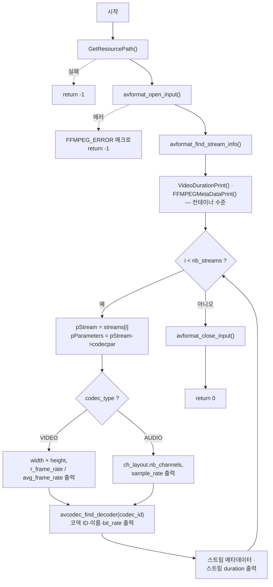

# 07. 스트림 순회와 디코더 탐색 — AVStream, AVCodecParameters

> 소스: `chapter01/07_video-stream/main.c` · 타겟: `chapter0107VideoStream` · [← 챕터 개요](README.md)

## 학습 목표

컨테이너 안의 개별 스트림(`AVStream`)을 순회하며 `AVCodecParameters->codec_type`으로 비디오/오디오를 분류한다. 비디오에서는 해상도와 프레임레이트를, 오디오에서는 채널 수와 샘플레이트를 읽고, `avcodec_find_decoder`로 각 스트림에 맞는 디코더를 찾는다. 챕터 1의 마무리로, 디코딩 직전까지의 모든 준비 단계를 완성한다.

## 핵심 개념

### 컨테이너 → 스트림 → 코덱 파라미터

`AVFormatContext->nb_streams`가 스트림 개수, `streams[i]`가 각 `AVStream`이다. 스트림의 코덱 정보는 `AVStream->codecpar`(`AVCodecParameters`)에 담겨 있으며, `codec_type` 필드로 매체 종류를 구분한다.

| codec_type | 의미 | 이 레슨에서 읽는 필드 |
|---|---|---|
| `AVMEDIA_TYPE_VIDEO` | 비디오 | `width`, `height`, (스트림의) `r_frame_rate`, `avg_frame_rate` |
| `AVMEDIA_TYPE_AUDIO` | 오디오 | `ch_layout.nb_channels`, `sample_rate` |

### 프레임레이트와 av_q2d

`AVStream->r_frame_rate`(실제/최소 공배수 기반 프레임레이트)와 `avg_frame_rate`(평균)는 `AVRational`(유리수)이다. `av_q2d()`가 `num / den`을 `double`로 바꿔 준다.

### 디코더 탐색 — avcodec_find_decoder

`AVCodecParameters->codec_id`(예: `AV_CODEC_ID_H264`)를 `avcodec_find_decoder`에 넘기면 해당 코덱의 디코더 구현(`const AVCodec *`)을 돌려준다. 빌드에 그 디코더가 없으면 `NULL`이 반환된다. 여기서 얻은 `AVCodec`이 다음 챕터에서 `AVCodecContext`를 만들어 실제 디코딩을 시작하는 출발점이 된다.

### 오디오 채널 레이아웃 — AVChannelLayout

FFmpeg 5.1부터 채널 정보는 `AVChannelLayout` 구조체로 통합됐다. `pParameters->ch_layout.nb_channels`로 채널 수를 읽는다(구 API의 `channels` 필드 대체).

## 프로그램 흐름



## 핵심 API

| API / 구조체 | 역할 |
|---|---|
| `AVFormatContext->nb_streams` / `streams[]` | 스트림 개수와 스트림 배열 |
| `AVStream` | 스트림 하나(비디오/오디오/자막 트랙) |
| `AVCodecParameters` (`codecpar`) | 스트림의 코덱 종류·해상도·샘플레이트 등 파라미터 |
| `AVMEDIA_TYPE_VIDEO` / `AVMEDIA_TYPE_AUDIO` | `codec_type` 판별 상수 |
| `av_q2d()` | `AVRational` → `double` 변환 (프레임레이트 계산) |
| `AVChannelLayout` (`ch_layout`) | 오디오 채널 구성 (채널 수 등) |
| `avcodec_find_decoder()` | `codec_id`에 해당하는 디코더(`const AVCodec *`) 탐색 |

## 이전 레슨과의 차이

- 06번까지는 컨테이너 **전체 수준**의 정보(메타데이터, duration)만 다뤘다. 이 레슨에서 처음으로 **스트림 단위**로 내려가 비디오/오디오를 구분하고 각 매체 고유의 속성을 읽는다.
- libavformat만 쓰던 흐름에 libavcodec의 API(`avcodec_find_decoder`)가 처음 합류한다.
- 06번의 헬퍼들이 이름을 바꿔 재사용된다: `PrintFFMPEGMetaData` → `FFMPEGMetaDataPrint`(스트림 메타데이터에도 사용), `PrintFormatDuration` → `VideoDurationPrint`. 에러 매크로도 `FFMPEG_CHECK_ERROR`(statement expression) 대신 `FFMPEG_ERROR`(일반 블록)로 바뀌었다.

## ⚠️ 알아두기

- **스트림 duration 출력이 잘못된 단위로 계산된다.** `VideoDurationPrint(pStream->duration)`은 `AV_TIME_BASE`(마이크로초)로 나누지만, `AVStream->duration`은 각 스트림의 `time_base` 단위다. 따라서 스트림별 duration 출력값은 실제 시간과 다르다(컨테이너 duration 출력은 올바름).
- **`avcodec_find_decoder` 결과를 NULL 검사 없이 역참조한다.** 지원하지 않는 코덱이면 `pCodec->id`에서 크래시한다.
- `avformat_find_stream_info`의 반환값을 검사하지 않는다.
- bit_rate 출력 단위가 `Hz`로 표기되어 있으나 비트레이트 단위는 bit/s다(표기 오류).

## 실행 방법

```bash
# 빌드
cmake --build cmake-build-debug --target chapter0107VideoStream

# 실행 — 빌드 디렉터리 안에서 실행해야 한다
cd cmake-build-debug/chapter01/07_video-stream
./chapter0107VideoStream
```

입력: `resources/murage.mp4`. 컨테이너 duration·메타데이터에 이어 스트림별로 `Found a Video Stream`(해상도, fps) / `Found an Audio Stream`(채널, 샘플레이트)과 코덱 정보가 출력된다.

---
→ 자세한 코드 해설: [코드 상세 해설](07-video-stream-deep-dive.md)
