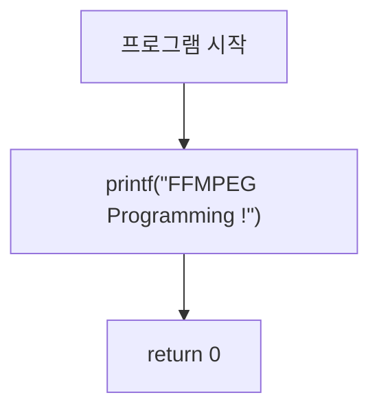

# 01. 프로젝트 셋업

> 소스: `chapter02/01-project-setting/main.c` · 타겟: `chapter0201ProjectSetting` · [← 챕터 개요](README.md)

## 학습 목표

chapter02 학습을 위한 CMake 프로젝트 골격을 만들고, FFmpeg과 stb 라이브러리가 정상적으로 링크되는지 확인한다. 이후 모든 레슨에서 공통으로 사용할 `GetResourcePath()` 헬퍼 함수의 동작 원리를 이해한다.

## 핵심 개념

### vcpkg 기반 라이브러리 연결

`find_package(FFMPEG REQUIRED)`와 `find_package(Stb REQUIRED)`로 vcpkg가 설치한 FFmpeg / stb를 찾고, `FFMPEG_INCLUDE_DIRS` / `FFMPEG_LIBRARIES` 변수를 타겟에 연결한다. main.c는 `libavformat`, `libavcodec`, `libswscale`, `libavutil`과 `stb_image.h` / `stb_image_write.h`를 모두 include 하여 헤더 경로가 올바른지 확인하는 역할을 한다.

### 리소스 경로 계산 (GetResourcePath)

실행 파일은 `cmake-build-debug/chapter02/<레슨>/` 아래에서 실행되므로, 현재 경로 문자열에서 `/cmake` 가 시작되는 위치를 찾아 그 앞부분(= 저장소 루트)을 잘라내고 `/resources/<파일명>` 을 붙여 리소스의 절대 경로를 만든다. Windows에서는 `GetCurrentDirectory()`, 그 외 플랫폼에서는 `realpath(".")`를 사용한다.

### 메모리 누수 검사 도구

소스 주석에 명시된 대로, Linux에서는 `valgrind <program>`, macOS에서는 `leaks --atExit -- <program>` 으로 메모리 누수를 확인한다. 이 도구들은 레슨 08(올바른 메모리 해제)에서 특히 유용하다.

## 프로그램 흐름



이 레슨의 `main()`은 문자열 한 줄만 출력한다. `GetResourcePath()`는 선언·정의만 되어 있고 아직 호출되지 않는다.

## 핵심 API

| API / 구조체 | 역할 |
|---|---|
| `find_package(FFMPEG)` | vcpkg로 설치된 FFmpeg 라이브러리 탐색 (CMake) |
| `find_package(Stb)` | stb 헤더 라이브러리 탐색 (CMake) |
| `GetResourcePath()` | 실행 경로에서 저장소 루트를 역산해 `resources/` 하위 파일의 절대 경로 생성 (사용자 정의 헬퍼) |
| `realpath()` / `GetCurrentDirectory()` | 플랫폼별 현재 작업 디렉터리 조회 |

## 이전 레슨과의 차이

chapter02의 첫 레슨이다. chapter01에서 만든 빌드 환경(vcpkg + CMake)을 그대로 이어받아, chapter02 전용 프로젝트 구조와 공통 헬퍼(`GetResourcePath`)의 기반을 마련한다.

## ⚠️ 알아두기

- **CMakeLists.txt의 타겟명 오타**: FFMPEG 블록이 include/link 설정을 이 레슨의 타겟이 아닌 `chapter0107VideoStream`(chapter01-07의 타겟)에 적용하고 있다. chapter01에서 복사해 오면서 수정하지 못한 부분으로, 이 레슨의 `main()`이 FFmpeg 함수를 실제로 호출하지 않아 문제가 드러나지 않을 뿐이다. 자세한 내용은 딥다이브 문서 참고.
- `GetResourcePath()`는 이 레슨에서는 정의만 있고 호출되지 않는다. 레슨 02부터 사용된다.

## 실행 방법

빌드:

```bash
cmake --build cmake-build-debug --target chapter0201ProjectSetting
```

실행 — `GetResourcePath()`가 현재 경로에서 `/cmake` 문자열을 찾는 구조이므로 이후 레슨과 동일하게 빌드 디렉터리 안에서 실행하는 습관을 들인다:

```bash
cd cmake-build-debug/chapter02/01-project-setting
./chapter0201ProjectSetting
```

이 레슨은 입력 파일을 사용하지 않는다. (레슨 02부터 **입력: `resources/out.mp4`** — murage.mp4가 아님)

---
→ 자세한 코드 해설: [코드 상세 해설](01-project-setting-deep-dive.md)
