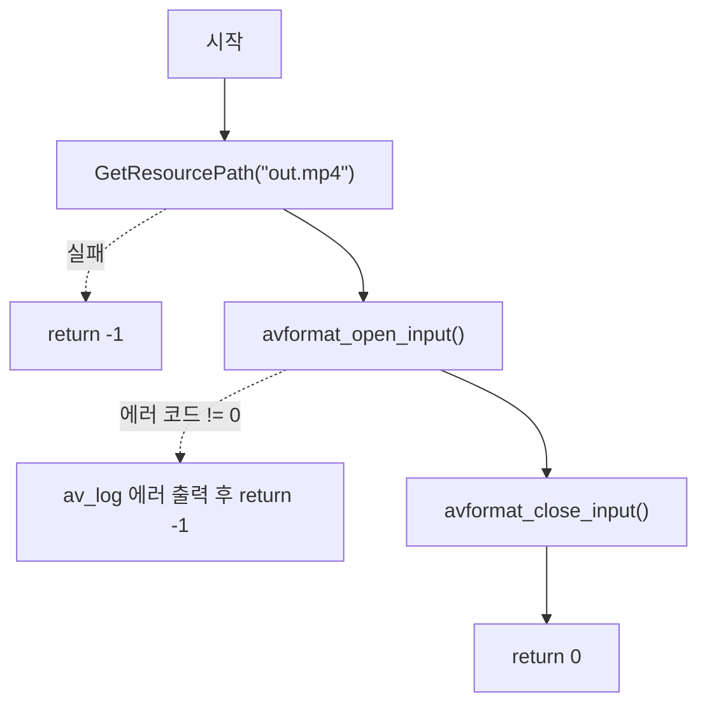

# 02. AVFormatContext로 미디어 파일 열기

> 소스: `chapter02/02-counting-data-streaming-using-AVFormatContext/main.c` · 타겟: `chapter0202CountingDataStreamUsingAVFormatContext` · [← 챕터 개요](README.md)

## 학습 목표

FFmpeg에서 미디어 파일(컨테이너)을 다루는 최상위 구조체인 `AVFormatContext`를 이해한다. `avformat_open_input()`으로 mp4 파일을 열고, 사용이 끝나면 `avformat_close_input()`으로 반드시 닫아 메모리 누수를 막는 열기/닫기 짝(pair) 패턴을 익힌다.

## 핵심 개념

### AVFormatContext

컨테이너(mp4, mkv, avi 등) 수준의 정보를 담는 구조체다. 파일 안에 어떤 스트림(비디오/오디오/자막)이 몇 개 들어 있는지, 재생 시간·포맷이 무엇인지 등 디먹싱(demuxing)의 출발점이 되는 모든 정보가 여기에 모인다. 소스 주석의 표현대로 "FFMPEG에서 데이터를 가져올 때 담아주는" 구조체다.

### avformat_open_input — 열기

`AVFormatContext **` 를 받아 파일 헤더를 읽고 컨텍스트를 할당·초기화한다. 포인터를 `NULL`로 초기화해 넘기면 함수 내부에서 할당해 준다. **성공 시 0**, 실패 시 음수 에러 코드를 반환한다.

### avformat_close_input — 닫기

열었던 컨텍스트를 해제하고 포인터를 다시 `NULL`로 만든다. `avformat_open_input()`과 항상 짝을 이뤄야 하며, 호출하지 않으면 메모리 누수가 발생한다.

### av_log — FFmpeg 로그 함수

`av_log(NULL, AV_LOG_ERROR, ...)` 형태로 FFmpeg의 로그 시스템에 메시지를 출력한다. printf 스타일 포맷을 지원하며, 로그 레벨(`AV_LOG_ERROR` 등)로 중요도를 구분한다.

## 프로그램 흐름



## 핵심 API

| API / 구조체 | 역할 |
|---|---|
| `AVFormatContext` | 컨테이너(포맷) 수준 정보를 담는 최상위 구조체 |
| `avformat_open_input()` | 미디어 파일을 열고 AVFormatContext 할당·초기화 (성공 시 0 반환) |
| `avformat_close_input()` | AVFormatContext 해제 및 포인터 NULL 초기화 |
| `av_log()` | FFmpeg 로그 시스템으로 메시지 출력 |

## 이전 레슨과의 차이

- 레슨 01에서 정의만 해 두었던 `GetResourcePath()`를 처음으로 실제 호출하여 `resources/out.mp4` 경로를 얻는다.
- FFmpeg API(`avformat_open_input` / `avformat_close_input` / `av_log`)를 처음으로 호출한다.
- CMakeLists.txt의 타겟명 오타(레슨 01 참고)가 수정되어 FFMPEG 설정이 올바른 타겟에 적용된다.

## ⚠️ 알아두기

- 디렉터리·타겟 이름은 "counting data stream"이지만, 이 레슨 코드는 스트림 개수를 세거나 출력하지 않는다. 파일을 열고 닫는 것까지만 하며, 실제 `nb_streams` 출력은 레슨 04에서 등장한다.

## 실행 방법

빌드:

```bash
cmake --build cmake-build-debug --target chapter0202CountingDataStreamUsingAVFormatContext
```

실행 — `GetResourcePath()`가 현재 경로의 `/cmake` 문자열을 기준으로 저장소 루트를 찾으므로 빌드 디렉터리 안에서 실행한다:

```bash
cd cmake-build-debug/chapter02/02-counting-data-streaming-using-AVFormatContext
./chapter0202CountingDataStreamUsingAVFormatContext
```

**입력: `resources/out.mp4`** (murage.mp4가 아님)

---
→ 자세한 코드 해설: [코드 상세 해설](02-counting-data-stream-deep-dive.md)
