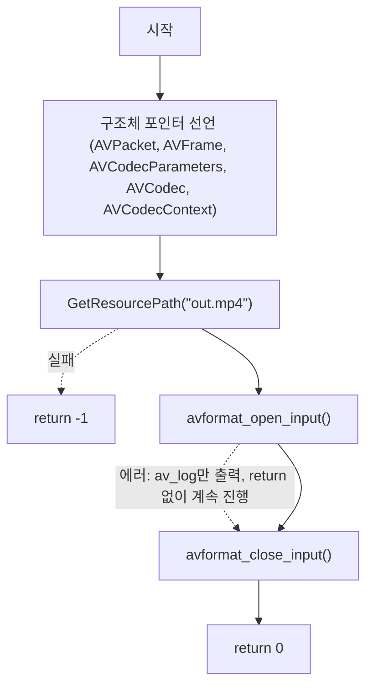

# 03. FFmpeg 핵심 데이터 구조체

> 소스: `chapter02/03-advanced-FFMPEG-data-structure/main.c` · 타겟: `chapter0203AdvancedFFMPEGDataStructure` · [← 챕터 개요](README.md)

## 학습 목표

디코딩 파이프라인에서 사용하는 FFmpeg의 핵심 구조체 5종(`AVPacket`, `AVFrame`, `AVCodecParameters`, `AVCodec`, `AVCodecContext`)의 역할을 이해한다. 아울러 에러 처리를 위한 `FFMPEG_ERROR` 매크로를 도입한다.

## 핵심 개념

### 디코딩 파이프라인의 구조체들

| 구조체 | 역할 (소스 주석 기준) |
|---|---|
| `AVPacket` | 원본(압축된) 데이터를 담는 구조체. 원본 데이터는 바이트 단위로 정의되어 있다 |
| `AVFrame` | 원본 오디오·비디오 데이터를 풀어 놓은(디코딩된) 데이터를 담는 구조체 |
| `AVCodecParameters` | 인코딩된 스트림에 대한 정보(코덱 ID, 해상도, 비트레이트 등)를 담는 구조체 |
| `AVCodec` | 코덱(인코더/디코더 구현체) 자체에 대한 정보를 담는 구조체 |
| `AVCodecContext` | 코덱 사용 시의 실제 실행 상태를 담는 구조체 |

데이터 흐름으로 보면 **컨테이너(AVFormatContext) → 압축 패킷(AVPacket) → 디코더(AVCodec + AVCodecContext) → 비압축 프레임(AVFrame)** 순서다. 이 레슨에서는 포인터 선언으로 등장만 시키고, 실제 사용은 레슨 04~06에서 단계적으로 이뤄진다.

### FFMPEG_ERROR 매크로

에러 코드가 음수이면 `av_log`로 메시지를 남기고 `return -1` 하는 매크로다. 반복되는 에러 처리 코드를 줄이려는 의도이나, 이 레슨을 포함해 chapter02 전반부에서는 정의만 되고 실제로 사용되지는 않는다.

## 프로그램 흐름



## 핵심 API

| API / 구조체 | 역할 |
|---|---|
| `AVPacket` | 디먹싱된 압축 데이터 단위 |
| `AVFrame` | 디코딩된 비압축 데이터 단위 |
| `AVCodecParameters` | 스트림의 코덱 파라미터(불변 정보) |
| `AVCodec` | 코덱 구현체 디스크립터 |
| `AVCodecContext` | 디코딩/인코딩 실행 컨텍스트 |
| `FFMPEG_ERROR` 매크로 | 음수 에러 코드 시 로그 출력 후 return -1 (이 레슨에서는 미사용) |

## 이전 레슨과의 차이

- 디코딩 파이프라인 구조체 5종의 포인터 선언이 추가되었다 (아직 할당·사용은 하지 않음).
- `FFMPEG_ERROR` 매크로가 처음 정의되었다.
- 비디오 스트림 인덱스를 담을 `videoStreamIdx` 변수가 `-1`로 초기화되어 등장한다.

## ⚠️ 알아두기

- **`avformat_open_input()` 실패 시 early return이 없다.** 레슨 02와 달리 에러 시 `av_log`만 출력하고 `return` 하지 않아, 흐름이 그대로 `avformat_close_input()`까지 진행된다. 열기 실패 시 포인터가 `NULL`로 남아 있어 이 코드에서는 실제 크래시가 나지 않지만, 이후 로직이 추가되면 NULL 역참조 위험이 있는 형태다. 상세는 딥다이브 참고.
- 선언된 구조체 포인터들과 `FFMPEG_ERROR` 매크로, `videoStreamIdx`는 모두 이 레슨에서는 사용되지 않는다 (개념 소개 목적).

## 실행 방법

빌드:

```bash
cmake --build cmake-build-debug --target chapter0203AdvancedFFMPEGDataStructure
```

실행:

```bash
cd cmake-build-debug/chapter02/03-advanced-FFMPEG-data-structure
./chapter0203AdvancedFFMPEGDataStructure
```

**입력: `resources/out.mp4`** (murage.mp4가 아님)

---
→ 자세한 코드 해설: [코드 상세 해설](03-advanced-data-structure-deep-dive.md)
