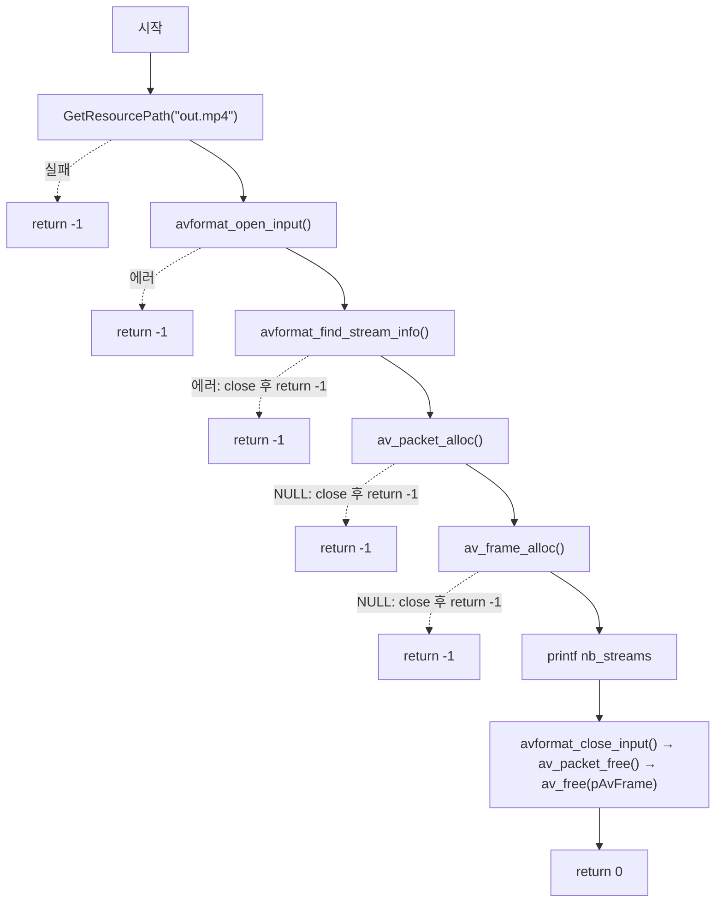

# 04. AVPacket / AVFrame 메모리 할당과 스트림 개수 확인

> 소스: `chapter02/04-allocated-memory-FFMPEG-video-data/main.c` · 타겟: `chapter0204AllocatedMemoryFFMPEG_VideoData` · [← 챕터 개요](README.md)

## 학습 목표

`av_packet_alloc()` / `av_frame_alloc()`으로 패킷과 프레임 구조체를 힙에 할당하고, 대응하는 해제 함수로 정리하는 방법을 배운다. 또한 `avformat_find_stream_info()`로 스트림 정보를 채운 뒤 `nb_streams`로 파일 안의 스트림 개수를 확인한다.

## 핵심 개념

### avformat_find_stream_info

`avformat_open_input()`이 헤더만 읽는 것과 달리, 이 함수는 파일 데이터를 일부 읽고 필요하면 디코딩까지 해 보면서 각 스트림의 상세 정보(코덱 파라미터, 프레임레이트 등)를 확정한다. 이후 스트림을 순회하며 코덱 정보를 읽는 작업(레슨 05)의 전제 조건이다.

### av_packet_alloc / av_frame_alloc

구조체를 힙에 할당하고 모든 필드를 기본값으로 초기화해 반환한다. 소스 주석의 표현대로 "기본 필드 값을 가져와서 메모리에 올려주기 때문에" 이후 필드 접근 시 안전한 기본값을 보게 된다. 이 시점에는 구조체 껍데기만 할당되며, 실제 미디어 데이터 버퍼는 나중에 `av_read_frame()`(패킷)이나 디코더(프레임)가 채운다.

### 할당과 해제의 짝

| 할당 | 해제 |
|---|---|
| `avformat_open_input()` | `avformat_close_input()` |
| `av_packet_alloc()` | `av_packet_free()` |
| `av_frame_alloc()` | `av_frame_free()` |

FFmpeg의 모든 `*_alloc()`류 함수는 대응하는 `*_free()`류 함수와 짝을 이룬다. 이 레슨의 코드는 프레임 해제에 `av_free()`를 사용하는데, 이는 특이점이다 (아래 참고).

## 프로그램 흐름



## 핵심 API

| API / 구조체 | 역할 |
|---|---|
| `avformat_find_stream_info()` | 스트림 상세 정보 확정 (성공 시 0 이상 반환) |
| `av_packet_alloc()` | AVPacket 할당 + 기본값 초기화 |
| `av_frame_alloc()` | AVFrame 할당 + 기본값 초기화 |
| `AVFormatContext.nb_streams` | 파일 내 스트림 개수 |
| `av_packet_free()` | AVPacket 해제 (참조 해제 포함) |
| `av_frame_free()` | AVFrame 해제 — 이 코드에서는 주석 처리되고 `av_free()` 사용 |

## 이전 레슨과의 차이

- `avformat_open_input()` 실패 시 early return이 다시 들어갔다 (레슨 03의 특이점 해소).
- `avformat_find_stream_info()` 호출이 추가되었다.
- 레슨 03에서 선언만 했던 `AVPacket` / `AVFrame`을 실제로 할당·해제한다.
- `nb_streams` 출력이 추가되어 디렉터리 이름(레슨 02)의 "counting data stream"이 실제로 구현되었다.

## ⚠️ 알아두기

- `avformat_find_stream_info()`의 반환값을 `!= 0`으로 검사한다. 이 함수는 성공 시 0 이상(양수 가능)을 반환하므로 양수 반환이 에러로 처리될 수 있다. 레슨 05부터는 `< 0`으로 수정된다.
- 프레임 해제에 `av_frame_free(&pAvFrame)` 대신 `av_free(pAvFrame)`을 사용한다 (`av_frame_free` 호출은 주석 처리). 상세는 딥다이브 참고.
- `av_frame_alloc()` 실패 경로에서 이미 할당된 `pAvPacket`을 해제하지 않는다.

## 실행 방법

빌드:

```bash
cmake --build cmake-build-debug --target chapter0204AllocatedMemoryFFMPEG_VideoData
```

실행:

```bash
cd cmake-build-debug/chapter02/04-allocated-memory-FFMPEG-video-data
./chapter0204AllocatedMemoryFFMPEG_VideoData
```

**입력: `resources/out.mp4`** (murage.mp4가 아님) — out.mp4는 비디오+오디오 스트림을 포함하므로 `number of stream : 2`가 출력된다.

---
→ 자세한 코드 해설: [코드 상세 해설](04-allocated-memory-deep-dive.md)
