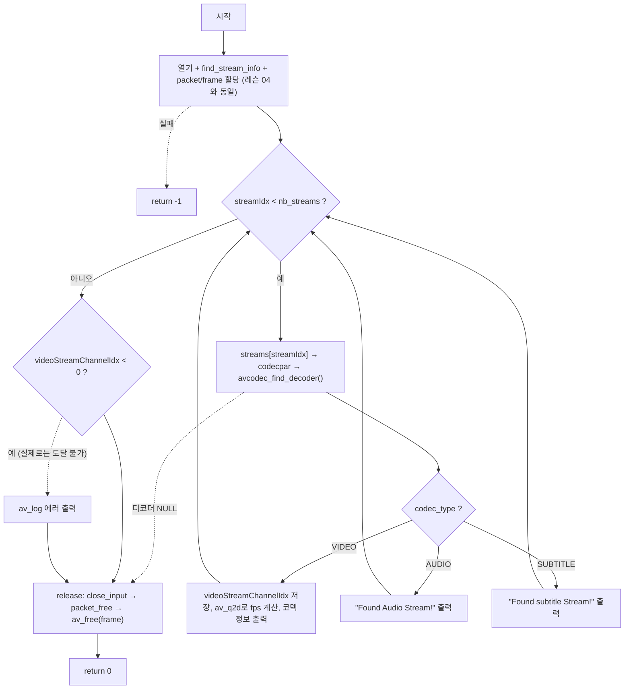

# 05. 비디오 스트림 찾기

> 소스: `chapter02/05-find-video-stream/main.c` · 타겟: `chapter0205FindVideoStream` · [← 챕터 개요](README.md)

## 학습 목표

`AVFormatContext.streams[]`를 순회하며 각 스트림의 `codecpar`(코덱 파라미터)를 읽고, `avcodec_find_decoder()`로 디코더를 찾은 뒤 `codec_type`으로 비디오/오디오/자막 스트림을 구분한다. 비디오 스트림에서는 코덱 이름, 비트레이트, 해상도, 프레임레이트를 출력한다.

## 핵심 개념

### 스트림 순회 패턴

```
for (streamIdx = 0; streamIdx < nb_streams; streamIdx++)
    stream  = pAvFormatContext->streams[streamIdx]
    par     = stream->codecpar
    decoder = avcodec_find_decoder(par->codec_id)
    if (par->codec_type == AVMEDIA_TYPE_VIDEO) ...
```

FFmpeg 디먹싱 코드의 가장 기본이 되는 관용구다. 스트림 → 코덱 파라미터 → 디코더 순으로 정보를 좁혀 가며, 찾은 비디오 스트림의 인덱스는 이후 패킷 분류(레슨 06)의 기준이 된다.

### codec_type과 미디어 타입

`AVCodecParameters.codec_type`은 `AVMEDIA_TYPE_VIDEO`, `AVMEDIA_TYPE_AUDIO`, `AVMEDIA_TYPE_SUBTITLE` 등의 열거값으로 스트림 종류를 알려준다. `codec_id`는 h264, aac처럼 구체적인 코덱을 가리키며, `avcodec_find_decoder(codec_id)`가 해당 코덱의 디코더 디스크립터(`AVCodec *`)를 돌려준다 (없으면 `NULL`).

### AVRational과 av_q2d

FFmpeg은 프레임레이트·타임베이스 같은 비율 값을 부동소수점 오차 없이 다루기 위해 분수 구조체 `AVRational`(num/den)로 표현한다. `av_q2d()`는 이를 `double`로 변환한다. 스트림에는 실제 프레임레이트인 `r_frame_rate`와 평균 프레임레이트인 `avg_frame_rate`가 있다.

## 프로그램 흐름



## 핵심 API

| API / 구조체 | 역할 |
|---|---|
| `AVFormatContext.streams[]` | 스트림 배열 (`AVStream *`) |
| `AVStream.codecpar` | 스트림의 코덱 파라미터 (`AVCodecParameters *`) |
| `avcodec_find_decoder()` | codec_id에 해당하는 디코더 검색 (없으면 NULL) |
| `AVCodecParameters.codec_type` | 미디어 타입 판별 (VIDEO / AUDIO / SUBTITLE) |
| `AVRational` | 분수(num/den) 표현 구조체 |
| `av_q2d()` | AVRational → double 변환 |
| `AVStream.r_frame_rate` | 실제 프레임레이트 (`avg_frame_rate`는 평균값) |

## 이전 레슨과의 차이

- 스트림 순회 루프와 타입별 분기(비디오/오디오/자막)가 추가되었다.
- 비디오 스트림의 코덱 ID·이름·비트레이트·해상도·프레임레이트 출력이 추가되었다.
- `avformat_find_stream_info()` 반환값 검사가 `!= 0`에서 `< 0`으로 수정되었다 (레슨 04의 특이점 해소).
- 에러 시 자원 해제 지점으로 건너뛰는 `goto release` 패턴이 도입되었다.

## ⚠️ 알아두기

- **`av_q2d(pCurrentStream[streamIdx].r_frame_rate)`는 포인터 인덱싱 버그다.** `pCurrentStream`은 이미 해당 스트림을 가리키는 포인터이므로 `[streamIdx]`를 다시 붙이면 `streamIdx > 0`일 때 범위 밖 메모리를 읽는다. out.mp4는 비디오가 스트림 0이라 우연히 정상 동작한다. 상세는 딥다이브 참고.
- `videoStreamChannelIdx`가 `-1`이 아닌 `0`으로 초기화되어, 루프 뒤의 `videoStreamChannelIdx < 0`(비디오 스트림 미발견) 검사는 절대 참이 될 수 없는 죽은 코드다.
- 프레임 해제는 여전히 `av_free(pAvFrame)`를 사용한다 (레슨 04 참고).

## 실행 방법

빌드:

```bash
cmake --build cmake-build-debug --target chapter0205FindVideoStream
```

실행:

```bash
cd cmake-build-debug/chapter02/05-find-video-stream
./chapter0205FindVideoStream
```

**입력: `resources/out.mp4`** (murage.mp4가 아님) — 스트림 0(h264 비디오), 스트림 1(aac 오디오)이 차례로 감지된다.

---
→ 자세한 코드 해설: [코드 상세 해설](05-find-video-stream-deep-dive.md)
