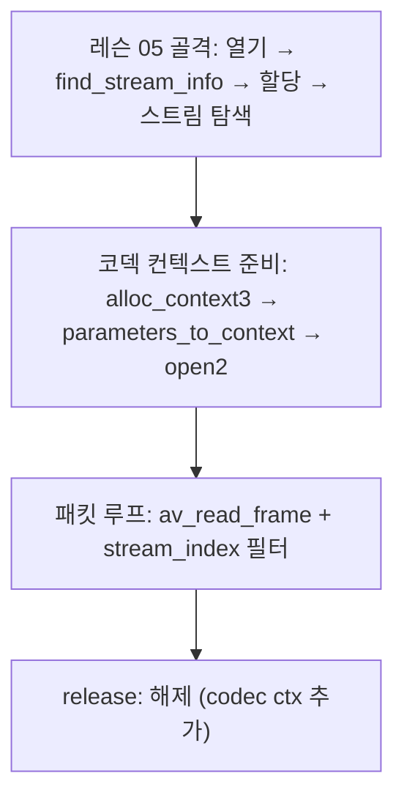

# 06. 비디오 패킷 추출 — 코드 상세 해설

> [← 기본 문서](06-extracting-video-packets.md)

## 전체 구조

레슨 05의 코드에 "코덱 컨텍스트 준비"와 "패킷 읽기 루프" 두 블록이 추가된 형태다.



`GetResourcePath()`와 스트림 탐색 루프는 레슨 05와 동일하므로 설명을 생략한다.

## 코드 블록별 해설

### 코덱 컨텍스트 할당

```c
    /** Video Code에 대해한 값을 가지고 해당 정보를 메모리에 불러온다. -> 메모리에 올리는 데이터는 pVideoCodecContext 이다. */
    /** 메모리에 가져오는 방식은 해당 정보를 메모리에 복사를 해서 가져오는 방식이다. */
    pVideoCodecContext = avcodec_alloc_context3(pVideoCode);
    if (pVideoCodecContext == NULL) {
        av_log(NULL, AV_LOG_ERROR, "Get Video Codec Context Failed..\r\n");
    }
```

`avcodec_alloc_context3()`에 코덱을 넘기면 그 코덱의 기본 설정(`defaults`)이 적용된 컨텍스트가 만들어진다. 스트림 탐색에서 저장해 둔 `pVideoCode`(h264 디코더)가 여기서 쓰인다. 실패 시 로그만 남기고 계속 진행하는 점은 특이점이다 (아래 참고).

### 파라미터 복사와 코덱 열기

```c
    /** CodecParameters 에 있는 정보를 CodecContext에 복사를 하는 함수 */
    errorCode = avcodec_parameters_to_context(pVideoCodecContext, pVideoCodecParameters);
    if (errorCode < 0) {
        av_log(NULL, AV_LOG_ERROR, "[ERROR CODE (%d)]Failed Copy Codec Parameter to CodecContext\r\n", errorCode);
    }

    /** Codec에 대해서 열기 */
    errorCode = avcodec_open2(pVideoCodecContext, pVideoCode, NULL);
    if (errorCode < 0) {
        av_log(NULL, AV_LOG_ERROR, "[ERROR CODE (%d)] Codec Open Failed...\r\n", errorCode);
    }
```

`avcodec_parameters_to_context()`가 해상도, 픽셀 포맷, extradata(SPS/PPS 등 디코더 초기화 데이터)를 컨텍스트에 복사한다. 이 복사 없이 `avcodec_open2()`를 호출하면 h264 같은 코덱은 초기화에 실패하거나 첫 패킷을 디코딩하지 못한다. `avcodec_open2()`의 세 번째 인자(`AVDictionary **options`)는 `NULL`로 기본 옵션을 사용한다. 열기까지 성공하면 컨텍스트는 `avcodec_send_packet()`을 받을 수 있는 상태가 된다.

### 패킷 읽기 루프

```c
    /** Frame 읽어오기 */
    while (av_read_frame(pAvFormatContext, pAvPacket) >= 0) {
        if (pAvPacket->stream_index == videoStreamChannelIdx) {
            printf("Found a Video packet\r\n");
            /** Decode Frame */
//            errorCode = avcodec_send_packet(pVideoCodecContext, pAvPacket);
        }
    }
```

`av_read_frame()`은 성공 시 0 이상을 반환하고 패킷을 채우며, 파일 끝에 도달하면 `AVERROR_EOF`(음수)를 반환해 루프가 끝난다. 비디오 패킷 판별은 `stream_index` 비교 한 줄이면 충분하다. 주석 처리된 `avcodec_send_packet()`은 다음 단계(레슨 09, 디코딩)를 예고한다.

### 해제부

```c
    release:
    if (pVideoCodecContext != NULL)
        avcodec_free_context(&pVideoCodecContext);
    avformat_close_input(&pAvFormatContext);
    av_packet_free(&pAvPacket);
//    av_frame_free(&pAvFrame);
    av_free(pAvFrame);
    return 0;
```

새로 생긴 자원인 코덱 컨텍스트가 해제 목록의 맨 앞에 추가되었다. `goto release`가 코덱 컨텍스트 생성 이전(스트림 탐색 중 디코더 미발견)에도 뛰어올 수 있으므로 `NULL` 검사를 둔 것이다.

## 심화

### 디먹싱과 패킷 인터리빙

mp4 컨테이너 안에서 비디오/오디오 패킷은 시간순으로 섞여(interleaved) 저장된다. 재생 시 비디오와 오디오가 함께 버퍼링되도록 하기 위한 배치다. `av_read_frame()`은 이 인터리브 순서대로 패킷을 돌려주므로, 호출자는 `stream_index`로 각 패킷을 담당 디코더에 분배해야 한다. 이 "분배기" 역할이 바로 디먹서(demuxer) 위에 얹는 애플리케이션 코드의 몫이며, 이 레슨의 while 루프가 그 최소 형태다.

### AVPacket의 수명과 av_read_frame

`av_read_frame()`이 채워 주는 패킷 데이터는 참조 카운팅되는 버퍼(`AVBufferRef`)다. 문서 규약상 **반환된 패킷은 더 이상 필요 없을 때 호출자가 `av_packet_unref()`로 참조를 놓아야 한다.** 이 레슨처럼 unref 없이 같은 `AVPacket`으로 계속 `av_read_frame()`을 호출하는 것은 규약 위반이며, 이전 패킷 버퍼의 참조가 제때 정리되지 않는다. 올바른 루프 형태는 레슨 08에서 완성된다.

### send_packet / receive_frame 모델 예고

주석 처리된 `avcodec_send_packet()`은 FFmpeg 3.1+의 비동기식 디코딩 API의 입구다. 패킷을 넣는 함수(`send_packet`)와 프레임을 꺼내는 함수(`receive_frame`)가 분리되어, 패킷 1개가 프레임 0개(참조 프레임 대기)나 여러 개(오디오 등)로 풀리는 비대칭 상황을 자연스럽게 다룬다. 레슨 09에서 본격적으로 사용한다.

## ⚠️ 코드 특이점 상세

### 코덱 컨텍스트 3단계의 에러 처리가 로그뿐

`avcodec_alloc_context3()`가 `NULL`을 반환해도, `avcodec_parameters_to_context()` / `avcodec_open2()`가 음수를 반환해도 로그만 남기고 다음 단계로 진행한다. 할당 실패 시 `avcodec_parameters_to_context(NULL, ...)`를 호출하는 셈이 되어 크래시로 이어질 수 있다. 올바른 형태는 각 단계 실패 시 `goto release`다 — 레슨 07에서 오디오 쪽 3단계에는 실제로 `goto release`가 들어간다.

### 루프에서 av_packet_unref 누락

위 심화 절 참고. `av_read_frame()`으로 받은 패킷을 unref하지 않고 재사용한다. 이 레슨에서는 패킷을 소비(디코딩)하지 않으므로 눈에 띄는 문제 없이 돌지만, API 규약 위반이며 레슨 08(`av_packet_unref` 도입)이 이를 바로잡는다.

### 비디오 스트림이 없을 때의 위험

`videoStreamChannelIdx`가 0으로 초기화되어 미발견 검사가 동작하지 않으므로(레슨 05 참고), 비디오 스트림이 없는 파일을 열면 `pVideoCode == NULL`, `pVideoCodecParameters == NULL` 상태로 코덱 컨텍스트 준비 코드에 진입한다. `avcodec_parameters_to_context(ctx, NULL)`는 NULL 역참조다. out.mp4에는 비디오가 있어 실행상 문제가 드러나지 않는다.

### 레슨 05에서 상속된 특이점

`pCurrentStream[streamIdx].r_frame_rate` 인덱싱 버그와 `av_free(pAvFrame)` 해제는 이 레슨에도 그대로 남아 있다 (레슨 05 딥다이브 참고).
