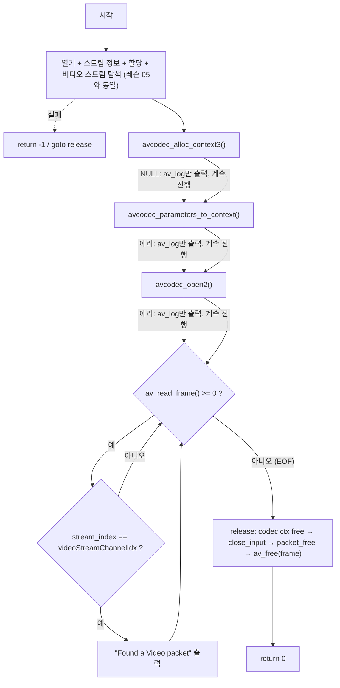

# 06. 비디오 패킷 추출

> 소스: `chapter02/06-extracting-individual-video-packets/main.c` · 타겟: `chapter0206ExtractingIndividualVideoPacket` · [← 챕터 개요](README.md)

## 학습 목표

`avcodec_alloc_context3()` → `avcodec_parameters_to_context()` → `avcodec_open2()`의 3단계로 디코더 컨텍스트를 준비하는 절차를 배운다. 이어서 `av_read_frame()` 루프로 컨테이너에서 패킷을 하나씩 꺼내고, `stream_index`로 비디오 패킷만 골라내는 디먹싱의 기본형을 익힌다.

## 핵심 개념

### 코덱 컨텍스트 준비 3단계

| 단계 | 함수 | 하는 일 |
|---|---|---|
| 1. 할당 | `avcodec_alloc_context3(pVideoCode)` | 코덱에 맞는 컨텍스트를 힙에 할당하고 기본값 설정 |
| 2. 파라미터 복사 | `avcodec_parameters_to_context(ctx, par)` | 스트림의 `codecpar` 정보를 컨텍스트로 복사 |
| 3. 열기 | `avcodec_open2(ctx, codec, NULL)` | 디코더를 초기화하여 실제 디코딩 가능 상태로 만듦 |

스트림이 가진 정보(`AVCodecParameters`)는 읽기 전용 스냅샷이므로, 디코딩하려면 이를 실행 상태 구조체(`AVCodecContext`)에 복사하고 열어야 한다.

### av_read_frame 루프 — 디먹싱

`av_read_frame()`은 컨테이너에서 다음 패킷 하나를 읽어 `pAvPacket`에 채운다. 0 이상 반환 시 성공, 음수(EOF 포함) 반환 시 루프를 끝낸다. 패킷의 `stream_index` 필드가 어느 스트림의 데이터인지 알려주므로, 레슨 05에서 저장한 `videoStreamChannelIdx`와 비교해 비디오 패킷만 골라낸다. 이렇게 컨테이너에 인터리브된 여러 스트림의 패킷을 분리해 내는 과정이 디먹싱(demuxing)이다.

## 프로그램 흐름



## 핵심 API

| API / 구조체 | 역할 |
|---|---|
| `avcodec_alloc_context3()` | AVCodecContext 할당 (인자로 준 코덱의 기본값 적용) |
| `avcodec_parameters_to_context()` | AVCodecParameters → AVCodecContext 복사 |
| `avcodec_open2()` | 코덱 초기화(열기) — 이후 디코딩 가능 |
| `av_read_frame()` | 컨테이너에서 다음 패킷 읽기 (0 이상 = 성공) |
| `AVPacket.stream_index` | 패킷이 속한 스트림의 인덱스 |
| `avcodec_free_context()` | AVCodecContext 해제 |

## 이전 레슨과의 차이

- 코덱 컨텍스트 3단계 준비(`avcodec_alloc_context3` / `avcodec_parameters_to_context` / `avcodec_open2`)가 추가되었다.
- `av_read_frame()` 패킷 읽기 루프와 `stream_index` 필터링이 추가되었다.
- `release:` 해제부에 `avcodec_free_context(&pVideoCodecContext)`가 추가되었다 (NULL 검사 포함).

## ⚠️ 알아두기

- 코덱 컨텍스트 3단계의 에러 처리가 모두 `av_log` 출력뿐이며 return/goto가 없어, 실패해도 다음 단계로 계속 진행한다.
- 패킷 루프에서 `av_packet_unref()`를 호출하지 않아 매 반복마다 이전 패킷의 참조가 정리되지 않는다. 이 문제는 레슨 08에서 해결된다.
- `avcodec_send_packet()` 호출이 주석 처리되어 있다 — 실제 디코딩은 레슨 09의 주제다.
- 레슨 05의 특이점(`pCurrentStream[streamIdx]` 인덱싱, `videoStreamChannelIdx` 초기값 0, `av_free(pAvFrame)`)이 그대로 남아 있다.

## 실행 방법

빌드:

```bash
cmake --build cmake-build-debug --target chapter0206ExtractingIndividualVideoPacket
```

실행:

```bash
cd cmake-build-debug/chapter02/06-extracting-individual-video-packets
./chapter0206ExtractingIndividualVideoPacket
```

**입력: `resources/out.mp4`** (murage.mp4가 아님) — 파일 끝까지 읽으며 비디오 패킷마다 `Found a Video packet`을 출력한다.

---
→ 자세한 코드 해설: [코드 상세 해설](06-extracting-video-packets-deep-dive.md)
