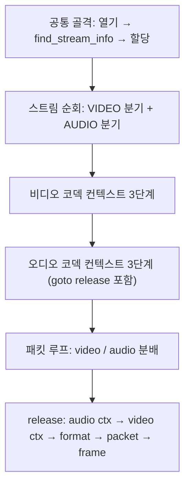

# 07. 오디오 스트림 찾기와 오디오 패킷 추출 — 코드 상세 해설

> [← 기본 문서](07-find-audio-stream.md)

## 전체 구조

레슨 06의 비디오 전용 코드에 오디오 처리를 대칭으로 추가한 형태다.



`GetResourcePath()`와 레슨 06까지의 공통 부분 설명은 생략한다.

## 코드 블록별 해설

### 오디오용 변수 세트

```c
    /** 오디오에 대한 Codec과 오디오 채널 아이디 */
    AVCodecParameters *pAudioCodecParameter = NULL;
    AVCodec *pAudioCodec = NULL;
    AVCodecContext *pAudioCodecContext = NULL;
    int audioStreamChannelIdx = 0;
```

비디오용 세트와 1:1 대칭이다. `audioStreamChannelIdx`도 비디오와 마찬가지로 `0`으로 초기화된다 (미발견 검사가 무력화되는 원인 — 특이점 참고).

### 스트림 탐색의 오디오 분기

```c
            /** codec 에 대한 정보가 오디오 일 경우 */
        else if (pCurrentCodecParameter->codec_type == AVMEDIA_TYPE_AUDIO) {
            printf("Found Audio Stream!\r\n");
            /** audio codec channel save */
            audioStreamChannelIdx = streamIdx;
            pAudioCodec = pCurrentCodec;
            pAudioCodecParameter = pCurrentStream->codecpar;
            /** Audio에 대한 정보 출력 */
            printf("ID : %d\r\nCodec : %s, BitRate : %lld\r\nChannel : %d, SampleRate : %d\r\n",
                   pCurrentCodecParameter->codec_id, pCurrentCodec->name, pCurrentCodecParameter->bit_rate,
                   audioStreamChannelIdx,
                   pCurrentCodecParameter->sample_rate
            );
        }
```

레슨 05~06에서 메시지만 출력하던 자리에 실제 저장 로직이 들어갔다. 비디오 분기와 같은 구조로 인덱스·디코더·파라미터를 보존하고, 오디오 고유 정보인 `sample_rate`를 출력한다. `Channel :` 라벨에 스트림 인덱스를 출력하는 점은 특이점이다 (아래 참고).

### 오디오 코덱 컨텍스트 3단계 — goto release 도입

```c
    /** Audio 에 대한 Conext를 가져오는 함수 */
    pAudioCodecContext = avcodec_alloc_context3(pAudioCodec);
    if (pAudioCodecContext == NULL) {
        av_log(NULL, AV_LOG_ERROR, "Failed Load Audio Context...\r\n");
        goto release;
    }

    /** Codec 에 대한 Parameter 가져오기 */
    errorCode = avcodec_parameters_to_context(pAudioCodecContext, pAudioCodecParameter);
    if (errorCode < 0) {
        av_log(NULL, AV_LOG_ERROR, "Failed Load Audio Codec parameters...\r\n");
        goto release;
    }

    /** Audio codec 에 대해서 가져오기 */
    errorCode = avcodec_open2(pAudioCodecContext, pAudioCodec, NULL);
    if (errorCode < 0) {
        av_log(NULL, AV_LOG_ERROR, "Failed Load Audio Codec...\r\n");
        goto release;
    }
```

비디오 쪽 3단계(레슨 06과 동일하게 로그만 남기고 진행)와 달리, 오디오 쪽은 각 단계 실패 시 `goto release`로 해제 지점에 합류한다. 같은 파일 안에 두 가지 에러 처리 스타일이 공존하는 셈인데, 오디오 쪽이 올바른 패턴이다.

### 패킷 분배 루프

```c
    while (av_read_frame(pAvFormatContext, pAvPacket) >= 0) {
        /** Video Frame 읽어오기 */
        if (pAvPacket->stream_index == videoStreamChannelIdx) {
            printf("Found a Video packet\r\n");
            /** Decode Frame */
//            errorCode = avcodec_send_packet(pVideoCodecContext, pAvPacket);
        }
            /** Audio 정보를 읽어오기 */
        else if (pAvPacket->stream_index == audioStreamChannelIdx) {
            printf("Found a Audio packet\r\n");
        }
    }

    printf("Read Done\r\n");
```

디먹서가 인터리브 순서대로 내주는 패킷을 `stream_index`로 두 갈래로 분배한다. 실제 재생기라면 각 분기에서 해당 디코더의 `avcodec_send_packet()`을 호출하게 된다. 여전히 `av_packet_unref()`가 없다는 점에 유의한다.

### 해제부 — av_frame_free로 교체

```c
    release:
    if (pAudioCodecContext != NULL)
        avcodec_free_context(&pAudioCodecContext);

    if (pVideoCodecContext != NULL)
        avcodec_free_context(&pVideoCodecContext);
    avformat_close_input(&pAvFormatContext);
    av_packet_free(&pAvPacket);
    av_frame_free(&pAvFrame);
//    av_free(pAvFrame);
    return 0;
```

두 가지가 바뀌었다. 첫째, 오디오 컨텍스트 해제가 목록 맨 앞에 추가되었다. 둘째, 레슨 04~06에서 쓰던 `av_free(pAvFrame)`가 주석으로 내려가고 정식 해제 함수 `av_frame_free(&pAvFrame)`가 활성화되었다.

## 심화

### 오디오 패킷과 비디오 패킷의 차이

- **비디오 패킷**: 보통 압축된 프레임 1개. 키프레임(I) 여부가 `AV_PKT_FLAG_KEY`로 표시되고, 크기 편차가 크다 (키프레임 >> P/B 프레임).
- **오디오 패킷(aac)**: 고정 길이 샘플 블록(aac는 프레임당 1024샘플)을 담아 크기가 비교적 균일하고, 시간당 패킷 수가 비디오보다 많다. 48kHz라면 초당 약 46.9개.

out.mp4 재생 위치 기준으로 비디오·오디오 패킷이 섞여 출력되는 것은 mp4 먹서가 두 스트림을 시간순으로 인터리브해 두었기 때문이다.

### 채널 수는 어디서 읽나

오디오의 실제 채널 수는 `AVCodecParameters`의 채널 레이아웃 정보에서 읽는다. FFmpeg 5.1+에서는 `codecpar->ch_layout.nb_channels`, 그 이전 버전에서는 `codecpar->channels`다. 이 레슨 코드가 출력하는 값은 이것이 아니라 스트림 인덱스다 (아래 특이점).

## ⚠️ 코드 특이점 상세

### "Channel" 라벨에 스트림 인덱스 출력

```c
            printf("ID : %d\r\nCodec : %s, BitRate : %lld\r\nChannel : %d, SampleRate : %d\r\n",
                   pCurrentCodecParameter->codec_id, pCurrentCodec->name, pCurrentCodecParameter->bit_rate,
                   audioStreamChannelIdx,
                   pCurrentCodecParameter->sample_rate
            );
```

`Channel : %d`에 대응하는 인자가 `audioStreamChannelIdx`(방금 저장한 스트림 인덱스)다. out.mp4에서는 오디오가 스트림 1이므로 `Channel : 1`이 출력되어 마치 1채널(모노)처럼 읽히지만 실제 채널 수와는 무관하다. 올바른 형태는 `pCurrentCodecParameter->ch_layout.nb_channels`(FFmpeg 5.1+) 또는 `pCurrentCodecParameter->channels`(구버전)를 출력하는 것이다.

### videoStreamChannelIdx < 0 경로가 return -1 — 자원 누수 경로

```c
    /** not found video stream error */
    if (videoStreamChannelIdx < 0) {
        av_log(NULL, AV_LOG_ERROR, "Video Stream Found Failed...\r\n");
        return -1;
    }
```

레슨 06에는 없던 `return -1`이 추가되었는데, `goto release`가 아니어서 이 경로로 나가면 `pAvFormatContext`, `pAvPacket`, `pAvFrame`이 해제되지 않는다. 다만 초기값이 0이라 이 분기 자체가 도달 불가능한 죽은 코드다 (레슨 05 특이점 참고). `audioStreamChannelIdx < 0` 검사도 마찬가지로 죽은 코드이며, 이쪽은 참이 되더라도 로그만 남기고 계속 진행하는 형태다.

### 상속된 특이점

- 패킷 루프의 `av_packet_unref()` 누락 (레슨 08에서 해결).
- `pCurrentStream[streamIdx].r_frame_rate` 인덱싱 버그 (레슨 05 딥다이브 참고).
- 비디오 코덱 컨텍스트 3단계는 여전히 로그만 남기고 진행 (오디오 쪽과 비대칭).
- `avcodec_send_packet()` 주석 처리 (디코딩은 레슨 09).
