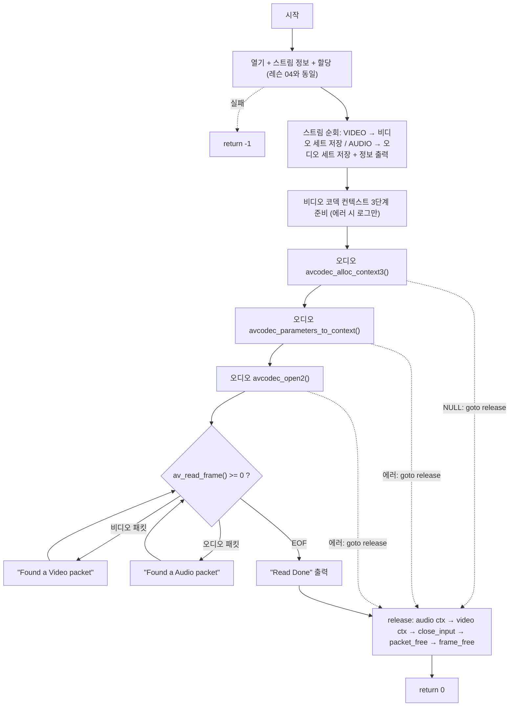

# 07. 오디오 스트림 찾기와 오디오 패킷 추출

> 소스: `chapter02/07-find-audio-stream-and-extracting-audio-packets/main.c` · 타겟: `chapter0207FindAudioStreamAndExtractingAudioPackets` · [← 챕터 개요](README.md)

## 학습 목표

비디오에 사용한 것과 동일한 패턴(스트림 탐색 → 코덱 컨텍스트 3단계 준비 → 패킷 필터링)을 오디오 스트림에도 적용한다. 하나의 파일에서 두 개의 코덱 컨텍스트(비디오 h264, 오디오 aac)를 동시에 관리하는 구조를 익힌다.

## 핵심 개념

### 스트림별 독립 코덱 컨텍스트

디코더는 스트림 단위로 필요하다. 비디오용 변수 세트(`pVideoCodecParameters` / `pVideoCode` / `pVideoCodecContext` / `videoStreamChannelIdx`)와 대칭으로 오디오용 세트(`pAudioCodecParameter` / `pAudioCodec` / `pAudioCodecContext` / `audioStreamChannelIdx`)를 선언하고, 스트림 탐색 루프의 `AVMEDIA_TYPE_AUDIO` 분기에서 채운다.

### 오디오 코덱 파라미터

오디오 스트림에서는 해상도 대신 `sample_rate`(초당 샘플 수) 같은 오디오 고유 파라미터를 읽는다. 코덱 컨텍스트 준비 절차는 비디오와 완전히 동일하다: `avcodec_alloc_context3()` → `avcodec_parameters_to_context()` → `avcodec_open2()`.

### 패킷 분배 확장

`av_read_frame()` 루프의 분기가 둘로 늘었다. `stream_index`가 `videoStreamChannelIdx`면 비디오 패킷, `audioStreamChannelIdx`면 오디오 패킷이다. 인터리브된 컨테이너에서 두 종류의 패킷이 섞여 나오는 것을 직접 확인할 수 있다.

## 프로그램 흐름



## 핵심 API

| API / 구조체 | 역할 |
|---|---|
| `AVMEDIA_TYPE_AUDIO` | 스트림 탐색 루프의 오디오 분기 판별 |
| `AVCodecParameters.sample_rate` | 오디오 샘플레이트 |
| `avcodec_alloc_context3()` 외 3단계 | 오디오 디코더 컨텍스트 준비 (비디오와 동일 절차) |
| `AVPacket.stream_index` | 비디오/오디오 패킷 분배 기준 |
| `av_frame_free()` | AVFrame 정식 해제 — 이 레슨부터 사용 |

## 이전 레슨과의 차이

- 오디오용 변수 세트와 스트림 탐색의 오디오 분기 처리(인덱스·코덱·파라미터 저장, 정보 출력)가 추가되었다.
- 오디오 코덱 컨텍스트 3단계 준비가 추가되었으며, 비디오 쪽과 달리 각 단계 실패 시 `goto release`로 빠진다 (레슨 06 특이점의 부분 개선).
- 패킷 루프에 오디오 분기가 추가되고, 루프 종료 후 `Read Done`을 출력한다.
- 해제부가 `av_free(pAvFrame)`에서 정식 해제 함수인 `av_frame_free(&pAvFrame)`로 수정되었다 (레슨 04~06의 특이점 해소).

## ⚠️ 알아두기

- 오디오 정보 출력에서 `Channel : %d` 자리에 채널 수가 아닌 `audioStreamChannelIdx`(스트림 인덱스)를 출력한다. out.mp4에서는 오디오가 스트림 1이라 `Channel : 1`로 표시되는데, 이는 "모노 1채널"이 아니라 스트림 번호다.
- `videoStreamChannelIdx < 0`일 때 `goto release`가 아닌 `return -1`로 즉시 반환한다 — 이 경로로 가면 할당된 자원이 해제되지 않는다 (초기값이 0이라 실제로는 도달 불가한 죽은 코드).
- 패킷 루프에 여전히 `av_packet_unref()`가 없다 (레슨 08에서 해결).
- 레슨 05의 `pCurrentStream[streamIdx]` 인덱싱 버그와 초기값 0 문제가 그대로 남아 있으며, `audioStreamChannelIdx`도 마찬가지로 0으로 초기화되어 미발견 검사가 동작하지 않는다.

## 실행 방법

빌드:

```bash
cmake --build cmake-build-debug --target chapter0207FindAudioStreamAndExtractingAudioPackets
```

실행:

```bash
cd cmake-build-debug/chapter02/07-find-audio-stream-and-extracting-audio-packets
./chapter0207FindAudioStreamAndExtractingAudioPackets
```

**입력: `resources/out.mp4`** (murage.mp4가 아님) — 비디오(h264)·오디오(aac) 정보가 출력된 뒤, 파일 끝까지 `Found a Video packet` / `Found a Audio packet`이 섞여 출력된다.

---
→ 자세한 코드 해설: [코드 상세 해설](07-find-audio-stream-deep-dive.md)
