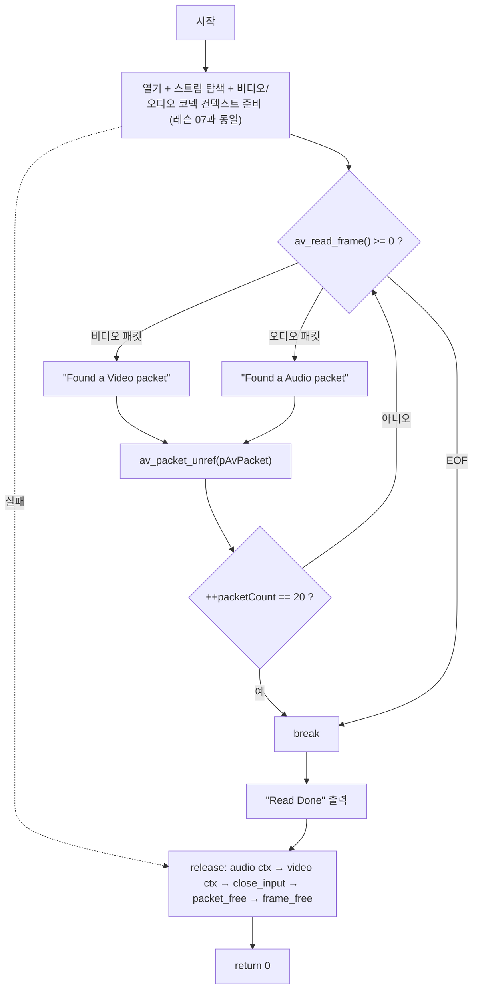

# 08. 올바른 메모리 해제

> 소스: `chapter02/08-freeing-memory-correctly/main.c` · 타겟: `chapter0208FreeingMemoryCorrectly` · [← 챕터 개요](README.md)

## 학습 목표

`av_read_frame()` 루프에서 매 패킷 사용 후 `av_packet_unref()`로 참조를 해제해야 하는 이유를 이해한다. 아울러 chapter02 전반부에서 만든 모든 FFmpeg 자원(코덱 컨텍스트 2개, 포맷 컨텍스트, 패킷, 프레임)의 올바른 해제 순서를 정리한다.

## 핵심 개념

### av_packet_unref — 루프 내 정리

`av_read_frame()`이 채워 주는 패킷 데이터는 참조 카운팅되는 버퍼다. 소스 주석의 표현대로 "사용한 packet에 대한 정리 → 연결 정보에 대한 초기화 및 포인터 초기화"를 위해, 패킷을 다 쓴 시점에 `av_packet_unref()`를 호출해 버퍼 참조를 놓고 패킷을 초기 상태로 되돌린다. 이렇게 해야 같은 `AVPacket` 구조체를 다음 `av_read_frame()`에 재사용할 수 있다. 레슨 06~07 루프에 빠져 있던 조각이 바로 이것이다.

### unref와 free의 구분

| 함수 | 대상 | 시점 |
|---|---|---|
| `av_packet_unref()` | 패킷이 참조하는 데이터 버퍼 | 루프 안, 패킷 하나를 다 쓸 때마다 |
| `av_packet_free()` | 버퍼 참조 해제 + 구조체 자체 | 프로그램 종료 시 1회 |

프레임도 동일하게 `av_frame_unref()` / `av_frame_free()` 짝이 존재한다.

### 해제 순서

이 레슨의 `release:` 블록이 보여주는 순서는 생성의 역순에 가깝다: 오디오 코덱 컨텍스트 → 비디오 코덱 컨텍스트 → 포맷 컨텍스트(`avformat_close_input`) → 패킷(`av_packet_free`) → 프레임(`av_frame_free`). 코덱 컨텍스트는 `NULL` 검사 후 해제하여 에러 경로에서 아직 만들어지지 않은 자원을 건드리지 않는다.

### 20패킷 제한

`packetCount`를 두어 20개 패킷을 처리하면 `break`로 루프를 끝낸다. 전체 파일을 읽지 않고도 루프·해제 로직을 빠르게 검증하기 위한 학습용 장치다.

## 프로그램 흐름



## 핵심 API

| API / 구조체 | 역할 |
|---|---|
| `av_packet_unref()` | 패킷의 버퍼 참조 해제 + 필드 초기화 (루프 내 매 반복) |
| `av_packet_free()` | 패킷 구조체까지 해제 (종료 시 1회, 내부에서 unref 수행) |
| `av_frame_free()` | 프레임 구조체 해제 |
| `avcodec_free_context()` | 코덱 컨텍스트 해제 |
| `avformat_close_input()` | 포맷 컨텍스트 해제 |

## 이전 레슨과의 차이

- 패킷 루프에 `av_packet_unref(pAvPacket)`가 추가되었다 — 레슨 06~07의 unref 누락 문제를 해결하는 이 레슨의 핵심이다.
- `packetCount` 변수와 20패킷 제한(`break`)이 추가되었다.
- 그 외 코드는 레슨 07과 동일하다.

## ⚠️ 알아두기

- `packetCount`는 비디오/오디오 구분 없이 읽은 모든 패킷을 세므로, "비디오 20개"가 아니라 "전체 패킷 20개"에서 멈춘다.
- 이전 레슨들의 특이점(`pCurrentStream[streamIdx]` 인덱싱, 스트림 인덱스 초기값 0, `Channel :` 라벨에 스트림 인덱스 출력, 비디오 코덱 컨텍스트 에러 시 로그만 출력)은 이 레슨에도 그대로 남아 있다.
- 메모리 해제가 올바른지는 macOS에서 `leaks --atExit -- ./chapter0208FreeingMemoryCorrectly`, Linux에서 `valgrind`로 확인할 수 있다 (레슨 01 주석 참고).

## 실행 방법

빌드:

```bash
cmake --build cmake-build-debug --target chapter0208FreeingMemoryCorrectly
```

실행:

```bash
cd cmake-build-debug/chapter02/08-freeing-memory-correctly
./chapter0208FreeingMemoryCorrectly
```

**입력: `resources/out.mp4`** (murage.mp4가 아님) — 패킷 20개 처리 후 `Read Done`을 출력하고 종료한다.

---
→ 자세한 코드 해설: [코드 상세 해설](08-freeing-memory-deep-dive.md)
