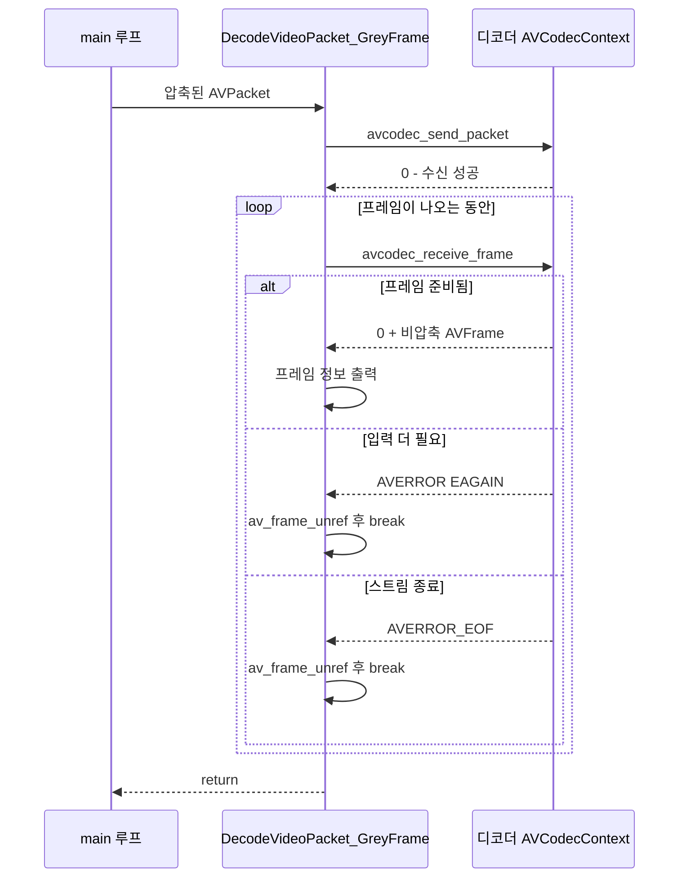

# 09. 비디오 프레임 디코딩 — 코드 상세 해설

> [← 기본 문서](09-decoding-video-frame.md)

## 전체 구조

`main()`은 07~08 레슨에서 만든 골격(파일 열기 → 스트림 탐색 → 비디오/오디오 코덱 컨텍스트 준비)을 그대로 유지하고, 패킷 읽기 루프에서 비디오 패킷을 만나면 새로 추가된 `DecodeVideoPacket_GreyFrame()`을 호출한다. 이 함수가 이번 레슨의 핵심으로, send/receive 디코딩 파이프라인을 구현한다.

```text
main
 ├─ GetResourcePath("out.mp4", ...)      경로 계산 유틸
 ├─ avformat_open_input / find_stream_info
 ├─ av_packet_alloc / av_frame_alloc
 ├─ 스트림 순회 → 비디오/오디오 코덱, 파라미터 확보
 ├─ 비디오 codec context: alloc → parameters_to_context → open2
 ├─ 오디오 codec context: alloc → parameters_to_context → open2
 ├─ while (av_read_frame >= 0)
 │    └─ 비디오 패킷 → DecodeVideoPacket_GreyFrame()
 └─ ffmpeg_release: frame/packet/format 해제
```

## 코드 블록별 해설

### 1. 디코딩에 필요한 변수 선언

```c
AVFormatContext *pFormatContext = NULL;
AVPacket *pPacket = NULL;
AVFrame *pFrame = NULL;

AVCodecParameters *pVideoCodecParameters = NULL;
const AVCodec *pVideoCodec;
AVCodecContext *pVideoCodecContext = NULL;
int videoStreamIdx = 0;
```

컨테이너(`AVFormatContext`), 압축 데이터(`AVPacket`), 비압축 데이터(`AVFrame`), 디코더(`AVCodec` + `AVCodecContext`)가 한 세트다. `videoStreamIdx = 0` 초기화는 이후 `< 0` 검사를 무력화하는 문제가 있다(아래 특이점 참고).

### 2. 스트림 순회와 코덱 탐색

```c
/** found current stream */
pCurStream = pFormatContext->streams[idx];
/** get codec parameter in stream structure */
pCurCodecParameter = pCurStream->codecpar;
/** get codec using codec_id */
pCurCodec = avcodec_find_decoder(pCurCodecParameter->codec_id);
```

각 스트림의 `codecpar->codec_id`로 디코더를 찾는다. 비디오 스트림이면 프레임레이트도 출력한다.

```c
double frameRate = av_q2d(pCurStream[idx].r_frame_rate);
```

`av_q2d()`는 분수(`AVRational`)를 `double`로 바꾼다. 단, `pCurStream[idx]` 인덱싱은 버그다(특이점 4 참고).

### 3. 코덱 컨텍스트 준비 3단계

```c
/** video stream decoding codec context memory allocated */
pVideoCodecContext = avcodec_alloc_context3(pVideoCodec);
...
/** CodecParameters information copy to CodecContext */
errorCode = avcodec_parameters_to_context(pVideoCodecContext, pVideoCodecParameters);
...
/** Codec Open */
errorCode = avcodec_open2(pVideoCodecContext, pVideoCodec, NULL);
```

`할당 → 파라미터 복사 → 열기` 순서는 FFmpeg 디코딩의 정석 패턴이다. 컨테이너가 알고 있는 코덱 정보(해상도, extradata 등)를 컨텍스트에 복사해야 디코더가 올바르게 초기화된다. 오디오 컨텍스트도 동일한 3단계로 준비하지만 이번 레슨에서는 열기만 하고 사용하지 않는다.

### 4. 패킷 읽기 루프

```c
/** Read Frame */
while (av_read_frame(pFormatContext, pPacket) >= 0) {
    /** video frame read  */
    if (pPacket->stream_index == videoStreamIdx) {
//            printf("Found Video Frame Packet!\r\n");
        DecodeVideoPacket_GreyFrame(pPacket, pVideoCodecContext, pFrame);
    }
        /** audio frame read */
    else if (pPacket->stream_index == audioStreamIdx) {
//            printf("Found Audio Frame Packet!\r\n");
    }
    /** reference free */
    av_packet_unref(pPacket);
    packetCount++;
}
```

패킷의 `stream_index`로 비디오/오디오를 구분한다. 이 레슨은 패킷 수 제한 없이 **파일 전체**를 읽는다(10번부터는 20개 제한이 생긴다). 사용이 끝난 패킷은 반드시 `av_packet_unref()`로 참조를 해제해야 한다.

### 5. send/receive 디코딩 파이프라인 (핵심)

```c
int DecodeVideoPacket_GreyFrame(AVPacket *packet, AVCodecContext *codecContext, AVFrame *avFrame) {
    int returnValue = 0;
    /** Send Compressed packet for decompression */
    returnValue = avcodec_send_packet(codecContext, packet);
    if (returnValue < 0) {
        av_log(NULL, AV_LOG_ERROR, "[FFMPEG ERROR](%d) Sending packet to dcoder\r\n", returnValue);
    }

    while (returnValue >= 0) {
        /** Receive decompressed frame */
        returnValue = avcodec_receive_frame(codecContext, avFrame);
        /** get failed frame status and end */
        if (returnValue == AVERROR(EAGAIN) || returnValue == AVERROR_EOF) {
            av_frame_unref(avFrame);
            break;
        }
```

- `avcodec_send_packet()`이 성공하면(0 이상) receive 루프에 진입한다.
- `avcodec_receive_frame()`이 `EAGAIN`을 반환하면 "이 패킷으로 만들 수 있는 프레임은 다 꺼냈으니 다음 패킷을 보내라"는 뜻이므로 정상 탈출한다.
- 한 패킷에서 여러 프레임이 나올 수도, 아무 프레임도 안 나올 수도 있으므로 receive는 항상 `while`로 감싼다.

프레임을 받으면 메타데이터를 출력한다.

```c
printf("Frame number %lld (type = %c frame, size = %dbytes, width=%d, height=%d) pts %lld key_frame %d [DTS %lld]\r\n",
       codecContext->frame_num,
       av_get_picture_type_char(avFrame->pict_type),
       packet->size,
       avFrame->width,
       avFrame->height,
       avFrame->pts,
       avFrame->key_frame,
       avFrame->pkt_dts
);
```

`pict_type`이 `I`인 프레임이 키프레임이며, `pts`(표시 순서)와 `pkt_dts`(디코딩 순서)가 B-프레임 구간에서 서로 어긋나는 것을 관찰할 수 있다.

### 6. 자원 해제

```c
ffmpeg_release:
/** release resource */
av_frame_free(&pFrame);
av_packet_free(&pPacket);
avformat_close_input(&pFormatContext);
return 0;
```

frame → packet → format 순으로 해제한다. 단, 코덱 컨텍스트 해제가 빠져 있다(특이점 2).

## 심화: send/receive 파이프라인의 동작



과거의 `avcodec_decode_video2()`는 "패킷 1개 입력 → 프레임 0~1개 출력"의 동기식 모델이었지만, send/receive 모델은 입력과 출력을 분리해 B-프레임 재정렬·멀티스레드 디코딩·하드웨어 가속에서 발생하는 지연(latency)을 자연스럽게 표현한다. 스트림이 끝났을 때 `avcodec_send_packet(ctx, NULL)`을 보내면 디코더가 flush 모드로 들어가 내부에 쌓인 프레임을 모두 내보낸 뒤 `AVERROR_EOF`를 반환한다.

## ⚠️ 코드 특이점 상세

1. **스트림 인덱스 초기화 값이 `0`**
   `int videoStreamIdx = 0;` / `int audioStreamIdx = 0;`으로 초기화되어 있어 스트림을 하나도 못 찾아도 `if (videoStreamIdx < 0)` 검사가 절대 참이 되지 않는다. "찾지 못함"을 표현하려면 유효하지 않은 값인 `-1`로 초기화해야 한다. 이 문제는 12번 레슨에서 `-1`로 고쳐진다.

2. **코덱 컨텍스트 미해제(메모리 누수)**
   `avcodec_alloc_context3()`로 할당한 `pVideoCodecContext`/`pAudioCodecContext`를 `ffmpeg_release` 블록에서 해제하지 않는다. 올바른 형태는 `avcodec_free_context(&pVideoCodecContext); avcodec_free_context(&pAudioCodecContext);`를 추가하는 것이다. 11번 레슨부터 해제 코드가 들어간다.

3. **디코더 flush 누락**
   `av_read_frame()`이 EOF를 반환한 뒤 `avcodec_send_packet(ctx, NULL)`로 디코더를 비우지 않으므로, 디코더 내부 버퍼에 남아 있던 마지막 프레임 몇 장은 영영 출력되지 않는다. 학습용으로는 문제없지만 전체 프레임을 정확히 뽑아야 한다면 flush가 필수다.

4. **`pCurStream[idx].r_frame_rate` — 이중 인덱싱 버그**
   `pCurStream = pFormatContext->streams[idx];`로 이미 idx번째 스트림을 가리키는 포인터를 얻었는데, 다시 `pCurStream[idx]`로 인덱싱한다. `idx == 0`일 때만 우연히 올바르고, `idx > 0`이면 `AVStream` 배열 밖의 메모리를 읽는다(비디오가 0번 스트림인 out.mp4에서는 우연히 동작). 올바른 형태는 `av_q2d(pCurStream->r_frame_rate)`다.

5. **send 실패 시에도 흐름이 계속됨**
   `avcodec_send_packet()`이 실패해도 `return`하지 않고 로그만 남긴다. `returnValue < 0`이라 while 조건에서 걸러지긴 하지만, 명시적으로 `return returnValue;` 하는 편이 의도가 분명하다(11번 레슨부터 `return`이 추가된다).

6. **`FFMPEG_ERROR` 매크로와 `packetCount`는 정의만 되고 사용되지 않음**, 에러 메시지의 `dcoder`는 `decoder` 오타다.
