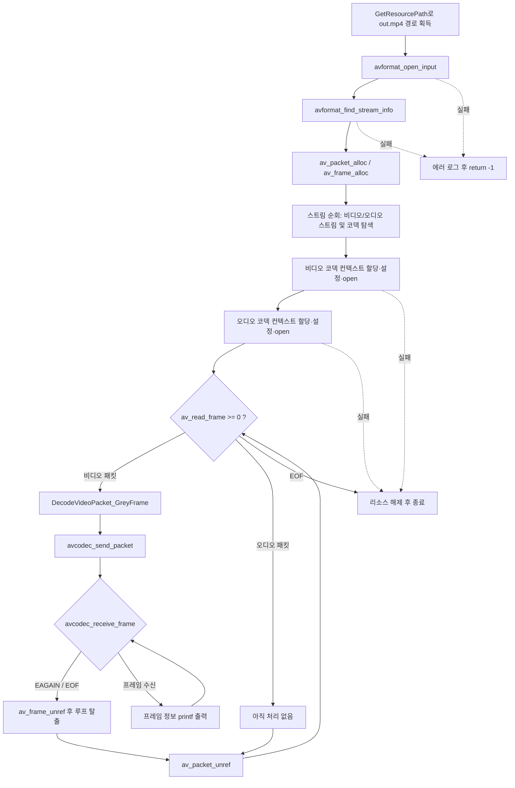

# 09. 비디오 프레임 디코딩

> 소스: `chapter02/09-decoding-a-video-frame/main.c` · 타겟: `chapter0209DecodingVideoFrame` · [← 챕터 개요](README.md)

## 학습 목표

지금까지 압축된 상태로 추출만 하던 비디오 패킷(AVPacket)을 실제로 디코딩해 비압축 프레임(AVFrame)을 얻는다. FFmpeg의 send/receive 디코딩 파이프라인(`avcodec_send_packet` / `avcodec_receive_frame`)과 `EAGAIN` / `AVERROR_EOF` 반환값 처리 방법을 익힌다.

## 핵심 개념

- **디코딩 파이프라인**: 디코더는 큐처럼 동작한다. `avcodec_send_packet()`으로 압축 패킷을 넣고, `avcodec_receive_frame()`으로 디코딩된 프레임을 꺼낸다. 1패킷 = 1프레임이 보장되지 않으므로(B-프레임 재정렬, 지연 등) receive는 루프로 돌려야 한다.
- **AVERROR(EAGAIN)**: 디코더가 프레임을 내놓기 위해 더 많은 입력이 필요하다는 뜻이다. 에러가 아니라 "다음 패킷을 보내라"는 신호다.
- **AVERROR_EOF**: 디코더가 완전히 flush되어 더 이상 나올 프레임이 없다는 뜻이다.
- **프레임 메타데이터**: 디코딩된 `AVFrame`에서 `pict_type`(I/P/B), `pts`, `pkt_dts`, `key_frame`, `width`/`height` 등을 읽어 프레임 정보를 확인한다.

## 프로그램 흐름



## 핵심 API

| API / 구조체 | 역할 |
|---|---|
| `avcodec_send_packet()` | 압축된 패킷을 디코더에 공급한다 |
| `avcodec_receive_frame()` | 디코더에서 비압축 프레임을 꺼낸다. `EAGAIN`/`AVERROR_EOF`로 상태를 알린다 |
| `AVERROR(EAGAIN)` | 입력이 더 필요함(에러 아님) |
| `AVERROR_EOF` | 디코더 flush 완료, 더 나올 프레임 없음 |
| `av_get_picture_type_char()` | `AVPictureType`(I/P/B 등)을 문자로 변환한다 |
| `AVCodecContext->frame_num` | 지금까지 디코딩된 프레임 수 |
| `AVFrame->pts` / `pkt_dts` | 표시 시각 / 해당 패킷의 디코딩 시각 |
| `av_frame_unref()` | 프레임이 참조하는 버퍼의 참조를 해제한다 |

## 이전 레슨과의 차이

- 08까지는 `av_read_frame()`으로 **압축 패킷을 읽기만** 했다. 이번 레슨에서 처음으로 패킷을 디코더에 넣어 **실제 픽셀 데이터를 가진 AVFrame**을 얻는다.
- 디코딩 로직을 `DecodeVideoPacket_GreyFrame()` 함수로 분리했다(이름의 GreyFrame은 다음 레슨의 그레이스케일 저장을 예고하는 것으로, 이 레슨에서는 프레임 정보 출력만 한다).

## ⚠️ 알아두기

- `videoStreamIdx`/`audioStreamIdx`가 `-1`이 아니라 `0`으로 초기화되어 있어, 스트림을 못 찾아도 `if (videoStreamIdx < 0)` 검사가 통과해 버린다(12번 레슨에서 `-1`로 수정됨).
- `avcodec_alloc_context3()`로 만든 비디오/오디오 코덱 컨텍스트를 종료 시 `avcodec_free_context()`로 해제하지 않는다 — 메모리 누수(11번 레슨에서 해제 코드가 추가됨).
- 파일 끝에서 디코더에 NULL 패킷을 보내 flush하지 않으므로 디코더 내부에 남은 마지막 프레임들은 출력되지 않는다.
- `av_q2d(pCurStream[idx].r_frame_rate)`는 `pCurStream`이 이미 `streams[idx]`이므로 `idx > 0`이면 배열 범위를 벗어난 접근이다. 자세한 내용은 딥다이브 참고.

## 실행 방법

```bash
# 빌드 (저장소 루트에서)
cmake --build cmake-build-debug --target chapter0209DecodingVideoFrame
# 실행
./cmake-build-debug/chapter02/09-decoding-a-video-frame/chapter0209DecodingVideoFrame
```

- **입력: `resources/out.mp4`** (실행 경로에서 `/cmake` 문자열 앞부분을 잘라 `resources/`를 붙이는 방식이므로 `cmake-build-*` 아래에서 실행해야 경로 계산이 성공한다)
- 출력물: 파일 생성 없음. 디코딩된 각 프레임의 번호/타입/크기/PTS/DTS를 콘솔에 출력한다.

---
→ 자세한 코드 해설: [코드 상세 해설](09-decoding-video-frame-deep-dive.md)
