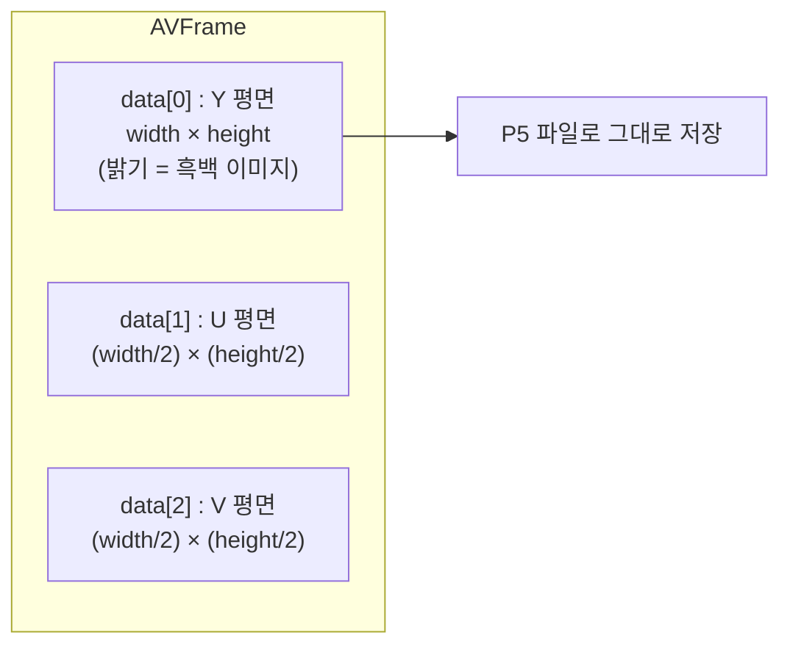

# 10. 그레이스케일 이미지 저장 — 코드 상세 해설

> [← 기본 문서](10-grayscale-image.md)

## 전체 구조

09번 코드에서 두 가지가 추가되었다.

```text
main
 ├─ (09와 동일) 열기 → 스트림 탐색 → 코덱 컨텍스트 준비
 ├─ while (av_read_frame)
 │    ├─ 비디오 패킷 → DecodeVideoPacket_GreyFrame()
 │    │      └─ 프레임 수신 시 SaveGreyFrameToPPM()  ← 신규
 │    └─ packetCount == 20 이면 break                ← 신규
 └─ ffmpeg_release
```

## 코드 블록별 해설

### 1. 20패킷 제한

```c
/** reference free */
av_packet_unref(pPacket);
packetCount++;

/** 20 Frame Image and audio data */
if (packetCount == 20) {
    break;
}
```

전체 영상을 디코딩할 필요가 없으므로 비디오+오디오를 합쳐 앞쪽 20개 패킷만 처리한다. 09에서 선언만 되어 있던 `packetCount`가 여기서 실제로 쓰인다.

### 2. 프레임 수신 후 저장 경로 계산

```c
char savePathBuffer[BUFFER_MAX] = {0};
char fileNameBuffer[40] = {0,};
#if defined(WIN32) || defined(WIN64)
sprintf(fileNameBuffer, "\\GeneratedGrayImage\\testPPM.ppm");
#else
sprintf(fileNameBuffer, "/GeneratedGrayImage/testPPM.ppm");
#endif
if (!GetResourcePath(fileNameBuffer, savePathBuffer)) {
    printf("Failed Get Resource Path...\r\n");
}
/** Turn Frame into ppm */
SaveGreyFrameToPPM(avFrame->data[0], avFrame->linesize[0], avFrame->height, avFrame->width, savePathBuffer);
```

`GetResourcePath()`는 실행 경로에서 `/cmake` 이전까지를 프로젝트 루트로 보고 `resources/`를 붙이는 유틸이므로, 최종 경로는 `<repo>/resources/GeneratedGrayImage/testPPM.ppm`이 된다. 프레임마다 **같은 파일명**을 다시 만들기 때문에 이전 프레임 이미지는 덮어써진다.

저장 함수에 넘기는 인자에 주목한다.

- `avFrame->data[0]` — Y 평면 포인터
- `avFrame->linesize[0]` — Y 평면의 stride
- U/V 평면(`data[1]`, `data[2]`)은 사용하지 않는다 → 색 정보가 빠진 흑백 이미지

### 3. SaveGreyFrameToPPM — P5 파일 쓰기

```c
void SaveGreyFrameToPPM(uint8_t *pixels, int wrap, int imageHeight, int imageWidth, char *filename) {

    FILE *pFile = fopen(filename, "w");
//    fopen_s(&pFile, filename, "w");
    assert(pFile != NULL);

    /** write file PPM File Header */
    fprintf(pFile, "P5\n%d %d\n%d\n", imageWidth, imageHeight, 255);

    /** write image data */
    for (int i = 0; i < imageHeight; i++) {
        unsigned char *ch = (pixels + i * wrap);
        /** write Data using PPM File format */
        fwrite(ch, sizeof(char), imageWidth, pFile);
    }

    fclose(pFile);
}
```

- 헤더: `P5`(그레이스케일 바이너리) + 폭/높이 + 최대 밝기 255.
- 본문: `i`번째 줄의 시작 주소는 `pixels + i * wrap`(wrap = linesize)이고, 거기서 **imageWidth 바이트만** 쓴다. `wrap`에는 codec이 SIMD 정렬을 위해 붙인 패딩이 포함될 수 있으므로 `wrap` 전체를 쓰면 오른쪽에 쓰레기 픽셀이 붙는다.

## 심화: YUV 색공간과 Y 평면

### 왜 Y 평면만 저장하면 흑백 이미지가 되는가

RGB는 세 채널 모두에 밝기 정보가 섞여 있지만, YUV(YCbCr)는 **밝기(Y)** 와 **색차(Cb=U, Cr=V)** 를 분리한다. 사람의 눈은 밝기 변화에 민감하고 색 변화에 둔감하므로, 코덱은 색차 채널을 절반 이하로 다운샘플링(크로마 서브샘플링)해 압축 효율을 높인다.

H.264가 흔히 쓰는 `yuv420p`(planar) 프레임의 메모리 배치는 다음과 같다.



- `420`의 의미: 가로·세로 각각 절반 해상도의 색차 평면(픽셀 4개가 U, V 하나씩을 공유).
- `p`(planar)의 의미: Y, U, V가 각각 연속된 별도 평면으로 저장됨(packed와 대비).
- 따라서 `data[0]`을 폭×높이만큼 읽으면 그게 곧 8bit 그레이스케일 이미지다. 컬러로 복원하려면 세 평면을 조합해 RGB로 변환해야 하며, 그것이 12~13 레슨에서 다루는 `swscale`의 역할이다.

### linesize를 무시하면 생기는 일

해상도가 1000픽셀인데 `linesize[0]`이 1024라면 각 줄 끝에 24바이트 패딩이 있다. `fwrite(pixels, 1, width * height, f)`처럼 통째로 쓰면 줄이 갈수록 오른쪽으로 밀리는 대각선 형태로 이미지가 왜곡된다. 줄 단위 복사가 필수인 이유다.

## ⚠️ 코드 특이점 상세

1. **매 프레임 같은 파일에 덮어쓰기 → 마지막 프레임만 남음**
   `fileNameBuffer`가 항상 `"/GeneratedGrayImage/testPPM.ppm"`이다. 20패킷 안에서 디코딩된 마지막 프레임이 최종 파일 내용이 된다. 올바른 형태는 `sprintf(fileNameBuffer, "/GeneratedGrayImage/frame-%03lld.ppm", codecContext->frame_num);`처럼 프레임 번호를 파일명에 포함하는 것이다.

2. **텍스트 모드 `"w"`로 바이너리 쓰기**
   POSIX에서는 `"w"`와 `"wb"`가 동일하지만 Windows에서는 개행 변환 때문에 픽셀 값 `0x0A`가 `0x0D 0x0A`로 바뀌어 이미지가 깨진다. 이식성을 위해 `"wb"`가 올바르다(13번 레슨의 컬러 저장 함수는 `"wb"`를 쓴다).

3. **`assert`에 의존한 에러 처리**
   `GeneratedGrayImage` 폴더가 없으면 `fopen`이 NULL을 반환하고 `assert(pFile != NULL)`로 프로그램이 즉시 중단된다. 릴리스 빌드(`NDEBUG`)에서는 assert가 제거되어 NULL 포인터로 `fprintf`를 호출하는 미정의 동작이 된다.

4. **P5 헤더 + `.ppm` 확장자 불일치**
   P5는 PGM(Portable GrayMap) 포맷이다. 확장자로 판별하는 도구에서는 혼란이 생길 수 있다.

5. **09의 특이점 상속**: `videoStreamIdx = 0` 초기화, 코덱 컨텍스트 미해제, 디코더 flush 누락, `pCurStream[idx].r_frame_rate` 이중 인덱싱이 모두 그대로 남아 있다. 상세 설명은 [09 딥다이브](09-decoding-video-frame-deep-dive.md#-코드-특이점-상세) 참고.
