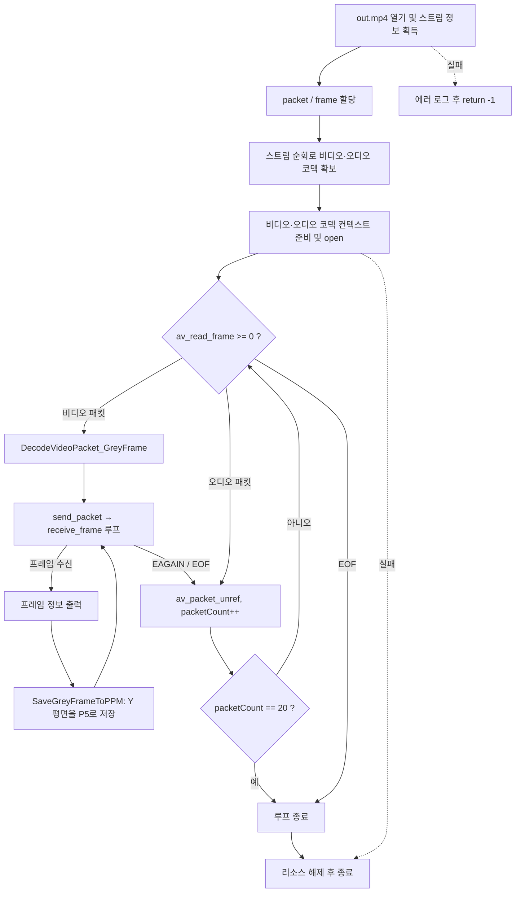

# 10. 그레이스케일 이미지 저장

> 소스: `chapter02/10-view-grayScale-image-using-FFMPEG/main.c` · 타겟: `chapter0210DecodingFrameAndViewingGrayScaleImage` · [← 챕터 개요](README.md)

## 학습 목표

디코딩된 `AVFrame`의 픽셀 데이터를 처음으로 파일에 저장한다. YUV 프레임의 Y(휘도) 평면만 꺼내면 그대로 그레이스케일 이미지가 된다는 점과, 헤더만 쓰면 되는 초간단 이미지 포맷 PPM/PGM(P5)의 구조, 그리고 `linesize`(stride) 개념을 익힌다.

## 핵심 개념

- **YUV와 Y 평면**: 대부분의 비디오 코덱은 RGB가 아닌 YUV(정확히는 YCbCr)로 프레임을 저장한다. `AVFrame->data[0]`이 Y(밝기) 평면이고, 이것만 저장하면 흑백 이미지가 된다.
- **linesize(stride)**: 메모리 정렬 때문에 한 줄의 실제 바이트 수(`linesize[0]`)는 이미지 폭보다 클 수 있다. 저장할 때는 줄마다 `linesize`만큼 건너뛰며 `width` 바이트만 쓴다.
- **PPM/PGM(P5)**: `P5\n<width> <height>\n<max>\n` 텍스트 헤더 뒤에 픽셀 바이트가 그대로 이어지는 무압축 포맷이다. 라이브러리 없이 몇 줄로 쓸 수 있어 디코딩 결과 확인용으로 적합하다.

## 프로그램 흐름



## 핵심 API

| API / 구조체 | 역할 |
|---|---|
| `AVFrame->data[0]` | YUV 프레임의 Y(휘도) 평면 시작 주소 |
| `AVFrame->linesize[0]` | Y 평면 한 줄의 바이트 수(stride, 폭보다 클 수 있음) |
| `fprintf(pFile, "P5\n...")` | PGM(P5) 헤더 작성 — 흑백 1채널 |
| `fwrite()` | 한 줄씩 `imageWidth` 바이트만 기록 |
| `avcodec_send_packet` / `avcodec_receive_frame` | 09와 동일한 디코딩 파이프라인 |

## 이전 레슨과의 차이

- 09에서는 프레임 정보를 출력만 했지만, 이제 `SaveGreyFrameToPPM()`이 추가되어 **Y 평면을 실제 파일로 저장**한다.
- 패킷 읽기 루프에 `packetCount == 20` 조건이 추가되어 앞쪽 20개 패킷만 처리하고 끝낸다(전체 영상을 다 돌 필요가 없기 때문).

## ⚠️ 알아두기

- **매 프레임 같은 파일명에 덮어쓴다**: 저장 경로가 항상 `GeneratedGrayImage/testPPM.ppm`이므로 프레임마다 파일을 덮어써서 **마지막으로 디코딩된 프레임 한 장만 남는다**. 프레임별로 남기려면 파일명에 `frame_num` 등을 넣어야 한다.
- 헤더가 `P5`(PGM, 흑백)인데 확장자는 `.ppm`이다. 뷰어 대부분은 매직 넘버(P5)를 보고 열어주지만, 엄밀히는 `.pgm`이 맞다.
- 파일을 `fopen(filename, "w")` 텍스트 모드로 연다. macOS/Linux에서는 문제없지만 Windows에서는 `0x0A` 바이트가 `0x0D 0x0A`로 변환되어 이미지가 깨진다. 바이너리 데이터는 `"wb"`로 열어야 한다.
- `GeneratedGrayImage` 디렉터리가 미리 존재해야 한다. 없으면 `fopen`이 NULL을 반환하고 `assert`로 즉사한다.
- 09의 특이점(스트림 인덱스 0 초기화, 코덱 컨텍스트 미해제, `pCurStream[idx]` 버그)이 그대로 남아 있다.

## 실행 방법

```bash
cmake --build cmake-build-debug --target chapter0210DecodingFrameAndViewingGrayScaleImage
./cmake-build-debug/chapter02/10-view-grayScale-image-using-FFMPEG/chapter0210DecodingFrameAndViewingGrayScaleImage
```

- **입력: `resources/out.mp4`**
- 출력물: `resources/GeneratedGrayImage/testPPM.ppm` (마지막으로 처리된 프레임의 흑백 이미지 1장)

---
→ 자세한 코드 해설: [코드 상세 해설](10-grayscale-image-deep-dive.md)
