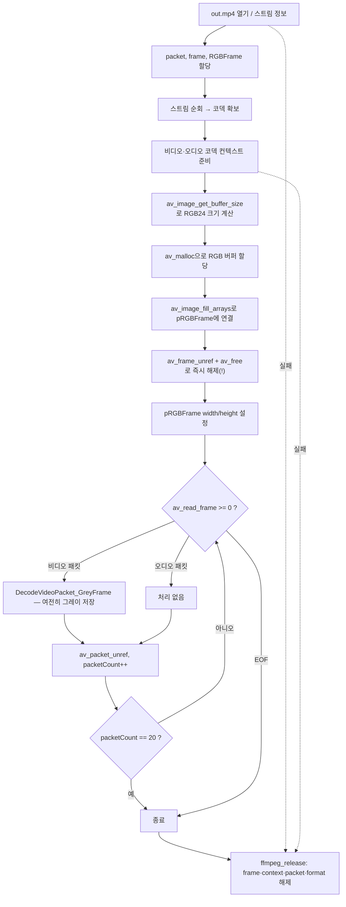

# 11. 컬러 이미지를 위한 RGB 버퍼 준비

> 소스: `chapter02/11-view-color-image-using-FFMPEG/main.c` · 타겟: `chapter0211ViewColorImageUsingFFMPEG` · [← 챕터 개요](README.md)

## 학습 목표

컬러 이미지 저장을 향한 첫 단계로, RGB 픽셀을 담을 별도의 `AVFrame`(pRGBFrame)과 그 데이터 버퍼를 준비하는 방법을 배운다. `av_image_get_buffer_size()`로 필요한 버퍼 크기를 계산하고 `av_image_fill_arrays()`로 프레임의 `data`/`linesize` 포인터를 버퍼에 연결하는 패턴을 익힌다.

## 핵심 개념

- **디코딩 프레임 vs 출력 프레임**: 디코더가 주는 프레임(YUV)과 변환 결과를 담을 프레임(RGB)은 별개다. 출력 프레임은 `av_frame_alloc()`으로 껍데기만 만들고, 픽셀 버퍼는 직접 할당해 연결해야 한다.
- **`av_image_get_buffer_size(fmt, w, h, align)`**: 픽셀 포맷·해상도·정렬 기준으로 이미지 한 장에 필요한 바이트 수를 계산한다. RGB24는 픽셀당 3바이트이므로 대략 `w * h * 3`이 된다.
- **`av_image_fill_arrays(data, linesize, buf, fmt, w, h, align)`**: 연속된 버퍼 하나를 픽셀 포맷 규칙에 따라 평면 포인터(`data[]`)와 stride(`linesize[]`)로 쪼개 채워 준다. 버퍼를 복사하는 게 아니라 **포인터를 배치**하는 함수다.
- 에러 처리 방식이 개별 해제 코드 반복에서 `goto ffmpeg_release` 단일 정리 블록으로 통일되었고, 코덱 컨텍스트 해제(`avcodec_free_context`)도 추가되었다.

## 프로그램 흐름



## 핵심 API

| API / 구조체 | 역할 |
|---|---|
| `av_image_get_buffer_size()` | 픽셀 포맷/해상도/정렬에 필요한 버퍼 크기 계산 |
| `av_malloc()` | FFmpeg 정렬 규칙을 만족하는 메모리 할당 |
| `av_image_fill_arrays()` | 버퍼를 `AVFrame->data[]` / `linesize[]`에 배치 |
| `AV_PIX_FMT_RGB24` | R,G,B 각 8bit, 픽셀당 3바이트 packed 포맷 |
| `av_free()` | `av_malloc` 메모리 해제 |
| `avcodec_free_context()` | 코덱 컨텍스트 해제(이번 레슨에서 추가됨) |

## 이전 레슨과의 차이

- `pRGBFrame`(세 번째 프레임 구조체)과 RGB 버퍼 할당/연결 코드가 추가되었다. 다만 **아직 YUV→RGB 변환은 하지 않으며**, 디코딩 루프는 여전히 `DecodeVideoPacket_GreyFrame()`으로 그레이스케일 PPM만 저장한다.
- 에러 처리: 10까지는 실패 지점마다 해제 코드를 반복했지만, 이번 레슨부터 초반 실패도 `goto ffmpeg_release`로 통일했다.
- `ffmpeg_release`에 `avcodec_free_context()` 두 건이 추가되어 09~10의 코덱 컨텍스트 누수가 해결되었다.

## ⚠️ 알아두기

- **픽셀 포맷 불일치**: 버퍼 크기는 `AV_PIX_FMT_RGB24`(3바이트/픽셀)로 계산했는데, `av_image_fill_arrays()`에는 `AV_PIX_FMT_RGB4`(4bit 팔레트 계열, 1바이트/픽셀 미만)를 넘긴다. 두 포맷의 linesize가 달라 이후 실제로 사용했다면 잘못된 stride가 잡혔을 코드다.
- **버퍼를 만들자마자 해제**: `av_image_fill_arrays()` 직후 `av_frame_unref(pRGBFrame)`와 `av_free(pRGBFrameBuffer)`를 호출한다. 연결해 둔 버퍼가 곧바로 사라지므로 `pRGBFrame->data`는 댕글링 포인터가 된다. 이 레슨에서는 pRGBFrame을 실제로 쓰지 않아 문제가 드러나지 않을 뿐이다.
- 에러 검사(`if (errorCode < 0)`)가 해제 **이후에** 있어 순서도 어색하다.
- 여전히 그레이 이미지가 `GeneratedGrayImage/testPPM.ppm` 한 파일에 덮어써진다.
- `main()`이 `int` 반환 선언인데 끝에 `return` 문이 없다(C99 이후 main은 암묵적으로 0을 반환하므로 동작은 한다).

## 실행 방법

```bash
cmake --build cmake-build-debug --target chapter0211ViewColorImageUsingFFMPEG
./cmake-build-debug/chapter02/11-view-color-image-using-FFMPEG/chapter0211ViewColorImageUsingFFMPEG
```

- **입력: `resources/out.mp4`**
- 출력물: `resources/GeneratedGrayImage/testPPM.ppm` (아직 컬러가 아니라 그레이스케일이다)

---
→ 자세한 코드 해설: [코드 상세 해설](11-color-image-deep-dive.md)
