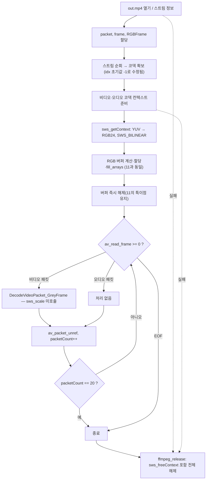

# 12. SwsContext 설정 — swscale 준비

> 소스: `chapter02/12-view-color-image-using-FFMPEG-swscale/main.c` · 타겟: `chapter0212ViewingColorImageUsingSwScaleSetting` · [← 챕터 개요](README.md)

## 학습 목표

YUV→RGB 변환을 담당할 libswscale의 `SwsContext`를 생성하고 해제하는 방법을 배운다. `sws_getContext()`의 인자(입출력 해상도, 픽셀 포맷, 스케일링 알고리즘)의 의미를 이해한다. 이 레슨은 **변환 자체는 수행하지 않는** 준비 단계다.

## 핵심 개념

- **libswscale**: 픽셀 포맷 변환(YUV↔RGB 등)과 해상도 변경(스케일링)을 담당하는 FFmpeg 라이브러리다. 변환 파라미터를 담은 `SwsContext`를 먼저 만들어 두고, 프레임마다 `sws_scale()`로 변환한다.
- **`sws_getContext(srcW, srcH, srcFmt, dstW, dstH, dstFmt, flags, ...)`**: 원본/대상의 해상도·픽셀 포맷과 스케일링 알고리즘(flags)을 지정해 컨텍스트를 만든다. 여기서는 해상도를 그대로 두고 포맷만 `pix_fmt(YUV) → RGB24`로 바꾸도록 설정한다.
- **`SWS_BILINEAR`**: 쌍선형 보간. 속도와 품질의 균형이 좋아 기본값으로 널리 쓰인다.
- **단계적 구성**: 11(RGB 버퍼) → 12(SwsContext) → 13(sws_scale 호출 + 저장) 순으로 컬러 파이프라인을 한 조각씩 쌓는 구성이며, 이 레슨에서 `sws_scale()`을 호출하지 않는 것은 **의도된 중간 단계**다.

## 프로그램 흐름



## 핵심 API

| API / 구조체 | 역할 |
|---|---|
| `struct SwsContext` | 픽셀 포맷 변환/스케일링 파라미터를 담는 컨텍스트 |
| `sws_getContext()` | 입출력 해상도·포맷·알고리즘으로 컨텍스트 생성 |
| `SWS_BILINEAR` | 쌍선형 보간 스케일링 플래그 |
| `AVCodecContext->pix_fmt` | 디코더 출력 픽셀 포맷(원본 포맷으로 사용) |
| `sws_freeContext()` | SwsContext 해제 |

## 이전 레슨과의 차이

- `struct SwsContext *pSwsContext` 변수와 `sws_getContext()` 호출, 해제부의 `sws_freeContext()`가 추가되었다.
- `videoStreamIdx`/`audioStreamIdx` 초기값이 `0`에서 **`-1`로 수정**되어 "스트림 못 찾음" 검사가 비로소 의미를 갖게 되었다.
- 디코딩 루프는 여전히 `DecodeVideoPacket_GreyFrame()`이며 출력물도 그레이스케일 PPM 그대로다.

## ⚠️ 알아두기

- **SwsContext는 만들기만 하고 `sws_scale()`은 호출하지 않는다.** 실제 변환과 컬러 저장은 다음 레슨(13)에서 완성된다 — 강의의 의도된 단계적 구성이다.
- `sws_getContext()`의 반환값 NULL 검사가 없다. 잘못된 포맷/해상도면 NULL이 반환될 수 있다.
- 11의 특이점(RGB24로 크기 계산 + `AV_PIX_FMT_RGB4`로 fill, fill 직후 버퍼 해제)이 그대로 남아 있다.
- 그레이 PPM은 여전히 `GeneratedGrayImage/testPPM.ppm`에 덮어써져 마지막 프레임만 남는다.

## 실행 방법

```bash
cmake --build cmake-build-debug --target chapter0212ViewingColorImageUsingSwScaleSetting
./cmake-build-debug/chapter02/12-view-color-image-using-FFMPEG-swscale/chapter0212ViewingColorImageUsingSwScaleSetting
```

- **입력: `resources/out.mp4`**
- 출력물: `resources/GeneratedGrayImage/testPPM.ppm` (컬러 출력은 아직 없다)

---
→ 자세한 코드 해설: [코드 상세 해설](12-swscale-setting-deep-dive.md)
