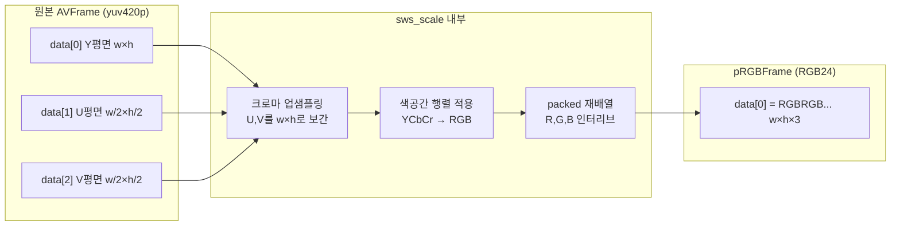

# 13. sws_scale로 컬러 이미지 저장 — 코드 상세 해설

> [← 기본 문서](13-color-image-swscale.md)

## 전체 구조

```text
main
 ├─ (12와 동일) 열기 → 스트림 탐색 → 코덱 컨텍스트 → sws_getContext
 ├─ pRGBFrame 할당 → RGB 버퍼 fill_arrays (해제 코드는 주석 처리) ← 변경
 ├─ while (av_read_frame)
 │    └─ 비디오 패킷 → DecodeVideoPacket_RGBFrame()  ← 신규 (핵심)
 │           └─ receive_frame → sws_scale → SaveRGBFrame(P6)
 └─ ffmpeg_release
```

## 코드 블록별 해설

### 1. RGB 버퍼 준비 — 이번에는 해제하지 않는다

```c
/** rgb channel data type defined -> get image size */
int rgbFrameNumberOfBytes = av_image_get_buffer_size(AV_PIX_FMT_RGB24, pVideoCodecContext->width,
                                                     pVideoCodecContext->height, 1);
/** get RGB Frame Buffer -> allocated image size buffer */
uint8_t *rgbFrameBuffer = av_malloc(rgbFrameNumberOfBytes);
/** frame buffer set image pixel */
errorCode = av_image_fill_arrays(pRGBFrame->data, pRGBFrame->linesize, (uint8_t *) rgbFrameBuffer,
                                 AV_PIX_FMT_BGR24,
                                 pVideoCodecContext->width, pVideoCodecContext->height, 1);

/** make color frame */
//    DecodeVideoPacket_RGBFrame(pPacket, pVideoCodecContext, pFrame, pRGBFrame, pSwsContext);
//    av_frame_unref(pRGBFrame);
//    av_free(pRGBFrameBuffer);
```

11~12의 치명적 패턴이었던 "fill 직후 해제"가 주석 처리되었다. 이제 `pRGBFrame->data[0]`은 루프 내내 유효한 버퍼를 가리키고, `sws_scale()`의 출력 대상이 될 수 있다. fill 포맷은 `AV_PIX_FMT_RGB4`에서 `AV_PIX_FMT_BGR24`로 바뀌었는데, SwsContext의 출력 포맷(`AV_PIX_FMT_RGB24`)과는 여전히 다르다(특이점 1).

### 2. 컬러 디코딩 함수 (핵심)

```c
/** Decode video packet get rgbScale Image */
int DecodeVideoPacket_RGBFrame(AVPacket *packet, AVCodecContext *pCodecContext, AVFrame *pFrame, AVFrame *pRgbFrame,
                               struct SwsContext *pSwsContext) {
    int result = 0;
    /** send decompressed packet for decompression */
    result = avcodec_send_packet(pCodecContext, packet);
```

send/receive 골격은 그레이 버전과 같고, 프레임 수신 후의 처리만 다르다.

```c
/** 영상의 프레임을 인자로 받아서 해당 프레임을 나눠서 이미지를 스케일링을 시켜준다. */
result = sws_scale(pSwsContext, (unsigned char const *const *) (pFrame->data), pFrame->linesize, 0,
                   pCodecContext->height, pRgbFrame->data, pRgbFrame->linesize);
if (result < 0) {
    av_log(NULL, AV_LOG_ERROR, "[FFMPEG](%d)software scale Failed...\r\n", result);
//                av_frame_unref(pFrame);
//                av_frame_free(&pFrame);
    return result;
}

/** Save Color Frame */
SaveRGBFrame(pRgbFrame->data[0], pRgbFrame->linesize[0], pRgbFrame->height, pRgbFrame->width,
             savePathBuffer);
```

`sws_scale`의 인자를 풀어 보면:

| 인자 | 값 | 의미 |
|---|---|---|
| ctx | `pSwsContext` | 12에서 만든 YUV→RGB24 변환기 |
| srcSlice | `pFrame->data` | 원본 YUV 평면 포인터 배열 (Y/U/V) |
| srcStride | `pFrame->linesize` | 평면별 stride 배열 |
| srcSliceY, srcSliceH | `0, pCodecContext->height` | 0번째 줄부터 전체 높이 = 프레임 전체 변환 |
| dst / dstStride | `pRgbFrame->data / linesize` | fill_arrays로 연결해 둔 RGB 버퍼 |

반환값은 출력된 슬라이스의 높이(성공 시 양수)다. 이 값이 `result`에 들어가므로 이후 `while (result >= 0)` 루프 조건도 계속 참으로 유지된다.

### 3. SaveRGBFrame — P6 컬러 PPM 쓰기

```c
/** save frame color swscale image */
void SaveRGBFrame(unsigned char *buf, int wrap, int ySize, int xSize, char *filename) {
    FILE *pFile;

    pFile = fopen(filename, "wb");

    if (pFile == NULL) {
        printf("Failed file open ... %s\r\n", filename);
        return;
    }
    assert(pFile != NULL);

    /** file header information setting color */
    fprintf(pFile, "P6\n%d %d\n%d\n", xSize, ySize, 255);
    printf("write");
    /** write frame data */
    for (int i = 0; i < ySize; i++) {
        unsigned char *ch = (buf + i * wrap);
        fwrite(ch, 1, xSize * 3, pFile);
    }


    fclose(pFile);
}
```

그레이 버전과의 차이점 세 가지가 핵심이다.

- 매직 넘버가 `P6`(컬러) — 본문이 R,G,B 반복이 된다.
- 한 줄에 `xSize * 3` 바이트를 쓴다(픽셀당 3바이트).
- `"wb"` 바이너리 모드로 열어 Windows 개행 변환 문제를 피했다(그레이 함수의 `"w"`보다 올바른 방식).

### 4. 저장 경로

```c
#if defined(WIN32) || defined(WIN64)
sprintf(fileNameBuffer, "\\GeneratedColorImage\\testColorPPM.ppm");
#else
sprintf(fileNameBuffer, "/GeneratedColorImage/color.ppm");
#endif
```

플랫폼에 따라 파일명 자체가 다르다(Windows: `testColorPPM.ppm`, 그 외: `color.ppm`). 구분자만 바꾸려던 것으로 보이는 비의도적 차이다.

## 심화: sws_scale과 픽셀 포맷 변환의 실제

### YUV420P → RGB24에서 일어나는 일



1. **크로마 업샘플링**: 1/4 해상도인 U/V를 픽셀 단위로 보간해 끌어올린다(여기서 `SWS_BILINEAR`가 관여).
2. **행렬 변환**: `R = Y + 1.402·(V-128)` 류의 YCbCr→RGB 변환식을 적용한다(BT.601/709 계수는 컨텍스트 설정에 따름).
3. **재배열**: planar 3평면을 packed 1평면(RGBRGB...)으로 인터리브한다.

### RGB24 vs BGR24

두 포맷 모두 픽셀당 3바이트, 1평면, 같은 linesize를 갖는다. 다른 것은 **바이트 순서뿐**이다.

| 포맷 | 메모리 배치 |
|---|---|
| `AV_PIX_FMT_RGB24` | `R G B R G B ...` |
| `AV_PIX_FMT_BGR24` | `B G R B G R ...` |

fill_arrays는 포인터/stride 계산에만 포맷을 쓰므로 두 포맷의 결과가 완전히 동일하다 — 그래서 이 코드의 불일치가 드러나지 않는다. 채널 순서를 실제로 결정하는 것은 `sws_scale`(SwsContext의 dstFormat)이므로 이 프로그램의 출력은 RGB 순서고, P6(RGB 순서 요구)와도 맞아떨어진다.

## ⚠️ 코드 특이점 상세

1. **fill은 `AV_PIX_FMT_BGR24`, sws 출력은 `AV_PIX_FMT_RGB24` — 채널 순서 불일치**
   위 심화에서 본 대로 3바이트 packed 포맷끼리는 레이아웃이 같아 우연히 올바른 결과가 나온다. 하지만 만약 이 fill 포맷 기준으로 다른 코드가 버퍼를 BGR로 해석하거나, 어느 한쪽 포맷을 4바이트 계열(RGBA 등)로 바꾸는 순간 색이 뒤집히거나 stride가 어긋난다. 올바른 형태는 `sws_getContext`의 dstFormat, `av_image_get_buffer_size`, `av_image_fill_arrays` 세 곳이 **모두 같은 포맷**을 쓰는 것이다.

2. **컬러 PPM도 단일 파일 덮어쓰기 → 마지막 프레임만 남음**
   `GeneratedColorImage/color.ppm`(Windows는 `testColorPPM.ppm`)에 매 프레임 덮어쓴다. 프레임 번호를 파일명에 포함해야 프레임별로 남는다.

3. **`rgbFrameBuffer` 누수**
   `av_free(pRGBFrameBuffer)`가 주석 처리된 채 대체 해제 코드가 없다. 또한 주석 처리된 코드의 변수명(`pRGBFrameBuffer`)과 실제 변수명(`rgbFrameBuffer`)이 달라, 주석을 되살려도 컴파일되지 않는다. `ffmpeg_release`에서 `av_free(rgbFrameBuffer);`를 호출하는 것이 올바르다.

4. **`sws_scale` 반환값의 재사용**
   성공 시 반환값(출력 높이)이 `result`에 덮어써진다. 이 함수의 반환 규약(음수=에러)과 상충하지는 않지만, receive 루프 제어 변수와 변환 결과를 한 변수로 겸용하는 것은 취약한 패턴이다.

5. **플랫폼별로 저장 파일명이 다름** — Windows `testColorPPM.ppm` vs 그 외 `color.ppm`.

6. **상속된 특이점**: 그레이 저장 함수(`"w"` 텍스트 모드)는 남아 있으나 호출부가 주석 처리되어 사용되지 않음, `pCurStream[idx]` 이중 인덱싱, 디코더 flush 누락, `sws_getContext` NULL 검사 부재, `main`의 `return` 누락.
