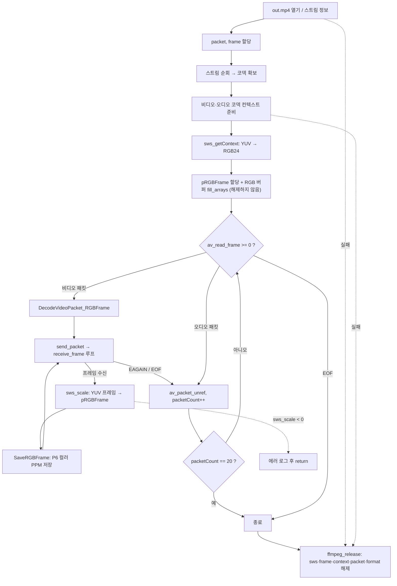

# 13. sws_scale로 컬러 이미지 저장

> 소스: `chapter02/13-view-color-image-using-swScale-FFMPEG/main.c` · 타겟: `chapter0213ViewingColorImageUsingSwScale` · [← 챕터 개요](README.md)

## 학습 목표

11~12에서 준비한 RGB 프레임과 SwsContext를 드디어 연결한다. `sws_scale()`로 디코딩된 YUV 프레임을 RGB24로 변환하고, 컬러 PPM(P6) 파일로 저장하는 전체 파이프라인을 완성한다.

## 핵심 개념

- **`sws_scale(ctx, srcData, srcLinesize, y, height, dstData, dstLinesize)`**: SwsContext에 설정된 규칙(YUV→RGB24)에 따라 원본 평면들을 변환해 대상 프레임 버퍼에 쓴다. 반환값은 출력된 슬라이스의 높이다.
- **P6 (컬러 PPM)**: P5와 헤더 구조는 같고, 본문이 픽셀당 R,G,B 3바이트로 이어진다. 한 줄에 `width * 3` 바이트를 쓴다.
- **버퍼 수명 관리**: 11~12와 달리 fill 직후의 버퍼 해제 코드가 주석 처리되어, RGB 버퍼가 루프 내내 살아 있게 되었다. 변환 대상 버퍼는 사용이 끝날 때까지 유지해야 한다는 원칙이 코드에 반영된 것이다.

## 프로그램 흐름



## 핵심 API

| API / 구조체 | 역할 |
|---|---|
| `sws_scale()` | YUV 평면들을 RGB24로 변환해 대상 버퍼에 기록 |
| `av_image_fill_arrays()` | RGB 버퍼를 pRGBFrame의 data/linesize에 연결 |
| `SaveRGBFrame()` | P6 헤더 + 줄당 `width * 3` 바이트 기록(사용자 함수) |
| `fopen(..., "wb")` | 바이너리 모드 열기 — 컬러 저장 함수에서 사용 |
| `pRgbFrame->data[0]` / `linesize[0]` | 변환 결과 RGB 픽셀과 stride |

## 이전 레슨과의 차이

- `DecodeVideoPacket_RGBFrame()`과 `SaveRGBFrame()`이 추가되었고, 디코딩 루프가 그레이 저장 대신 **컬러 저장 경로를 호출**한다(그레이 함수 호출은 주석 처리).
- 11~12에 있던 fill 직후의 `av_frame_unref` / `av_free`가 주석 처리되어 RGB 버퍼가 유지된다.
- `pRGBFrame` 할당이 SwsContext 생성 **이후**로 이동했다.
- `av_image_fill_arrays()`의 포맷이 `AV_PIX_FMT_RGB4`에서 `AV_PIX_FMT_BGR24`로 바뀌었다(RGB24와의 불일치는 여전히 남음 — 아래 참고).
- `SaveGreyFrameToPPM()`에 `fopen` 실패 시 `return`하는 NULL 가드가 추가되었다.

## ⚠️ 알아두기

- **fill은 BGR24, sws 출력은 RGB24**: 버퍼 연결은 `AV_PIX_FMT_BGR24`로 했는데 SwsContext의 대상 포맷은 `AV_PIX_FMT_RGB24`다. 두 포맷 모두 3바이트/픽셀이라 linesize가 같아 **우연히** 정상 동작하지만, 채널 순서 해석이 어긋날 수 있는 불일치다. 두 곳 모두 같은 포맷을 써야 한다.
- 컬러 PPM도 매 프레임 같은 파일(`GeneratedColorImage/color.ppm`)에 덮어써서 마지막 프레임만 남는다.
- 저장 파일명이 플랫폼별로 다르다: Windows는 `testColorPPM.ppm`, 그 외는 `color.ppm`.
- RGB 버퍼(`rgbFrameBuffer`)를 해제하는 코드가 주석 처리된 채 끝나므로 프로그램 종료 시까지 누수된다(종료 직전이라 실해는 없음).
- `GeneratedColorImage` 디렉터리가 없으면 저장이 조용히 건너뛰어진다(`fopen` NULL 가드로 return).

## 실행 방법

```bash
cmake --build cmake-build-debug --target chapter0213ViewingColorImageUsingSwScale
./cmake-build-debug/chapter02/13-view-color-image-using-swScale-FFMPEG/chapter0213ViewingColorImageUsingSwScale
```

- **입력: `resources/out.mp4`**
- 출력물: `resources/GeneratedColorImage/color.ppm` (마지막으로 처리된 프레임의 컬러 이미지 1장, macOS/Linux 기준 파일명)

---
→ 자세한 코드 해설: [코드 상세 해설](13-color-image-swscale-deep-dive.md)
