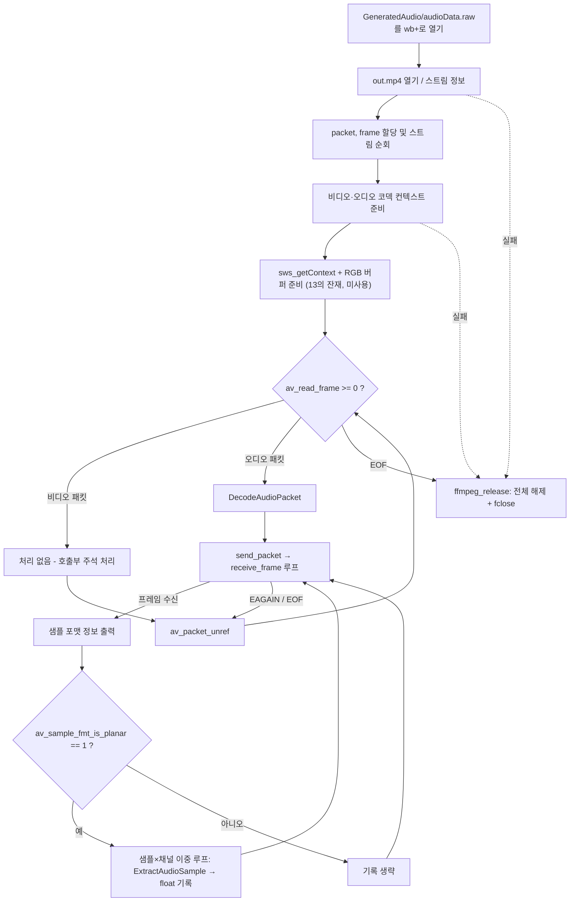

# 14. 오디오 데이터 디코딩과 PCM 저장

> 소스: `chapter02/14-introduction-audio-data/main.c` · 타겟: `chapter0214IntroductionAudioData` · [← 챕터 개요](README.md)

## 학습 목표

비디오와 동일한 send/receive 파이프라인으로 오디오 패킷을 디코딩한다. 오디오 샘플 포맷(planar vs packed, 정수 vs 실수)의 차이를 이해하고, `av_get_bytes_per_sample()`과 `av_sample_fmt_is_planar()`를 이용해 채널별 평면에서 샘플을 꺼내 float PCM으로 정규화한 뒤 `.raw` 파일로 저장한다.

## 핵심 개념

- **오디오 프레임**: 비디오 프레임이 픽셀 2차원 배열이라면, 오디오 프레임은 `nb_samples`개의 샘플 × 채널 수의 묶음이다. AAC는 보통 프레임당 1024샘플이다.
- **planar vs packed**: planar(`fltp` 등, 이름 끝 `p`)는 채널별로 분리된 버퍼(`extended_data[ch]`)에 샘플이 담기고, packed(`flt` 등)는 한 버퍼에 L,R,L,R... 순으로 인터리브된다. AAC 디코더의 기본 출력은 `fltp`(planar float)다.
- **샘플 정규화**: 정수 포맷(U8/S16/S32)은 `[-1, 1]` 범위의 float으로 스케일링하고, float/double 포맷은 그대로 읽는다. 이렇게 통일하면 이후 처리(재생, 분석)가 단순해진다.
- **인터리브 저장**: 파일에는 샘플 루프 안에서 채널 루프를 돌며 `L R L R ...` 순서로 기록한다 — planar를 packed로 재배열하는 셈이다.

## 프로그램 흐름



## 핵심 API

| API / 구조체 | 역할 |
|---|---|
| `avcodec_send_packet` / `avcodec_receive_frame` | 오디오도 비디오와 동일한 디코딩 파이프라인 사용 |
| `AVFrame->nb_samples` | 이 프레임에 담긴 채널당 샘플 수 |
| `AVFrame->extended_data[ch]` | planar 포맷에서 ch번 채널의 샘플 버퍼 |
| `AVFrame->ch_layout.nb_channels` | 채널 수(신형 채널 레이아웃 API) |
| `av_get_bytes_per_sample()` | 샘플 포맷의 바이트 크기(S16=2, FLT=4 등) |
| `av_sample_fmt_is_planar()` | planar 포맷 여부(1이면 planar) |
| `av_get_sample_fmt_name()` | 샘플 포맷 이름 문자열(`fltp` 등) |

## 이전 레슨과의 차이

- 07에서 열어만 두었던 **오디오 코덱 컨텍스트를 처음으로 실제 사용**한다. 디코딩 루프의 오디오 분기에 `DecodeAudioPacket()`이 들어가고, 비디오 분기의 그레이/컬러 호출은 모두 주석 처리되었다.
- `ExtractAudioSample()`이 추가되어 샘플 포맷별(크기별) 읽기와 float 정규화를 수행한다.
- 패킷 제한이 사실상 사라졌다: `packetCount == 200` 검사 안의 `break`가 주석 처리되어 파일 전체를 처리한다.
- CMake가 `LANGUAGES C`에서 **`LANGUAGES CXX`로 전환**되었다(소스는 여전히 `main.c` — 아래 알아두기 참고).

## ⚠️ 알아두기

- **CMake `LANGUAGES CXX` + C 소스**: 이 하위 프로젝트는 CXX만 선언하지만, 루트 `CMakeLists.txt`의 `project(udemy_ffmpeg_study)`가 기본으로 C/CXX를 모두 활성화해 두었기 때문에 `main.c`가 C로 컴파일된다. 하위 프로젝트만 떼어 빌드하면 문제가 될 수 있는 구성이다.
- **packed 포맷이면 아무것도 저장되지 않는다**: `av_sample_fmt_is_planar() == 1`일 때만 기록하므로, 디코더가 packed 포맷을 내놓는 경우 조용히 건너뛴다.
- **double 포맷 처리 버그**: `ExtractAudioSample()`의 `DBL/DBLP` 분기는 8바이트 double을 float으로 변환하지 않고 앞 4바이트를 float으로 재해석해 잘못된 값이 나온다.
- 오디오 파일 경로 계산 실패 시 `goto ffmpeg_release`가 `pAudioFile` 초기화보다 앞서 실행되어, 정리 블록의 `fclose(pAudioFile)`이 미초기화 포인터를 닫는 미정의 동작이 될 수 있다.
- 출력은 헤더 없는 raw PCM(float32, 인터리브)이므로 재생 시 포맷을 직접 지정해야 한다(아래 실행 방법 참고).

## 실행 방법

```bash
cmake --build cmake-build-debug --target chapter0214IntroductionAudioData
./cmake-build-debug/chapter02/14-introduction-audio-data/chapter0214IntroductionAudioData
```

- **입력: `resources/out.mp4`**
- 출력물: `resources/GeneratedAudio/audioData.raw` (float32 인터리브 PCM, 전체 오디오 트랙)
- 재생 확인 (44.1kHz 스테레오 기준):

```bash
ffplay -f f32le -ar 44100 -ch_layout stereo resources/GeneratedAudio/audioData.raw
```

---
→ 자세한 코드 해설: [코드 상세 해설](14-audio-data-deep-dive.md)
