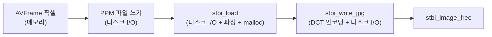

# 15. stb_image로 JPEG 저장 — 코드 상세 해설

> [← 기본 문서](15-jpeg-support.md)

## 전체 구조

14번 코드에서 비디오 경로를 되살리고, 두 저장 함수의 끝에 JPEG 재인코딩 단계를 붙였다.

```text
main
 ├─ audioData.raw 열기 (14와 동일)
 ├─ 열기 → 스트림 탐색 → 코덱 컨텍스트 → sws/RGB 준비 (13~14와 동일)
 ├─ while (av_read_frame)
 │    ├─ 비디오 패킷 → DecodeVideoPacket_GreyFrame()   ← 재활성화
 │    │                DecodeVideoPacket_RGBFrame()    ← 연달아 호출(특이점 1)
 │    └─ 오디오 패킷 → DecodeAudioPacket()             (14와 동일)
 └─ ffmpeg_release + fclose
저장 함수
 ├─ SaveGreyFrameToPPM: P5 저장 → stbi_load → stbi_write_jpg  ← 신규
 └─ SaveRGBFrame:       P6 저장 → stbi_load → stbi_write_jpg  ← 신규
```

## 코드 블록별 해설

### 1. stb 구현부 포함 (핵심)

```c
/** JPEG 를 사용하기 위한 설정 */
#define STB_IMAGE_IMPLEMENTATION

#include <stb_image.h>

#define STB_IMAGE_WRITE_IMPLEMENTATION

#include <stb_image_write.h>
```

stb 계열 헤더는 기본적으로 선언만 노출한다. `STB_IMAGE_IMPLEMENTATION`을 정의한 상태로 include한 번역 단위에만 함수 구현이 실제로 컴파일되어 들어간다. 프로젝트 전체에서 정확히 한 곳(여기서는 `main.c`)에서만 정의해야 하며, 두 곳 이상에서 정의하면 링크 시 중복 심볼 에러가 난다. 09~14 레슨은 이 매크로 없이 헤더만 include했기 때문에 stb 함수를 호출할 수 없었다.

### 2. 비디오 패킷을 두 함수에 전달

```c
/** video frame read  */
if (pPacket->stream_index == videoStreamIdx) {
//            printf("Found Video Frame Packet!\r\n");
    DecodeVideoPacket_GreyFrame(pPacket, pVideoCodecContext, pFrame);
    DecodeVideoPacket_RGBFrame(pPacket, pVideoCodecContext, pFrame, pRGBFrame, pSwsContext);
}
```

그레이 JPEG과 컬러 JPEG을 모두 만들기 위한 구성이지만, 같은 패킷을 같은 디코더 컨텍스트에 두 번 보내는 문제가 있다(특이점 1).

### 3. 그레이 저장 함수의 JPEG 단계

```c
    fclose(pFile);
    /** compiles slow */
    int colorChannel = 0;
    char jpegFilePath[BUFFER_MAX] = {0};
    char savedFileName[50] = {0};
#if defined(WIN32) || defined(WIN64)
    sprintf(savedFileName, "GeneratedGrayImage\\stbi_jpeg_file.jpeg");
#else
    sprintf(savedFileName, "GeneratedGrayImage/stbi_jpeg_file.jpeg");
#endif
    if (!GetResourcePath(savedFileName, jpegFilePath)) {
        printf("Failed resource path...\r\n");
        return;
    }
    /** stb write jpeg file -> Load PPM File */
    unsigned char *image = stbi_load(filename, &imageWidth, &imageHeight, &colorChannel, 0);
    /** write image file */
    stbi_write_jpg(jpegFilePath, imageWidth, imageHeight, colorChannel, image, 80);
    stbi_image_free(image);
```

흐름은 "방금 쓴 PPM 파일을 → 다시 읽어 → JPEG으로 인코딩"이다.

- `stbi_load(filename, &w, &h, &ch, 0)`: 마지막 인자 0은 "파일의 채널 수 그대로"라는 뜻. P5는 `ch = 1`로 로드된다. stb_image는 JPEG/PNG 외에 PNM(P5/P6 바이너리)도 읽을 수 있어서 이 우회가 가능하다.
- `stbi_write_jpg(..., 80)`: 마지막 인자는 JPEG 품질(1~100). 80은 화질/용량 균형점으로 흔히 쓰는 값이다.
- `stbi_image_free(image)`: `stbi_load`가 malloc한 픽셀 버퍼를 해제한다.

`imageWidth`/`imageHeight`는 함수 파라미터를 `stbi_load`의 출력 변수로 재사용한 것이다 — PPM 헤더에서 다시 읽히므로 값은 같다.

### 4. 컬러 저장 함수의 JPEG 단계

```c
#if defined(WIN32) || defined(WIN64)
    sprintf(savedFileName, "GeneratedColorImage\\stbi_jpeg_file.jpeg");
#else
    sprintf(savedFileName, "GeneratedColorImage/stbi_jpeg_file.jpeg");
#endif
    if (!GetResourcePath(savedFileName, jpegFilePath)) {
        printf("Failed resource path...\r\n");
        return;
    }
    /** stb write jpeg file -> Load PPM File */
    unsigned char *image = stbi_load(filename, &xSize, &ySize, &colorChannel, 0);
    /** write image file */
    stbi_write_jpg(jpegFilePath, xSize, ySize, colorChannel, image, 80);
    stbi_image_free(image);
```

P6를 로드하면 `colorChannel = 3`이 되어 컬러 JPEG이 만들어진다. 그레이/컬러 코드가 채널 수 하드코딩 없이 동일한 패턴인 것이 stb의 편리함이다. 참고로 두 경로의 `savedFileName`은 이전 레슨들과 달리 앞에 경로 구분자가 없는데, `GetResourcePath()`가 `"/resources/"`로 끝나는 접두사를 만들어 붙이므로 결과 경로는 정상이다.

## 심화: PPM 경유 재인코딩의 비용과 정석 경로

이 코드의 프레임당 처리 비용은 다음과 같이 불어난다.



메모리에 이미 픽셀이 있으므로 PPM 왕복은 순수한 낭비다. 정석은 두 가지다.

1. **stb로 바로 인코딩**: `stbi_write_jpg(path, w, h, 1, avFrame->data[0], 80)` — 단 stride 문제로 `linesize[0] == width`일 때만 안전하며, 아니면 줄 단위로 압축 없는 임시 버퍼에 복사 후 호출한다.
2. **FFmpeg 자체 인코더 사용**: `AV_CODEC_ID_MJPEG` 인코더에 `AV_PIX_FMT_YUVJ420P` 프레임을 넣으면 라이브러리 추가 없이 JPEG을 만들 수 있다. 이 방식이 이후 인코딩 학습의 출발점이 된다.

또한 JPEG은 손실 압축이므로 "PPM → JPEG → (다시 로드)" 를 반복하면 세대 손실(generation loss)이 누적된다는 점도 기억해 둘 만하다.

## ⚠️ 코드 특이점 상세

1. **같은 패킷을 같은 디코더에 두 번 send**
   `DecodeVideoPacket_GreyFrame()`이 패킷을 send하고 프레임을 모두 receive한 뒤, `DecodeVideoPacket_RGBFrame()`이 **같은 packet을 같은 `pVideoCodecContext`에 다시 send**한다. 디코더 입장에서는 동일 압축 데이터가 연속으로 두 번 들어오는 것이므로 각 프레임이 두 번 디코딩되고(`frame_num` 두 배 증가), DTS가 역행해 참조 상태가 오염될 수 있다(H.264는 대개 화면 깨짐 없이 넘어가지만 보장은 없다). 올바른 형태는 한 번만 디코딩해 받은 `pFrame`으로 그레이 저장과 RGB 변환·저장을 모두 수행하는 것이다.

2. **JPEG 파일명 고정 → 마지막 프레임만 남음**
   PPM과 마찬가지로 `stbi_jpeg_file.jpeg` 하나에 계속 덮어쓴다. 프레임 번호를 파일명에 포함해야 프레임별 결과를 얻는다.

3. **`stbi_load` 반환값 미검사**
   PPM 쓰기가 실패했거나(폴더 없음 등) 파일이 손상됐으면 `stbi_load`가 NULL을 반환하는데, 그대로 `stbi_write_jpg`에 넘긴다. `if (image == NULL) { fprintf(stderr, "%s\n", stbi_failure_reason()); return; }` 같은 방어가 필요하다.

4. **그레이 PPM의 텍스트 모드 쓰기와의 조합**
   `SaveGreyFrameToPPM`은 여전히 `fopen(filename, "w")`이다. Windows에서는 `0x0A` → `0x0D 0x0A` 변환으로 PPM이 오염되고, 그 오염된 파일을 `stbi_load`가 읽으므로 JPEG까지 연쇄적으로 깨진다.

5. **프레임마다 전체 파이프라인 실행(성능)**
   소스 주석 `/** compiles slow */`가 시사하듯, 모든 프레임에 대해 PPM 쓰기+로드+JPEG 인코딩을 수행해 실행이 매우 느리다. 이 레슨은 20패킷 제한도 없어(`packetCount == 200`의 `break`가 주석) 파일 전체를 처리한다.

6. **상속된 특이점**: fill 포맷 불일치(BGR24 vs RGB24), `rgbFrameBuffer` 누수, `pAudioFile` 초기화 전 `goto` 가능성, double 샘플 재해석 버그, packed 오디오 미기록, `pCurStream[idx]` 이중 인덱싱, 디코더 flush 누락, CMake `LANGUAGES CXX` + C 소스 조합. 각각의 상세는 [13](13-color-image-swscale-deep-dive.md#-코드-특이점-상세)·[14](14-audio-data-deep-dive.md#-코드-특이점-상세) 딥다이브 참고.
