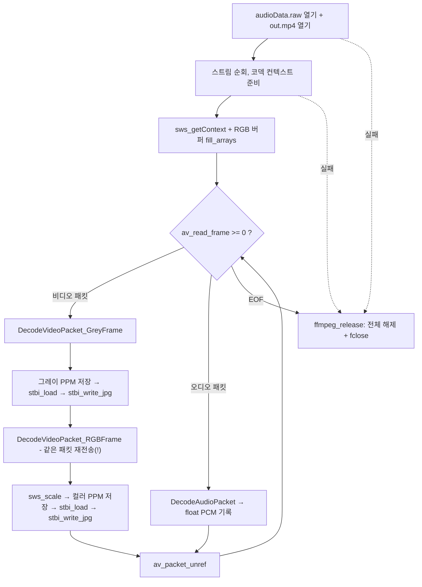

# 15. stb_image로 JPEG 저장

> 소스: `chapter02/15-jpeg-support/main.c` · 타겟: `chapter0215JPEGImage` · [← 챕터 개요](README.md)

## 학습 목표

무압축 PPM으로만 저장하던 프레임을 범용 포맷인 JPEG으로 변환한다. 헤더 온리 라이브러리 stb_image / stb_image_write의 사용법(`STB_IMAGE_IMPLEMENTATION` 매크로, `stbi_load`, `stbi_write_jpg`)을 익히고, 챕터 전체 파이프라인(그레이 저장 + 컬러 저장 + 오디오 저장)을 한 프로그램에서 모두 실행한다.

## 핵심 개념

- **헤더 온리 라이브러리**: stb 계열은 `.c` 파일이 없고, 사용하는 번역 단위 중 **한 곳에서만** `#define STB_IMAGE_IMPLEMENTATION`(쓰기용은 `STB_IMAGE_WRITE_IMPLEMENTATION`)을 정의한 뒤 include하면 구현부가 함께 컴파일된다.
- **PPM → JPEG 재인코딩**: 저장 함수가 PPM을 쓴 직후 그 파일을 `stbi_load()`로 다시 읽어 `stbi_write_jpg(..., 80)`으로 품질 80의 JPEG을 만든다. stb_image가 PNM(P5/P6)을 읽을 수 있기에 가능한 우회 경로다.
- **채널 수 자동 감지**: `stbi_load()`가 반환하는 `colorChannel`(P5=1, P6=3)을 그대로 `stbi_write_jpg()`에 넘겨 그레이/컬러 모두 같은 코드로 처리한다.

## 프로그램 흐름



## 핵심 API

| API / 구조체 | 역할 |
|---|---|
| `STB_IMAGE_IMPLEMENTATION` / `STB_IMAGE_WRITE_IMPLEMENTATION` | stb 구현부를 이 번역 단위에 포함시키는 매크로 |
| `stbi_load(path, &w, &h, &ch, 0)` | 이미지 파일(PPM 포함)을 8bit 픽셀 배열로 로드 |
| `stbi_write_jpg(path, w, h, ch, data, quality)` | 픽셀 배열을 JPEG으로 인코딩(품질 1~100) |
| `stbi_image_free()` | `stbi_load`가 할당한 픽셀 메모리 해제 |
| `sws_scale` 외 FFmpeg API | 13~14 레슨과 동일 |

## 이전 레슨과의 차이

- `SaveGreyFrameToPPM()`과 `SaveRGBFrame()` 끝부분에 **PPM을 다시 읽어 JPEG으로 쓰는 코드**가 추가되었다.
- 14에서 주석 처리됐던 비디오 경로가 되살아나, 비디오 패킷에 대해 `DecodeVideoPacket_GreyFrame()`과 `DecodeVideoPacket_RGBFrame()`을 **연달아 호출**한다(같은 패킷을 디코더에 두 번 보냄 — 알아두기 참고). 오디오 저장도 그대로 수행한다.
- 이전 레슨들에는 있던 `#include <stb_image_write.h>`가 구현 매크로와 함께 정식으로 활용된다.

## ⚠️ 알아두기

- **같은 패킷을 같은 디코더에 두 번 send**: 비디오 패킷마다 Grey → RGB 함수를 연달아 부르는데, 두 함수 모두 동일한 `pVideoCodecContext`에 `avcodec_send_packet()`을 호출한다. 같은 압축 데이터가 두 번 디코딩되어 frame_num이 두 배로 늘고, 타임스탬프 역행 경고가 뜰 수 있다.
- **JPEG도 매번 같은 파일명**: `GeneratedGrayImage/stbi_jpeg_file.jpeg`, `GeneratedColorImage/stbi_jpeg_file.jpeg`에 덮어써서 각각 마지막 프레임만 남는다.
- **프레임마다 디스크 왕복 재인코딩**: PPM 쓰기 → 디스크에서 다시 읽기 → JPEG 인코딩을 모든 프레임에 대해 수행하므로 매우 느리다(소스 주석 `compiles slow`). 메모리의 픽셀 버퍼를 바로 `stbi_write_jpg`에 넘기는 것이 정석이다.
- 그레이 PPM은 여전히 텍스트 모드(`"w"`)로 쓰이므로 Windows에서는 재로드 시 이미지가 깨질 수 있다.
- `stbi_load()` 실패(NULL 반환) 검사가 없어 폴더가 없거나 로드에 실패하면 NULL이 `stbi_write_jpg`로 전달된다.
- 이 레슨도 `LANGUAGES CXX`로 선언되어 있으나 루트 프로젝트가 C를 활성화해 둔 덕에 `main.c`가 빌드된다(14와 동일).

## 실행 방법

```bash
cmake --build cmake-build-debug --target chapter0215JPEGImage
./cmake-build-debug/chapter02/15-jpeg-support/chapter0215JPEGImage
```

- **입력: `resources/out.mp4`**
- 출력물 (전체 파일을 끝까지 처리):
  - `resources/GeneratedGrayImage/testPPM.ppm` + `resources/GeneratedGrayImage/stbi_jpeg_file.jpeg`
  - `resources/GeneratedColorImage/color.ppm` + `resources/GeneratedColorImage/stbi_jpeg_file.jpeg`
  - `resources/GeneratedAudio/audioData.raw`

---
→ 자세한 코드 해설: [코드 상세 해설](15-jpeg-support-deep-dive.md)
