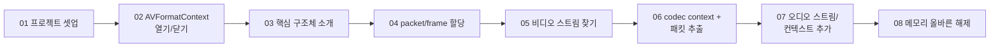
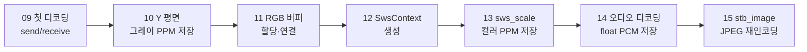

# Chapter 02 — 디코딩과 이미지/오디오 추출

FFmpeg 라이브러리(libavformat / libavcodec / libavutil / libswscale)를 직접 호출해 **컨테이너 열기 → 스트림 탐색 → 패킷 추출 → 디코딩 → 이미지/오디오 저장**까지의 전체 파이프라인을 한 단계씩 완성하는 챕터다.

- **01~08 (전반부)**: `AVFormatContext`로 파일을 열고 스트림을 세는 것에서 시작해, 핵심 자료구조(`AVPacket`/`AVFrame`/`AVCodecContext`)를 이해하고, 비디오·오디오 스트림을 찾아 압축 패킷을 추출한 뒤, 할당한 자원을 올바른 순서로 해제하는 방법까지 다룬다.
- **09~15 (후반부)**: `avcodec_send_packet` / `avcodec_receive_frame` 파이프라인으로 패킷을 실제 디코딩하고, Y 평면 그레이스케일 저장 → RGB 버퍼 준비 → SwsContext 설정 → `sws_scale` 컬러 변환 저장으로 이미지 파이프라인을 완성한다. 이어서 오디오 디코딩과 float PCM 저장, stb_image를 이용한 JPEG 재인코딩까지 확장한다.

모든 예제의 입력은 `resources/out.mp4`이며, 생성물은 `resources/GeneratedGrayImage/`, `resources/GeneratedColorImage/`, `resources/GeneratedAudio/`에 저장된다.

## 레슨 진행 관계

### 01~08 — 스트림 찾기와 패킷 추출

### 09~15 — 디코딩과 저장

## 레슨 목록

| # | 레슨 | 주제 | 핵심 API | 문서 |
|---|---|---|---|---|
| 01 | 01-project-setting | vcpkg + CMake로 FFmpeg 프로젝트 셋업 | `av_log` | [기본](01-project-setting.md) · [딥다이브](01-project-setting-deep-dive.md) |
| 02 | 02-counting-data-streaming-using-AVFormatContext | 컨테이너 열기/닫기와 스트림 개수 세기 | `avformat_open_input`, `avformat_find_stream_info`, `nb_streams` | [기본](02-counting-data-stream.md) · [딥다이브](02-counting-data-stream-deep-dive.md) |
| 03 | 03-advanced-FFMPEG-data-structure | 핵심 구조체(AVStream/AVCodecParameters 등) 소개 | `AVStream`, `AVCodecParameters`, `avcodec_find_decoder` | [기본](03-advanced-data-structure.md) · [딥다이브](03-advanced-data-structure-deep-dive.md) |
| 04 | 04-allocated-memory-FFMPEG-video-data | AVPacket / AVFrame 메모리 할당 | `av_packet_alloc`, `av_frame_alloc` | [기본](04-allocated-memory.md) · [딥다이브](04-allocated-memory-deep-dive.md) |
| 05 | 05-find-video-stream | 비디오 스트림 찾기와 정보 출력 | `AVMEDIA_TYPE_VIDEO`, `av_q2d`, `r_frame_rate` | [기본](05-find-video-stream.md) · [딥다이브](05-find-video-stream-deep-dive.md) |
| 06 | 06-extracting-individual-video-packets | 코덱 컨텍스트 준비와 비디오 패킷 추출 | `avcodec_alloc_context3`, `avcodec_parameters_to_context`, `avcodec_open2`, `av_read_frame` | [기본](06-extracting-video-packets.md) · [딥다이브](06-extracting-video-packets-deep-dive.md) |
| 07 | 07-find-audio-stream-and-extracting-audio-packets | 오디오 스트림 탐색과 오디오 코덱 컨텍스트 추가 | `AVMEDIA_TYPE_AUDIO`, `sample_rate` | [기본](07-find-audio-stream.md) · [딥다이브](07-find-audio-stream-deep-dive.md) |
| 08 | 08-freeing-memory-correctly | 할당 자원의 올바른 해제 순서 | `av_frame_free`, `av_packet_free`, `avformat_close_input` | [기본](08-freeing-memory.md) · [딥다이브](08-freeing-memory-deep-dive.md) |
| 09 | 09-decoding-a-video-frame | 첫 디코딩 — send/receive 파이프라인과 EAGAIN/EOF | `avcodec_send_packet`, `avcodec_receive_frame`, `AVERROR(EAGAIN)` | [기본](09-decoding-video-frame.md) · [딥다이브](09-decoding-video-frame-deep-dive.md) |
| 10 | 10-view-grayScale-image-using-FFMPEG | Y 평면을 그레이스케일 PPM(P5)으로 저장 | `AVFrame->data[0]`, `linesize[0]` | [기본](10-grayscale-image.md) · [딥다이브](10-grayscale-image-deep-dive.md) |
| 11 | 11-view-color-image-using-FFMPEG | RGB 출력 프레임과 버퍼 할당·연결 | `av_image_get_buffer_size`, `av_image_fill_arrays`, `av_malloc` | [기본](11-color-image.md) · [딥다이브](11-color-image-deep-dive.md) |
| 12 | 12-view-color-image-using-FFMPEG-swscale | SwsContext 생성(변환 준비 단계) | `sws_getContext`, `SWS_BILINEAR`, `sws_freeContext` | [기본](12-swscale-setting.md) · [딥다이브](12-swscale-setting-deep-dive.md) |
| 13 | 13-view-color-image-using-swScale-FFMPEG | YUV→RGB 변환과 컬러 PPM(P6) 저장 | `sws_scale` | [기본](13-color-image-swscale.md) · [딥다이브](13-color-image-swscale-deep-dive.md) |
| 14 | 14-introduction-audio-data | 오디오 디코딩과 float PCM(.raw) 저장 | `av_sample_fmt_is_planar`, `av_get_bytes_per_sample`, `extended_data` | [기본](14-audio-data.md) · [딥다이브](14-audio-data-deep-dive.md) |
| 15 | 15-jpeg-support | stb_image로 PPM→JPEG 재인코딩 | `STB_IMAGE_IMPLEMENTATION`, `stbi_load`, `stbi_write_jpg` | [기본](15-jpeg-support.md) · [딥다이브](15-jpeg-support-deep-dive.md) |

## 후반부(09~15)에서 반복 등장하는 주의점

- 이미지 저장 파일명이 고정되어 있어(`testPPM.ppm`, `color.ppm`, `stbi_jpeg_file.jpeg`) **항상 마지막 프레임만 남는다**.
- 11~12는 컬러 파이프라인을 위한 **의도된 중간 단계**로, 실행 결과는 여전히 그레이스케일이다.
- `videoStreamIdx` 초기값(09~11의 `0` → 12부터 `-1`), 코덱 컨텍스트 해제(11부터 추가) 등 앞 레슨의 문제가 뒤 레슨에서 고쳐지는 흐름 자체가 학습 포인트다.
- 세부 특이점(픽셀 포맷 불일치, use-after-free, 이중 디코딩 등)은 각 레슨의 딥다이브 문서에 정리했다.

---
[← 전체 로드맵](../README.md) · [이전: Chapter 01](../chapter01/README.md) · [다음: FFMPEG-Books →](../ffmpeg-books/README.md)
