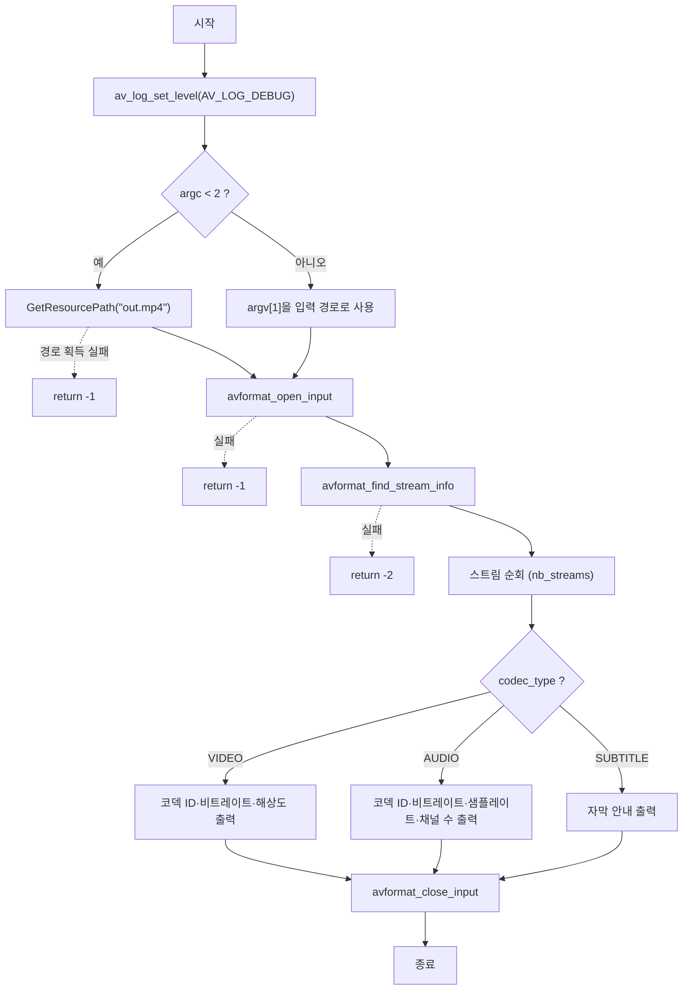

# 01. 스캐닝 — 컨테이너 열기와 스트림 분류

> 소스: `FFMPEG-Books/FFMPEG-Library-Codec-and-Image-Transform/01-scanning/main.c` · 타겟: `Scanning` · [← 개요](README.md)

## 학습 목표

- 미디어 파일(컨테이너)을 열어 `AVFormatContext`를 얻는 과정을 이해한다
- `avformat_find_stream_info`로 스트림 정보를 확보한 뒤 스트림을 순회하며 타입별로 분류한다
- `av_log_set_level`로 FFmpeg 내부 로그 출력 수준을 제어한다
- 명령행 인자(argv)로 입력 파일을 받도록 확장한다

## 핵심 개념

- **컨테이너(Container)**: mp4, mkv 같은 파일 포맷. 내부에 비디오·오디오·자막 등 여러 스트림을 담는다. FFmpeg에서는 `AVFormatContext`가 컨테이너 전체를 대표한다.
- **스트림(Stream)**: 컨테이너 안의 개별 미디어 트랙. `pAvFormatContext->streams[i]`로 접근하며 개수는 `nb_streams`다.
- **AVCodecParameters**: 각 스트림의 코덱 정보(코덱 ID, 비트레이트, 해상도, 샘플레이트 등)를 담는다. `stream->codecpar`로 얻는다.
- **로그 레벨**: 이 예제는 `av_log_set_level(AV_LOG_DEBUG)`를 호출해 FFmpeg의 디버그 로그까지 모두 콘솔에 출력한다.

## 프로그램 흐름



## 핵심 API

| API / 구조체 | 역할 |
|---|---|
| `av_log_set_level(AV_LOG_DEBUG)` | FFmpeg 로그 출력 수준을 DEBUG로 설정한다 |
| `avformat_open_input` | 파일을 열고 `AVFormatContext`를 할당·초기화한다 |
| `avformat_find_stream_info` | 패킷을 일부 읽어 스트림 정보(코덱 파라미터 등)를 채운다 |
| `AVFormatContext` | 컨테이너 전체(스트림 배열, 메타데이터)를 대표하는 구조체 |
| `AVCodecParameters` | 스트림별 코덱 정보. `codec_type`으로 비디오/오디오/자막을 구분한다 |
| `avformat_close_input` | 컨텍스트를 닫고 메모리를 해제한다 |

## chapter01/02와의 차이

- chapter01의 스트림 정보 예제와 골격은 같지만, **argv로 입력 파일을 받는 분기**가 추가되어 인자가 없으면 `GetResourcePath("out.mp4", ...)`로 기본 리소스를 사용한다.
- `av_log_set_level`을 명시적으로 호출해 FFmpeg 내부 동작(프로브 과정 등)을 로그로 관찰할 수 있게 했다.
- 아직 `VideoContext` 구조체나 `open_input`/`Release` 함수 분리는 없다. 모든 로직이 `main` 안에 있으며, 이 구조화는 02번부터 시작된다.

## ⚠️ 알아두기

- `FFMPEG_RELEASE:` 레이블이 선언되어 있지만 **어떤 `goto`도 이 레이블로 점프하지 않는다**. 에러 경로는 전부 `return`으로 즉시 종료하므로, `avformat_find_stream_info` 실패 시 이미 열린 `AVFormatContext`가 닫히지 않고 누수된다.
- `GetResourcePath`는 현재 작업 디렉터리 경로에서 `"/cmake"` 문자열을 찾아 그 앞까지를 저장소 루트로 간주한다. 즉 `cmake-build-debug` 같은 빌드 디렉터리에서 실행해야 동작하며, 빌드 폴더 이름에 `cmake`가 없으면 실패한다.

## 실행 방법

CMake 타겟 `Scanning`을 빌드한 뒤 실행한다.

```bash
# 인자 없이 실행 → 저장소 루트 resources/out.mp4 사용
./Scanning

# 파일을 직접 지정
./Scanning /path/to/video.mp4
```

`GetResourcePath` 특성상 인자 없이 실행할 때는 경로에 `cmake`가 포함된 빌드 디렉터리(예: `cmake-build-debug/FFMPEG-Books/...`)에서 실행해야 한다.

---
→ 자세한 코드 해설: [코드 상세 해설](01-scanning-deep-dive.md)
