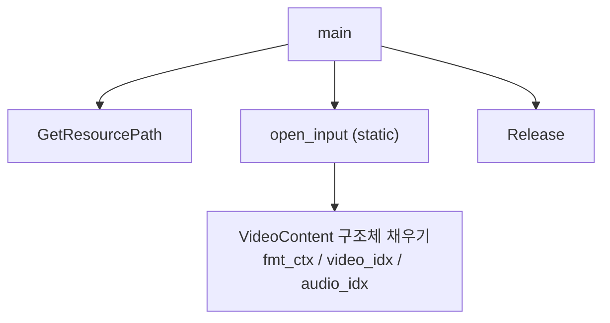
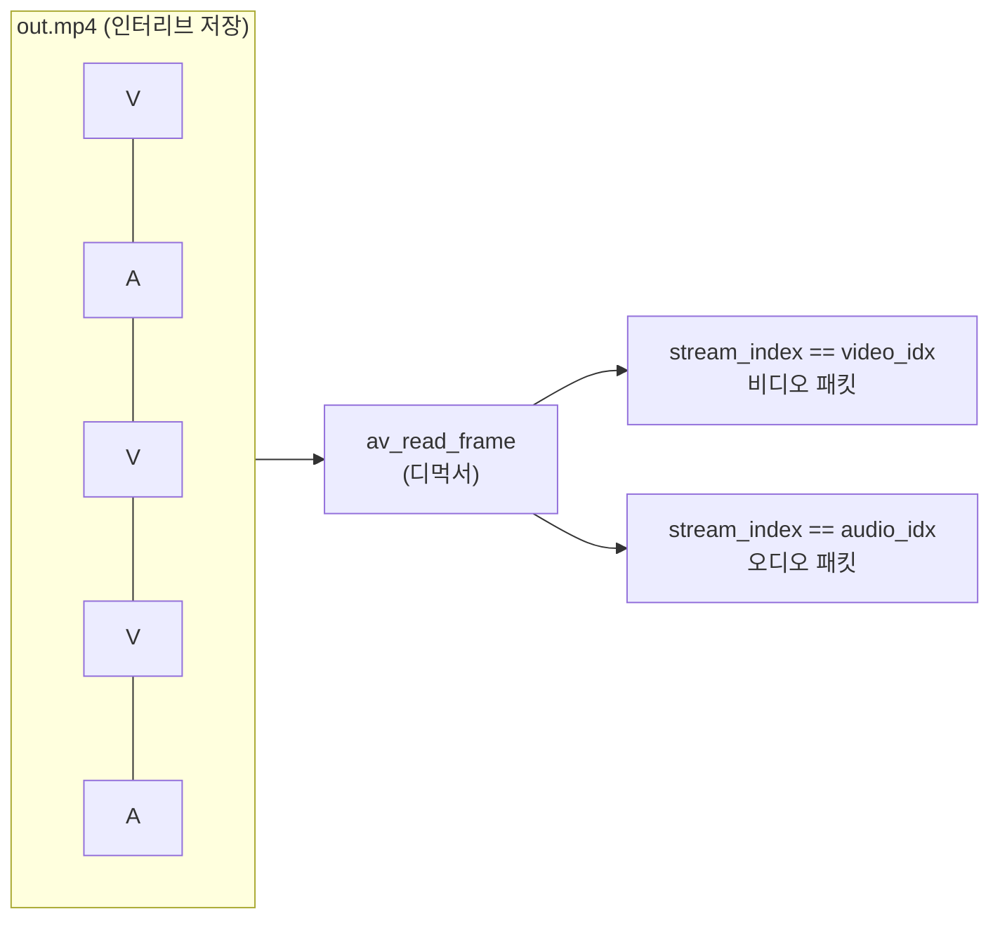

# 02. 디먹싱 — 코드 상세 해설

> [← 기본 문서](02-demuxing.md)

## 전체 구조



이 레슨의 핵심은 API가 아니라 **구조체 기반 캡슐화**다.

```c
typedef struct _VideoContext {
    AVFormatContext *fmt_ctx;
    int video_idx;
    int audio_idx;
} VideoContent;
```

| 함수 | 역할 |
|---|---|
| `open_input` | 파일 열기 + 스트림 정보 획득 + 첫 비디오/오디오 스트림 인덱스 기록. `static`으로 선언해 "이 파일 안에서 한 번만 쓰는 초기화 함수"임을 표현 |
| `main` | 패킷 할당 → `open_input` → 패킷 읽기 루프 → 정리 |
| `GetResourcePath` | 01번과 동일. 저장소 루트 `resources/` 경로 역산 |
| `Release` | `avformat_close_input` + 인덱스 필드 초기화 |

## 코드 블록별 해설

### 1) open_input — 초기화의 캡슐화

```c
static int open_input(const char *filename, VideoContent *outVideoContext) {
    int index = 0;
    int errorCode = 0;
    /** 구조체 초기화 */
    outVideoContext->fmt_ctx = NULL;
    outVideoContext->audio_idx = outVideoContext->video_idx = -1;

    /** FFMPEG 로 파일 열기 */
    if ((errorCode = avformat_open_input(&outVideoContext->fmt_ctx, filename, NULL, NULL)) < 0) {
        av_log(NULL, AV_LOG_ERROR, "[FFMPEG](%d)Failed Open FFMPEG : [%s]\r\n", errorCode, filename);
        return -1;
    }
```

호출자 쪽 구조체를 함수가 직접 초기화하므로, `main`은 `VideoContent video_cxt;`를 미초기화 상태로 선언해도 안전하다. 인덱스의 초기값 `-1`은 "해당 타입 스트림 없음"의 센티널로 쓰인다.

### 2) 스트림 인덱스 분류 — 첫 번째 것만

```c
/** Video Type 일 경우 */
if (codec_params->codec_type == AVMEDIA_TYPE_VIDEO && outVideoContext->video_idx < 0) {
    outVideoContext->video_idx = index;
}
    /** Audio Type 일 경우 */
else if (codec_params->codec_type == AVMEDIA_TYPE_AUDIO && outVideoContext->audio_idx < 0) {
    outVideoContext->audio_idx = index;
}
```

`< 0` 조건 덕분에 같은 타입의 스트림이 여러 개여도 **첫 번째 스트림만** 기록한다. 01번이 모든 스트림을 순회 "출력"했다면, 여기서는 이후 처리에 쓸 대표 스트림을 "선택"하는 것으로 목적이 바뀌었다. 비디오·오디오 둘 다 못 찾았을 때만 `-3`을 반환한다(둘 중 하나만 있어도 성공).

### 3) 패킷 읽기 루프

```c
while (true) {

    /** context에서 데이터를 읽어서 packet 형태로 만들어 주기 */
    ret = av_read_frame(video_cxt.fmt_ctx, pkt);
    /** Frame이 끝일 경우 */
    if (ret == AVERROR_EOF) {
        printf("End of Frame\r\n");
        break;
    }
    /** packet에 있는 데이터가 비디오 스트림일 경우 */
    if (pkt->stream_index == video_cxt.video_idx) {
        printf("Video Packet!\r\n");
    }
        /** packet에 있는 데이터가 오디오 스트림일 경우 */
    else if (pkt->stream_index == video_cxt.audio_idx) {
        printf("Audio Packet!\r\n");
    }
    /** packet은 데이터를 한 번 읽어주면 다음에 초기화를 해줘야 한다. */
    av_packet_unref(pkt);
}
```

`av_read_frame`은 함수 이름과 달리 **프레임이 아니라 패킷**(압축된 데이터)을 반환한다. 반환된 패킷의 `stream_index`를 `open_input`에서 기록해 둔 인덱스와 비교해 소속 스트림을 판별한다. 매 반복 끝의 `av_packet_unref`가 중요하다 — `av_read_frame`은 패킷에 새 참조 버퍼를 채우므로, unref 하지 않으면 이전 반복의 버퍼가 누수된다.

### 4) 정리

```c
/** 사용한 packet에 대한 메모리에서 해제 */
av_packet_free(&pkt);
Release(&video_cxt);
```

`av_packet_unref`(내용 해제)와 `av_packet_free`(객체 자체 해제)의 역할 구분을 보여준다. `Release`는 `avformat_close_input` 후 인덱스를 `-1`로 되돌려 구조체를 재사용 가능한 상태로 만든다.

## 심화 — 디먹싱이란

컨테이너 파일 안에서 비디오/오디오 패킷은 시간순으로 섞여(인터리브) 저장돼 있다. 디먹서는 이를 읽어 스트림 소속이 표시된 `AVPacket`으로 하나씩 돌려준다.



이 단계의 패킷은 여전히 **압축된 상태**다. 압축을 푸는 것은 04번(디코딩)의 몫이고, 압축을 풀지 않은 채 다른 컨테이너에 다시 넣는 것이 03번(리먹싱)이다.

## ⚠️ 코드 특이점 상세

### 1) EOF 이외의 읽기 에러를 처리하지 않음

```c
ret = av_read_frame(video_cxt.fmt_ctx, pkt);
if (ret == AVERROR_EOF) { ... break; }
```

`av_read_frame`은 EOF 외에도 I/O 오류 등으로 음수를 반환할 수 있다. 그 경우 `pkt`에는 유효한 데이터가 없는데도 루프가 계속 돌아 stream_index 비교와 unref를 반복한다. 올바른 형태는 `if (ret < 0) break;`로 모든 음수를 종료 조건으로 삼고, 필요하면 EOF 여부만 별도 메시지로 구분하는 것이다.

### 2) `open_input` 실패 시 패킷 누수

```c
AVPacket *pkt = av_packet_alloc();
...
if (open_input(resourcePath, &video_cxt) < 0) {
    printf("Failed FFMPEG Open..\r\n");
    return -1;   /* pkt가 해제되지 않는다 */
}
```

`pkt` 할당이 `open_input`보다 먼저 이뤄지는데, 실패 분기에서 `av_packet_free`를 호출하지 않는다. 프로세스 종료로 회수되긴 하지만, 03번처럼 `goto RELEASE` 패턴으로 공통 정리 경로를 두는 편이 올바르다.

### 3) `open_input` 내부의 부분 실패 시 컨텍스트 미해제

`avformat_open_input` 성공 후 `avformat_find_stream_info`나 인덱스 탐색이 실패하면 `-1`/`-3`을 반환만 하고 이미 열린 `fmt_ctx`를 닫지 않는다. `main`의 실패 분기도 `Release`를 호출하지 않으므로 컨텍스트가 누수된다. 실패 시 함수 내부에서 `avformat_close_input(&outVideoContext->fmt_ctx)` 후 반환하거나, 호출자가 실패 시에도 `Release`를 태우는 형태가 올바르다.

### 4) typedef 이름 불일치 — `VideoContent`

구조체 태그는 `_VideoContext`인데 typedef 이름은 `VideoContent`다(주석·의도상 "Context"의 오타로 보인다). 03·04번에서는 `typedef struct fmt_ctx { ... } VideoContext;`로 이름이 바뀌어 레슨 간 코드 이식 시 혼동의 여지가 있다.

---
[← 기본 문서](02-demuxing.md) · [개요](README.md)
