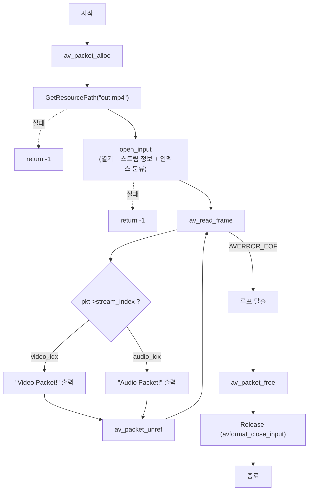

# 02. 디먹싱 — 패킷 읽기 루프와 VideoContext 도입

> 소스: `FFMPEG-Books/FFMPEG-Library-Codec-and-Image-Transform/02-demuxing/main.c` · 타겟: `Demuxing` · [← 개요](README.md)

## 학습 목표

- 디먹싱(demuxing)의 개념 — 컨테이너에서 압축된 패킷을 스트림별로 꺼내는 과정 — 을 이해한다
- `av_read_frame` 루프로 패킷을 읽고 `stream_index`로 비디오/오디오를 구분한다
- `AVPacket`의 할당(`av_packet_alloc`)·재사용(`av_packet_unref`)·해제(`av_packet_free`) 수명 주기를 익힌다
- 포맷 컨텍스트와 스트림 인덱스를 묶는 `VideoContext` 구조체와 `open_input`/`Release` 함수 분리 패턴을 도입한다

## 핵심 개념

- **디먹싱**: 컨테이너에 인터리브되어 저장된 비디오·오디오 데이터를 스트림 단위 패킷(`AVPacket`)으로 분리해 꺼내는 것. 디코딩(압축 해제)과는 별개 단계다.
- **AVPacket**: 코덱으로 압축된 스트림 데이터 한 덩어리. `pkt->stream_index`가 어느 스트림 소속인지 알려준다.
- **패킷 재사용**: 루프에서 같은 `AVPacket`을 반복 사용하려면 매 반복 끝에 `av_packet_unref`로 내부 버퍼 참조를 해제해야 한다.
- **컨텍스트 구조체**: 이 레슨부터 `AVFormatContext*` + `video_idx` + `audio_idx`를 하나로 묶은 구조체(`VideoContent`)를 사용한다.

## 프로그램 흐름



## 핵심 API

| API / 구조체 | 역할 |
|---|---|
| `av_packet_alloc` | `AVPacket` 객체를 힙에 할당한다 |
| `av_read_frame` | 컨테이너에서 다음 패킷 하나를 읽는다. EOF면 `AVERROR_EOF` 반환 |
| `pkt->stream_index` | 패킷이 속한 스트림 번호. `video_idx`/`audio_idx`와 비교해 분류한다 |
| `av_packet_unref` | 패킷 내부 데이터 참조를 해제해 다음 `av_read_frame`에 재사용 가능하게 한다 |
| `av_packet_free` | 패킷 객체 자체를 해제한다 |
| `avformat_close_input` | 입력 컨텍스트를 닫는다 (`Release`에서 호출) |

## chapter01/02와의 차이

- **`VideoContext` 구조체 도입**: chapter01에서는 포맷 컨텍스트와 스트림 인덱스를 지역 변수로 흩어놓았지만, 여기서는 `typedef struct _VideoContext { AVFormatContext *fmt_ctx; int video_idx; int audio_idx; } VideoContent;`로 묶어 함수 간에 전달한다.
- **`open_input` 함수 분리**: 파일 열기 → 스트림 정보 획득 → 첫 번째 비디오/오디오 스트림 인덱스 저장까지를 `static` 함수 하나로 캡슐화했다. "파일 열기는 한 번만"이라는 의도를 `static`으로 표현했다.
- **`Release` 함수 분리**: 정리 로직을 별도 함수로 빼서 구조체 필드를 일관되게 초기 상태(-1)로 되돌린다.
- 01번과 달리 argv 입력 지원이 없고 `av_log_set_level` 호출도 없다.

## ⚠️ 알아두기

- typedef 이름이 `VideoContext`가 아니라 **`VideoContent`** 다(구조체 태그는 `_VideoContext`). 03·04번에서는 `VideoContext`로 바뀌므로 레슨 간 이름이 일치하지 않는다.
- `av_read_frame` 반환값을 `AVERROR_EOF`하고만 비교한다. EOF가 아닌 다른 에러(음수)가 나오면 루프를 탈출하지 못하고 계속 돈다. 정석은 `ret < 0`이면 탈출하는 것이다.
- `open_input` 실패 시 `return -1`로 종료하는데 이미 할당된 `pkt`를 해제하지 않는다(패킷 누수). 또한 `open_input` 내부에서 `avformat_open_input` 성공 후 이후 단계가 실패해도 컨텍스트를 닫지 않고 반환한다.

## 실행 방법

CMake 타겟 `Demuxing`을 빌드한 뒤 실행한다. 입력은 저장소 루트 `resources/out.mp4`로 고정이며 argv를 받지 않는다.

```bash
./Demuxing
# Video Packet! / Audio Packet! 이 패킷 단위로 출력되고 End of Frame으로 종료된다
```

`GetResourcePath` 특성상 경로에 `cmake`가 포함된 빌드 디렉터리에서 실행해야 한다.

---
→ 자세한 코드 해설: [코드 상세 해설](02-demuxing-deep-dive.md)
