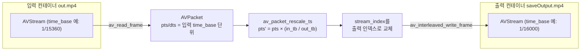

# 03. 리먹싱 — 코드 상세 해설

> [← 기본 문서](03-remuxing.md)

## 전체 구조

```c
typedef struct fmt_ctx {
    AVFormatContext *fmt_ctx;
    int video_idx;
    int audio_idx;
} VideoContext;
```

02번의 `VideoContent`가 `VideoContext`로 이름이 바뀌었고(구조체 태그는 멤버와 같은 `fmt_ctx`), 입력용 `video_cxt`와 출력용 `copy_cxt` **두 인스턴스**를 대칭으로 사용한다.

| 함수 | 역할 |
|---|---|
| `open_input` | 02번과 동일 — 입력 열기 + 스트림 인덱스 분류 |
| `create_output` | 출력 컨텍스트 생성 → 스트림 복제(`avcodec_parameters_copy`) → `avio_open` → `avformat_write_header` |
| `main` | 두 컨텍스트 준비 → 패킷 복사 루프(rescale + write) → trailer → 정리 |
| `Release` | 입력은 `avformat_close_input`, 출력은 `avio_closep` + `avformat_free_context` |
| `GetResourcePath` | 01·02번과 동일 |

## 코드 블록별 해설

### 1) create_output — 출력 컨테이너 준비

```c
/** 동영상을 만들어주기 위한 파일 열기 */
if ((errCode = avformat_alloc_output_context2(&outputContext->fmt_ctx, NULL, NULL, filename)) < 0) {
    av_log(NULL, AV_LOG_ERROR, "[FFMPEG](%d) Output File Create Failed... [%s]\r\n", errCode, filename);
    return -1;
}
av_dump_format(outputContext->fmt_ctx, 0, filename, 1);
```

2·3번째 인자가 `NULL`이므로 파일 이름의 확장자(`.mp4`)로 muxer를 자동 선택한다. 이 시점의 `av_dump_format`은 아직 스트림이 없는 빈 컨테이너를 덤프한다(스트림 구성 확인은 `main`에서 다시 한 번 수행한다).

### 2) 스트림 복제 루프

```c
AVStream *pInStream = pVideoContext->fmt_ctx->streams[streamIdx];
AVCodecParameters *pInCodecContext = pInStream->codecpar;
/** Codec에 대한 정보를 codec_id를 통해서 가져온다. */
const AVCodec *pCodec = avcodec_find_decoder(pInCodecContext->codec_id);
...
/** 새로 만들어주는 Stream 동영상 파일을 만들기 위해서 사용이 되는 스트림이다. */
AVStream *pOutStream = avformat_new_stream(outputContext->fmt_ctx, pCodec);
...
/** Straem에 Codec에 대한 파라미터 정보를 복사해준다. */
if ((errCode = avcodec_parameters_copy(pOutStream->codecpar, pInStream->codecpar)) < 0) {
```

입력의 비디오/오디오 스트림에 대해서만(그 외 스트림은 `continue`) 출력 스트림을 만들고, `avcodec_parameters_copy`로 코덱 파라미터를 통째로 복사한다. **디코딩을 하지 않으므로** `avcodec_find_decoder`는 실제로 필요 없다 — `avformat_new_stream`의 codec 인자는 힌트일 뿐이며 리먹싱 예제들은 보통 `NULL`을 넘긴다.

```c
/** 시간 정보를 복사를 해준다. */
pOutStream->time_base = pInStream->time_base;
```

출력 스트림 time_base를 입력과 같게 요청한다. 단, muxer가 `avformat_write_header`에서 이 값을 자기 규칙(mp4는 보통 그대로 수용)에 맞게 바꿀 수 있으므로, 이후 패킷 쓰기 시점의 `av_packet_rescale_ts`가 실제 안전장치다.

```c
if (streamIdx == pVideoContext->video_idx) {
    outputContext->video_idx = out_idx++;
} else {
    outputContext->audio_idx = out_idx++;
}
```

출력 컨테이너에는 비디오/오디오만 추가되므로 출력 스트림 인덱스는 0부터 새로 매겨진다(`out_idx`). 입력 인덱스와 출력 인덱스가 다를 수 있어 이 매핑을 구조체에 기록해 둔다.

### 3) 파일 열기와 헤더 작성

```c
/** 파일에 동영상 복제 */
if (!(outputContext->fmt_ctx->oformat->flags & AVFMT_NOFILE)) {
    /** 파일에 데이터를 쓰기 위한 파일 열기 */
    if ((errCode = avio_open(&outputContext->fmt_ctx->pb, filename, AVIO_FLAG_WRITE)) < 0) {
        ...
    }
}

/** Container 헤더 파일 작성 */
if ((errCode = avformat_write_header(outputContext->fmt_ctx, NULL)) < 0) {
```

입력과 달리 출력 `AVFormatContext`는 파일 I/O(`pb`)를 직접 열어줘야 한다. `AVFMT_NOFILE` 포맷(장치 출력 등)은 예외다. 헤더 작성까지 끝나야 패킷을 쓸 수 있는 상태가 된다.

### 4) 패킷 복사 루프 — rescale이 핵심

```c
/** 해당 Packet에 대한 Stream을 가져온다. */
AVStream *pInStream = video_cxt.fmt_ctx->streams[pkt->stream_index];
/** 출력할 스트림의 종류 가져오기 */
outputStreamIdx = (pkt->stream_index == video_cxt.video_idx) ? copy_cxt.video_idx : copy_cxt.audio_idx;
/** output stream 가져오기 */
AVStream *pOutStream = copy_cxt.fmt_ctx->streams[outputStreamIdx];
/** 시간 정보를 변경을 해준다. */
av_packet_rescale_ts(pkt, pInStream->time_base, pOutStream->time_base);
/** packet에 있는 StreamIdx에 대한 값을 변경을 해준다. -> 변경을 해주지 않아도 동작한다. */
pkt->stream_index = outputStreamIdx;
/** file에 데이터 쓰기 */
if ((ret = av_interleaved_write_frame(copy_cxt.fmt_ctx, pkt)) < 0) {
```

패킷의 pts/dts/duration은 **입력 스트림의 time_base 단위**로 적혀 있다. 출력 스트림의 time_base가 다르면 그대로 쓸 경우 재생 속도/길이가 틀어지므로 `av_packet_rescale_ts`로 환산한다. `stream_index`도 출력 기준으로 바꿔야 한다 — 주석은 "변경하지 않아도 동작한다"고 하지만, 이는 입력·출력의 인덱스 배치가 우연히 같은 경우(out.mp4처럼 video=0, audio=1)에만 성립하며 일반적으로는 필수다.

### 5) 마무리

```c
/** 파일에 쓰는 시점에 마무리 못한 정보를 처리 */
av_write_trailer(copy_cxt.fmt_ctx);
```

mp4의 moov 박스(인덱스) 등 마무리 정보를 기록한다. trailer를 쓰지 않으면 재생 불가능한 파일이 남는다.

## 심화 — 리먹싱 파이프라인과 time_base 재스케일



- 디코더/인코더가 전혀 개입하지 않는다. 패킷의 압축 데이터(`pkt->data`)는 바이트 단위로 동일하게 복사된다.
- 시간축만 컨테이너 규칙에 맞게 다시 계산된다. 예를 들어 pts=1024, 입력 tb=1/15360, 출력 tb=1/16000이면 새 pts는 1024 × 16000/15360 ≈ 1066이 된다.
- `av_interleaved_write_frame`은 비디오/오디오 패킷을 dts 순서로 버퍼링·정렬해 기록하므로 호출 순서가 다소 어긋나도 올바른 인터리브가 보장된다.

## ⚠️ 코드 특이점 상세

### 1) `pOutputCodecContext`가 아무 일도 하지 않음 — GLOBAL_HEADER 미반영

```c
/** Codec에 대한 Context를 만들어 준다. */
AVCodecContext *pOutputCodecContext = avcodec_alloc_context3(pCodec);
...
/** Codec에 대한 Meta 정보를 삭제 -> FFMPEG에서 지원하는 코덱과 호환성을 맞추기 위해서 삭제를 한다. */
pOutputCodecContext->codec_tag = 0;
/** Codec Context에 대한 Header 설정 */
if (outputContext->fmt_ctx->oformat->flags & AVFMT_GLOBALHEADER) {
    pOutputCodecContext->flags |= AV_CODEC_FLAG_GLOBAL_HEADER;
}
...
avcodec_free_context(&pOutputCodecContext);
```

`codec_tag = 0`과 `AV_CODEC_FLAG_GLOBAL_HEADER`를 설정한 대상은 방금 만든 **임시 `AVCodecContext`** 인데, 이 값을 `pOutStream->codecpar`로 옮기는 코드(`avcodec_parameters_from_context` 등)가 없이 곧바로 `avcodec_free_context`로 해제한다. 따라서 두 설정 모두 출력 스트림에 **전혀 반영되지 않는다**.

- 왜 문제인가: 이 패턴은 원래 **트랜스코딩(재인코딩)** 예제에서 인코더 컨텍스트에 필요한 설정이다. 리먹싱에서는 인코더가 없으므로 GLOBAL_HEADER 플래그 자체가 무의미하고, 대신 `codec_tag` 초기화는 스트림의 `codecpar`에 직접 해야 의미가 있다. 지금 코드는 `avcodec_parameters_copy`가 입력의 `codec_tag`를 그대로 복사해 오므로, mp4 → mp4처럼 같은 포맷 간에는 우연히 문제가 없지만 **다른 컨테이너로 리먹싱하면 호환되지 않는 codec_tag 때문에 `avformat_write_header`가 실패**할 수 있다.
- 올바른 형태(리먹싱 기준): 임시 코덱 컨텍스트 할당/해제를 모두 제거하고, 파라미터 복사 직후 `pOutStream->codecpar->codec_tag = 0;` 한 줄만 두는 것이다(FFmpeg 공식 remux 예제와 동일).

### 2) `open_input` 실패 시 미초기화 `copy_cxt`로 `Release` 호출

```c
VideoContext video_cxt;
VideoContext copy_cxt;
...
if (open_input(resourcePath, &video_cxt) < 0) {
    printf("Failed FFMPEG Open..\r\n");
    goto RELEASE;
}
...
RELEASE:
Release(&video_cxt, &copy_cxt);
```

`copy_cxt`는 스택 변수로 선언만 되고 `create_output`이 호출돼야 초기화된다. `open_input`이 실패하면 초기화 전에 `Release(&video_cxt, &copy_cxt)`가 실행되는데, `Release`는 `pWriteContext->fmt_ctx != NULL`을 검사하므로 **쓰레기 값이 NULL이 아니면** `oformat->flags` 접근과 `avformat_free_context`에서 미정의 동작(크래시)이 발생할 수 있다. 올바른 형태는 선언 시 `VideoContext copy_cxt = { NULL, -1, -1 };`처럼 0 초기화하는 것이다. (04번은 같은 문제를 `output_ctx.fmt_ctx = NULL;` 한 줄로 부분적으로 막았다.)

### 3) `goto RELEASE` 경로에서 패킷 누수 + trailer 미기록

`open_input`/`create_output` 실패 시 `goto RELEASE`는 `av_packet_free(&pkt)` **앞의 코드를 건너뛰기 때문에** 이미 할당된 `pkt`가 해제되지 않는다. 반대로 정상 경로에서는 `av_write_trailer` → `av_packet_free` → (레이블 통과) → `Release` 순으로 모두 실행된다. 또한 쓰기 루프에서 `av_interleaved_write_frame` 실패로 `break`한 경우에도 `av_write_trailer`는 호출된다.

### 4) EOF 이외의 읽기 에러 미처리 (02번과 동일)

`av_read_frame` 반환값을 `AVERROR_EOF`와만 비교하므로 다른 음수 에러 시 루프가 종료되지 않는다.

### 5) `WIn64` 오타

```c
#if defined(WIN32) || defined(WIn64)
```

`WIN64`가 `WIn64`로 잘못 적혀 있다(01·02번은 정상). C 매크로는 대소문자를 구분하므로 64비트 전용 Windows 빌드에서 `WIN32`도 정의되지 않는 환경이라면 `<Windows.h>` 포함이 누락된다. 다만 `GetResourcePath` 안의 분기는 `WIN64`로 올바르게 적혀 있어 파일 내에서도 표기가 일치하지 않는다.

### 6) 사용되지 않는 `savePath` 이중 검증 구조는 아님 — 출력도 루트 `resources/`

`GetResourcePath("saveOutput.mp4", savePath)`도 입력과 같은 로직을 타므로, 출력 파일은 레슨 폴더가 아니라 **저장소 루트 `resources/saveOutput.mp4`** 에 생성된다. `FFMPEG-Books/.../resources/` 폴더(빈 `READMD.md`만 존재)와 혼동하지 않도록 주의한다.

---
[← 기본 문서](03-remuxing.md) · [개요](README.md)
