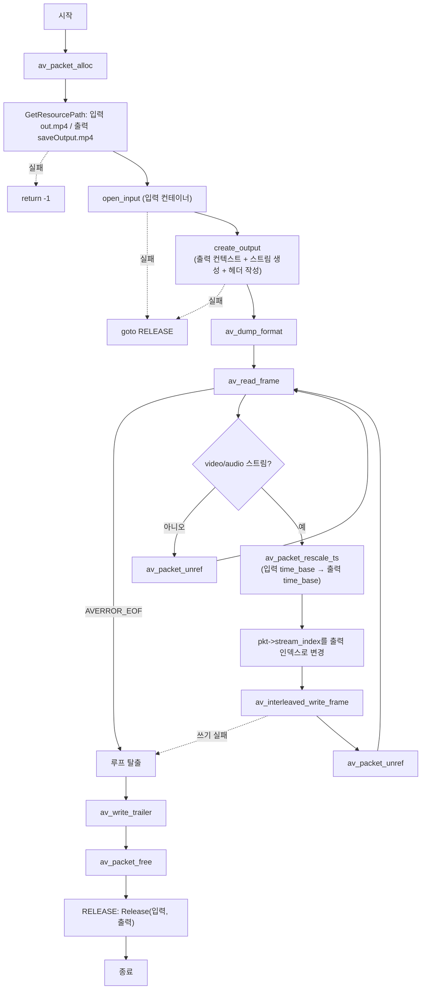

# 03. 리먹싱 — 무손실 컨테이너 복사

> 소스: `FFMPEG-Books/FFMPEG-Library-Codec-and-Image-Transform/03-remuxing/main.c` · 타겟: `Remuxing` · [← 개요](README.md)

## 학습 목표

- 리먹싱(remuxing) — 디코딩/인코딩 없이 패킷을 새 컨테이너로 옮기는 무손실 복사 — 을 구현한다
- 출력 컨테이너 생성 절차(`avformat_alloc_output_context2` → `avformat_new_stream` → `avcodec_parameters_copy` → `avio_open` → `avformat_write_header`)를 익힌다
- 입력과 출력 스트림의 `time_base`가 다를 수 있으므로 `av_packet_rescale_ts`로 타임스탬프를 재스케일한다
- `av_interleaved_write_frame`과 `av_write_trailer`로 파일 쓰기를 완결한다

## 핵심 개념

- **리먹싱**: 압축된 패킷을 그대로 다른(또는 같은) 컨테이너 포맷에 다시 넣는 것. 코덱 데이터를 건드리지 않으므로 화질 손실이 없고 매우 빠르다. `ffmpeg -c copy`와 같은 동작이다.
- **time_base**: 스트림의 타임스탬프 단위(유리수). 입력과 출력 스트림의 time_base가 다르면 pts/dts/duration을 출력 기준으로 환산해야 재생 시간이 맞는다.
- **인터리브 쓰기**: `av_interleaved_write_frame`은 내부 버퍼링으로 패킷을 dts 순서에 맞게 섞어서 기록해 준다.
- **header/trailer**: 컨테이너는 `avformat_write_header`로 시작하고 `av_write_trailer`로 인덱스 등 마무리 정보를 기록해야 완전한 파일이 된다.

## 프로그램 흐름



## 핵심 API

| API / 구조체 | 역할 |
|---|---|
| `avformat_alloc_output_context2` | 출력 파일 이름으로 출력용 `AVFormatContext`를 생성한다 (확장자로 muxer 자동 선택) |
| `avformat_new_stream` | 출력 컨테이너에 새 스트림을 추가한다 |
| `avcodec_parameters_copy` | 입력 스트림의 코덱 파라미터를 출력 스트림으로 복사한다 (무손실 복사의 핵심) |
| `avio_open` | 실제 출력 파일을 쓰기 모드로 연다 (`AVFMT_NOFILE`이 아닐 때) |
| `avformat_write_header` | 컨테이너 헤더를 기록한다 |
| `av_packet_rescale_ts` | pts/dts/duration을 입력 time_base에서 출력 time_base로 환산한다 |
| `av_interleaved_write_frame` | 패킷을 인터리브 순서를 보장하며 출력에 기록한다 |
| `av_write_trailer` | 컨테이너 마무리 정보(인덱스 등)를 기록한다 |
| `av_dump_format` | 컨텍스트의 스트림 구성을 사람이 읽기 좋게 덤프한다 |

## chapter01/02와의 차이

- `VideoContext` 구조체(이번엔 이 이름 그대로)를 **입력용과 출력용 두 개**(`video_cxt`, `copy_cxt`) 사용해 대칭 구조를 만든다.
- `open_input`에 대응하는 `create_output` 함수가 새로 등장한다 — 출력 쪽 초기화(컨텍스트 생성, 스트림 복제, 파일 열기, 헤더 작성)를 한 함수로 캡슐화했다.
- `Release`가 읽기/쓰기 컨텍스트를 모두 받아 `avformat_close_input` / `avio_closep` + `avformat_free_context`로 각각 다르게 정리한다.
- 에러 처리에 `goto RELEASE;` 패턴이 도입되어 01·02번의 "즉시 return"보다 정리 경로가 일원화됐다.

## ⚠️ 알아두기

- `create_output`에서 `pOutputCodecContext`를 할당해 `codec_tag = 0`과 `AV_CODEC_FLAG_GLOBAL_HEADER` 플래그를 설정하지만, **스트림에 반영하지 않고 곧바로 `avcodec_free_context`로 해제**한다. 즉 GLOBAL_HEADER 설정은 아무 효과가 없다. 자세한 내용은 딥다이브 참고.
- `open_input` 실패 시 `goto RELEASE`로 가는데, 이때 `copy_cxt`는 **미초기화 스택 변수** 상태라 `Release` 내부에서 쓰레기 포인터를 검사/해제할 수 있다(미정의 동작 위험).
- `#if defined(WIN32) || defined(WIn64)` — `WIN64`가 `WIn64`로 오타나 있어 64비트 Windows 매크로 분기가 의도대로 동작하지 않을 수 있다.

## 실행 방법

CMake 타겟 `Remuxing`을 빌드한 뒤 실행한다. argv 입력은 받지 않는다.

```bash
./Remuxing
# 입력: 저장소 루트 resources/out.mp4
# 출력: 저장소 루트 resources/saveOutput.mp4 (무손실 복사본)
```

실행 후 `resources/saveOutput.mp4`가 생성되며, 원본과 동일하게 재생되면 성공이다. `GetResourcePath` 특성상 경로에 `cmake`가 포함된 빌드 디렉터리에서 실행해야 한다.

---
→ 자세한 코드 해설: [코드 상세 해설](03-remuxing-deep-dive.md)
