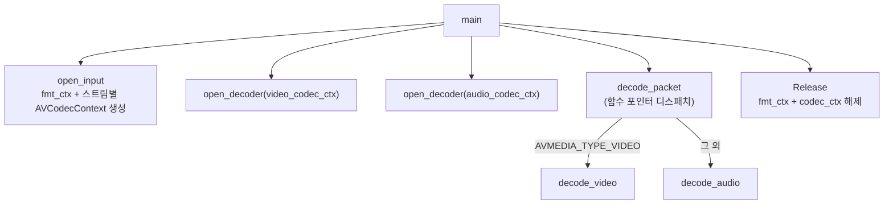
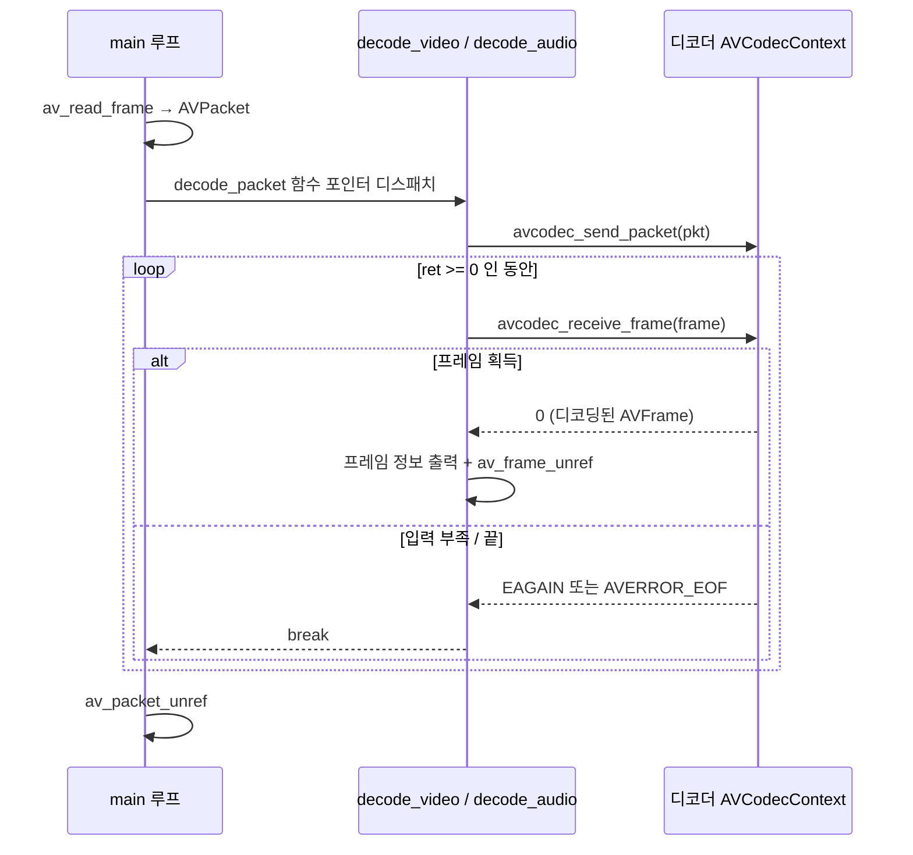

# 04. 디코딩 — 코드 상세 해설

> [← 기본 문서](04-decoding.md)

## 전체 구조

`VideoContext`가 코덱 컨텍스트 두 개를 품도록 확장됐다.

```c
typedef struct fmt_ctx {
    AVFormatContext *fmt_ctx;
    AVCodecContext *video_codec_ctx;
    AVCodecContext *audio_codec_ctx;
    int video_idx;
    int audio_idx;
} VideoContext;
```



| 함수 | 역할 |
|---|---|
| `open_input` | 열기 + 스트림 정보 + 비디오/오디오 각각 `AVCodecContext` 할당·파라미터 복사 |
| `open_decoder` | `avcodec_find_decoder` + `avcodec_open2`로 디코더 활성화 |
| `decode_packet` | `codec_type`으로 `decode_video`/`decode_audio` 함수 포인터 선택 후 호출 |
| `decode_video` / `decode_audio` | send/receive 루프 + 프레임 정보 콘솔 출력 |
| `Release` | `avformat_close_input` + `avcodec_free_context` × 2 |

## 코드 블록별 해설

### 1) open_input — 스트림별 코덱 컨텍스트 생성

```c
/** Video Type 인 경우 */
if (pCodecParameters->codec_type == AVMEDIA_TYPE_VIDEO && outVideoContext->video_idx < 0) {
    outVideoContext->video_idx = idx;

    outVideoContext->video_codec_ctx = avcodec_alloc_context3(pCodec);
    if (outVideoContext->video_codec_ctx == NULL) {
        av_log(NULL, AV_LOG_ERROR, "[FFMPEG]Create Codec Context...\r\n");
        return -1;
    }
    errCode = avcodec_parameters_to_context(outVideoContext->video_codec_ctx, pCodecParameters);
```

02·03번의 `open_input`에서 인덱스만 기록하던 것에 더해, 스트림별로 `AVCodecContext`를 할당하고 `avcodec_parameters_to_context`로 컨테이너가 알려준 코덱 파라미터(해상도, extradata 등)를 복사한다. 이 복사가 없으면 H.264 같은 코덱은 SPS/PPS가 없어 디코딩에 실패한다.

### 2) open_decoder — 코덱 열기

```c
int open_decoder(AVCodecContext *pCodecContext) {
    int ret = 0;
    /** Find Codec */
    const AVCodec *pCodec = avcodec_find_decoder(pCodecContext->codec_id);
    ...
    /** Codec Open */
    if (avcodec_open2(pCodecContext, pCodec, NULL) < 0) {
```

컨텍스트에 이미 `codec_id`가 들어 있으므로 그것으로 디코더를 다시 찾아 `avcodec_open2`로 연다. `main`에서 비디오·오디오 컨텍스트에 대해 각각 한 번씩 호출한다 — 같은 로직을 시그니처 하나로 재사용하는 것이 이 함수 분리의 목적이다.

### 3) 메인 루프 — 패킷 분류와 정보 출력

```c
if (pPacket->stream_index == input_ctx.video_idx) {

    /** packet에 대한 rescale */
//            av_packet_rescale_ts(pPacket, pStream->time_base, input_ctx.video_codec_ctx->time_base);
    ...
    double frameRate = av_q2d(pStream[pPacket->stream_index].r_frame_rate);
    /** decoding packet */
    decode_packet(input_ctx.video_codec_ctx, pPacket, &pFrame, &got_frame);
```

비디오 패킷이면 프레임레이트를 계산해 코덱 정보와 함께 출력한 뒤 디코딩한다. 주석은 `r_frame_rate`(실제 레이트)와 `avg_frame_rate`(평균 레이트)의 차이를 설명한다. `av_q2d`는 `AVRational`을 `double`로 바꾸는 유틸리티다. (이 줄의 인덱싱 버그는 아래 특이점 1 참고.)

### 4) decode_packet — 함수 포인터 디스패치

```c
int decode_packet(AVCodecContext *pCodecContext, AVPacket *pPacket, AVFrame **pFrame, int *got_frame) {
    /** channel에 따라 decoding 할 함수 */
    int (*decode_func)(AVCodecContext *pCodec_ctx, AVFrame *pFrame, int *got_frame, const AVPacket *pPacket);
    int decode_size;

    decode_func = pCodecContext->codec_type == AVMEDIA_TYPE_VIDEO ? decode_video : decode_audio;

    /** decode size */
    decode_size = decode_func(pCodecContext, *pFrame, got_frame, pPacket);

    if (*got_frame) {

        (*pFrame)->pts = (*pFrame)->best_effort_timestamp;
    }
    return decode_size;
}
```

동일한 시그니처의 두 함수(`decode_video`, `decode_audio`)를 함수 포인터 변수에 조건부 대입해 호출한다. 호출부(`main`)는 어떤 코덱 컨텍스트를 넘기느냐만 다르고, 타입별 분기는 이 한 곳에 모인다. FFmpeg의 옛 API(`avcodec_decode_video2`/`avcodec_decode_audio4`)가 `got_frame` 출력 인자를 쓰던 관례를 본뜬 시그니처인데, 새 send/receive API에서는 이 플래그가 채워지지 않는다(특이점 3 참고).

### 5) decode_video — send/receive 루프

```c
ret = avcodec_send_packet(pCodecContext, pPacket);
if (ret < 0) {
    av_log(NULL, AV_LOG_ERROR, "[FFMPEG](%d)Send packet to decode context...\r\n", ret);
}
while (ret >= 0) {
    ret = avcodec_receive_frame(pCodecContext, pFrame);
    if (ret == AVERROR(EAGAIN) || ret == AVERROR_EOF) {
        av_frame_unref(pFrame);
        break;
    } else if (ret < 0) {
        av_log(NULL, AV_LOG_ERROR, "[FFMPEG](%d)Receive Frame...\r\n", ret);
    } else {
        printf("-----------------------\n");
        printf("Video : frame->width, height : %dx%d\n",
               pFrame->width, pFrame->height);
        ...
    }
    av_frame_unref(pFrame);
}
```

- `send_packet` 1회에 대해 `receive_frame`을 `EAGAIN`(입력이 더 필요함)까지 반복한다. B-프레임 재정렬 등으로 패킷과 프레임이 1:1이 아니기 때문이다.
- 성공 시 `pFrame`에서 해상도, `av_get_picture_type_char`로 픽처 타입(I/P/B), `pCodecContext->frame_num`(디코딩된 누적 프레임 수), pts/dts를 출력한다.
- 매 프레임 처리 후 `av_frame_unref`로 참조를 풀어 재사용한다. `decode_audio`도 구조가 같고 출력 항목만 `nb_samples`, `ch_layout.nb_channels`로 다르다.

## 심화 — send/receive 시퀀스



디코더는 내부에 프레임 버퍼(지연)를 가진다. 정석 구현은 EOF 후 `avcodec_send_packet(ctx, NULL)`로 **flush**를 보내 잔여 프레임을 모두 배출하지만, 이 예제에는 flush 단계가 없어 마지막 몇 프레임이 출력되지 않을 수 있다.

## ⚠️ 코드 특이점 상세

### 1) `pStream[pPacket->stream_index]` — 범위 밖 메모리 접근 버그

```c
AVStream *pStream = input_ctx.fmt_ctx->streams[pPacket->stream_index];
...
double frameRate = av_q2d(pStream[pPacket->stream_index].r_frame_rate);
```

`pStream`은 이미 `streams[stream_index]`로 선택된 **단일 스트림 포인터**다. 여기에 다시 `[pPacket->stream_index]`를 붙이면 그 스트림 구조체 뒤쪽의 임의 메모리를 `AVStream`으로 해석해 읽는다. `stream_index`가 0(비디오가 첫 스트림)인 파일에서는 `pStream[0]`이 되어 우연히 정상 동작하지만, 비디오 인덱스가 0이 아니면 쓰레기 값 프레임레이트 또는 크래시가 난다. 올바른 형태는 `av_q2d(pStream->r_frame_rate)`다.

### 2) `saveOutput.mp4` 경로를 만들지만 실제로 쓰지 않음

```c
if (!GetResourcePath("saveOutput.mp4", outputPath)) { ... return -1; }
...
VideoContext output_ctx;
output_ctx.fmt_ctx = NULL;
...
Release(&input_ctx, &output_ctx);
```

`outputPath`와 `output_ctx`는 03번(리먹싱)에서 복사해 온 흔적으로, 출력 컨테이너를 만들거나 파일을 여는 코드가 전혀 없다. 디코딩 결과는 콘솔 출력이 전부이고 출력 파일은 생성되지 않는다. `output_ctx`는 `fmt_ctx = NULL`만 설정한 채 `Release`에 넘겨지는데, `Release`의 쓰기 컨텍스트 분기가 `fmt_ctx != NULL`을 검사하므로 사실상 no-op이다. 다만 `video_codec_ctx`/`audio_codec_ctx`/인덱스 필드는 미초기화 상태로 남는다(쓰기 분기에서는 접근하지 않아 실해는 없음).

### 3) `got_frame`이 영원히 0 — dead code

`decode_video`/`decode_audio`는 `int *got_frame` 인자를 받지만 **본문 어디에서도 값을 쓰지 않는다**. `main`에서 `int got_frame = 0;`으로 시작하므로 `decode_packet`의 다음 블록은 절대 실행되지 않는다.

```c
if (*got_frame) {

    (*pFrame)->pts = (*pFrame)->best_effort_timestamp;
}
```

또한 실행된다 해도 의미가 없다 — `decode_video` 내부에서 프레임마다 `av_frame_unref`를 호출한 뒤이므로 이 시점의 `pFrame`은 빈 상태다. 올바른 형태는 `receive_frame` 성공 지점에서 `*got_frame = 1;`을 설정하고 pts 보정도 그 지점(unref 이전)에서 수행하는 것이다.

### 4) `open_input`이 모든 스트림에 대해 디코더를 요구

```c
const AVCodec *pCodec = avcodec_find_decoder(pCodecParameters->codec_id);
if (pCodec == NULL) {
    av_log(NULL, AV_LOG_ERROR, "[FFMPEG]Failed to find Codec...\r\n");
    return -1;
}
```

이 검사는 비디오/오디오 분기 **이전**, 즉 모든 스트림에 대해 수행된다. 자막·데이터 스트림처럼 현재 빌드에 디코더가 없는 스트림이 하나라도 있으면 전체가 실패한다. 디코더 탐색은 비디오/오디오 분기 안으로 옮기는 것이 올바르다.

### 5) 미초기화 코덱 컨텍스트 포인터로 `Release` 가능성

`open_input`은 `fmt_ctx`와 인덱스만 초기화하고 `video_codec_ctx`/`audio_codec_ctx`는 해당 타입 스트림을 만났을 때만 대입한다. 입력에 오디오 스트림이 없으면 `audio_codec_ctx`는 **미초기화 쓰레기 포인터**인 채로 `open_decoder`와 `Release`의 `avcodec_free_context`에 전달되어 미정의 동작이 될 수 있다. 구조체 초기화 단계에서 두 포인터도 `NULL`로 채워야 안전하다.

### 6) 오디오 정보 출력의 잘못된 값 — 채널 자리에 stream_index

```c
printf("ID : %d\r\nCodec : %s, BitRate : %lld\r\nChannel : %d, SampleRate : %d\r\n\r\n",
       pParam->codec_id, PCodec->name, pParam->bit_rate,
       pPacket->stream_index,
       pParam->sample_rate
);
```

`Channel :` 라벨에 채널 수가 아니라 `pPacket->stream_index`가 출력된다. 올바른 값은 `pParam->ch_layout.nb_channels`다(실제 채널 수는 `decode_audio`의 프레임 출력에서 확인 가능).

### 7) 기타

- `pFrame->key_frame` 필드는 최신 FFmpeg에서 deprecated이며 `pFrame->flags & AV_FRAME_FLAG_KEY`가 권장된다. 출력의 `pts` 자리에는 `pFrame->pts` 대신 `pPacket->pts`를 사용하고 있다(주석 처리 흔적 참고).
- 매 비디오/오디오 패킷마다 `avcodec_find_decoder`를 다시 호출하는데, 이는 코덱 이름 출력용으로만 쓰이며 성능상 불필요한 반복이다.
- EOF 후 디코더 flush(`avcodec_send_packet(ctx, NULL)`)가 없어 디코더 내부에 버퍼링된 마지막 프레임들이 유실된다.
- 03번과 동일한 `#if defined(WIN32) || defined(WIn64)` 오타가 파일 상단에 있다.

---
[← 기본 문서](04-decoding.md) · [개요](README.md)
