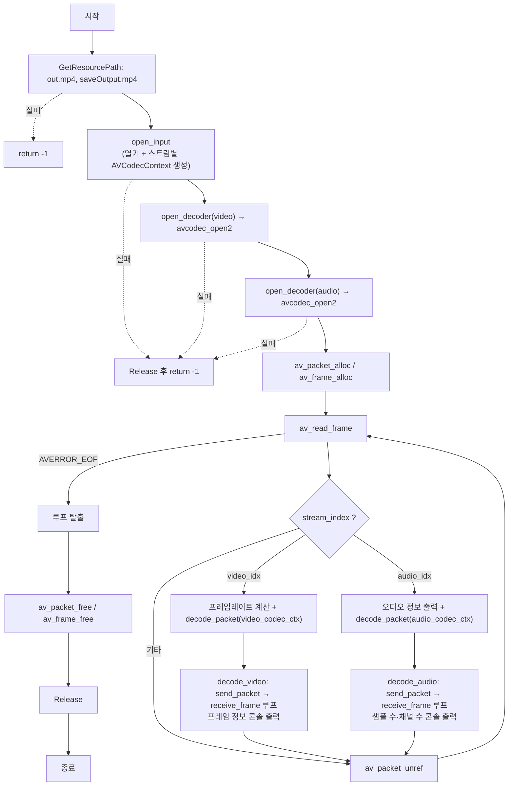

# 04. 디코딩 — 스트림별 코덱 컨텍스트와 send/receive

> 소스: `FFMPEG-Books/FFMPEG-Library-Codec-and-Image-Transform/04-decoding/main.c` · 타겟: `Decoding` · [← 개요](README.md)

## 학습 목표

- 스트림별로 독립된 `AVCodecContext`를 만들고(`avcodec_alloc_context3` + `avcodec_parameters_to_context`) 디코더를 연다(`avcodec_open2`)
- `avcodec_send_packet` / `avcodec_receive_frame` 기반의 현대적 디코딩 루프를 구현한다
- 비디오/오디오를 **함수 포인터 디스패치**(`decode_video` / `decode_audio`)로 분기하는 구조화 기법을 익힌다
- 디코딩된 `AVFrame`에서 해상도·픽처 타입·pts·샘플 수 등 프레임 수준 정보를 읽는다

## 핵심 개념

- **AVCodecContext**: 디코더(또는 인코더) 인스턴스의 상태. 스트림의 `codecpar`(정적 정보)와 달리 실제 압축 해제 상태를 가지므로 **비디오용·오디오용을 각각** 만들어야 한다.
- **send/receive 모델**: 패킷 1개를 `send_packet`으로 넣고, 나올 수 있는 프레임을 `receive_frame`으로 **여러 번** 꺼낸다. 1패킷 = 1프레임이 보장되지 않기 때문에 receive는 `EAGAIN`이 나올 때까지 루프를 돈다.
- **함수 포인터 디스패치**: `decode_packet`이 `codec_type`을 보고 `decode_video` 또는 `decode_audio` 함수 포인터를 골라 호출한다. 스트림 타입이 늘어나도 분기문 대신 함수만 추가하면 되는 구조다.
- **best_effort_timestamp**: 컨테이너/코덱 상황에 따라 pts가 비어 있을 수 있어, FFmpeg가 추정해 주는 타임스탬프를 프레임 pts로 채택하는 관례가 있다.

## 프로그램 흐름



## 핵심 API

| API / 구조체 | 역할 |
|---|---|
| `avcodec_find_decoder` | `codec_id`로 등록된 디코더를 찾는다 |
| `avcodec_alloc_context3` | 디코더용 `AVCodecContext`를 할당한다 |
| `avcodec_parameters_to_context` | 스트림의 `codecpar`를 코덱 컨텍스트로 복사한다 |
| `avcodec_open2` | 코덱 컨텍스트를 실제 디코더와 연결해 연다 |
| `avcodec_send_packet` | 압축 패킷을 디코더에 공급한다 |
| `avcodec_receive_frame` | 디코딩 완료된 프레임을 꺼낸다. 더 없으면 `AVERROR(EAGAIN)` |
| `av_frame_alloc` / `av_frame_unref` / `av_frame_free` | 프레임 객체의 할당/재사용/해제 |
| `av_q2d` | `AVRational`(유리수)을 `double`로 변환 — 프레임레이트 계산에 사용 |
| `avcodec_free_context` | 코덱 컨텍스트 해제 (`Release`에서 호출) |

## chapter01/02와의 차이

- chapter01의 디코딩 예제가 `main` 안에 모든 것을 넣었다면, 여기서는 `VideoContext`가 `video_codec_ctx` / `audio_codec_ctx` 필드를 갖도록 확장되고, `open_input`(컨텍스트 생성까지) → `open_decoder`(코덱 열기) → `decode_packet`(디스패치) → `decode_video`/`decode_audio`(실제 디코딩)로 **역할별 함수 계층**이 생겼다.
- `decode_packet` 내부에서 함수 포인터 `int (*decode_func)(...)`를 선언하고 `codec_type`에 따라 `decode_video` 또는 `decode_audio`를 대입해 호출한다 — 조건 분기를 호출부 한 곳으로 모으는 패턴이다.
- 03번의 출력 컨테이너 관련 코드는 사라지고, 디코딩 결과는 콘솔 출력으로만 확인한다.

## ⚠️ 알아두기

- `saveOutput.mp4` 경로를 만들고 `output_ctx`도 선언하지만 **실제로는 아무 것도 쓰지 않는다**. 디코딩 결과는 콘솔 출력이 전부다(출력 파일 생성 없음).
- 비디오 분기의 `av_q2d(pStream[pPacket->stream_index].r_frame_rate)`는 이미 선택된 스트림 포인터를 다시 배열 인덱싱하는 **범위 밖 접근 버그**다. 올바른 형태는 `pStream->r_frame_rate`다. 딥다이브 참고.
- `got_frame` 플래그는 어디에서도 1로 설정되지 않아 `decode_packet`의 `pFrame->pts = best_effort_timestamp` 라인은 절대 실행되지 않는다.
- 03번과 동일한 `WIn64` 오타가 있다.

## 실행 방법

CMake 타겟 `Decoding`을 빌드한 뒤 실행한다. argv 입력은 받지 않는다.

```bash
./Decoding
# 입력: 저장소 루트 resources/out.mp4
# 출력: 없음 (프레임 정보가 콘솔에만 출력된다)
```

비디오 프레임마다 해상도·픽처 타입(I/P/B)·pts·dts가, 오디오 프레임마다 샘플 수·채널 수가 출력된다. `GetResourcePath` 특성상 경로에 `cmake`가 포함된 빌드 디렉터리에서 실행해야 한다.

---
→ 자세한 코드 해설: [코드 상세 해설](04-decoding-deep-dive.md)
