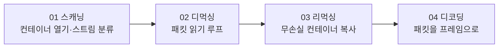

# FFMPEG-Books — 디먹싱·리먹싱·디코딩 통합 실습

서적(FFMPEG Library Codec and Image Transform) 기반 실습 트랙이다. chapter01(디코딩 기초)과 chapter02(인코딩/변환)에서 개별 API를 익혔다면, 이 트랙에서는 **컨테이너 스캐닝 → 디먹싱 → 리먹싱 → 디코딩**의 전체 파이프라인을 하나의 흐름으로 다시 구현하면서 코드를 구조화하는 방법을 익힌다.

chapter01/02가 "API를 처음 만나는" 단계였다면, 여기서는 다음과 같은 코드 구조화 관점이 추가된다.

- `VideoContext` 구조체로 포맷 컨텍스트·스트림 인덱스·코덱 컨텍스트를 묶어 관리한다
- `open_input` / `create_output` / `Release` 등으로 초기화·정리 로직을 함수로 분리한다
- 스트림 타입에 따라 함수 포인터로 디코딩 함수를 디스패치한다

## 학습 흐름

## 레슨 목록

| # | 레슨 | 주제 | 핵심 API | 문서 |
|---|---|---|---|---|
| 01 | Scanning | 컨테이너 열기 + 스트림 스캔/분류 (argv 입력 지원) | `avformat_open_input`, `avformat_find_stream_info`, `av_log_set_level` | [기본](01-scanning.md) · [딥다이브](01-scanning-deep-dive.md) |
| 02 | Demuxing | `av_read_frame` 패킷 루프 + `VideoContext` 구조체 도입 | `av_read_frame`, `av_packet_alloc`, `av_packet_unref` | [기본](02-demuxing.md) · [딥다이브](02-demuxing-deep-dive.md) |
| 03 | Remuxing | 출력 컨테이너 생성과 무손실 스트림 복사 | `avformat_alloc_output_context2`, `avcodec_parameters_copy`, `av_packet_rescale_ts`, `av_interleaved_write_frame` | [기본](03-remuxing.md) · [딥다이브](03-remuxing-deep-dive.md) |
| 04 | Decoding | 스트림별 `AVCodecContext` + send/receive 디코딩, 함수 포인터 디스패치 | `avcodec_send_packet`, `avcodec_receive_frame`, `avcodec_parameters_to_context` | [기본](04-decoding.md) · [딥다이브](04-decoding-deep-dive.md) |

## 소스 및 리소스 위치

- 소스: `FFMPEG-Books/FFMPEG-Library-Codec-and-Image-Transform/<NN-레슨>/main.c`
- 입력 미디어: 저장소 루트 `resources/out.mp4` (모든 레슨의 `GetResourcePath`가 저장소 루트의 `resources/`를 가리킨다)
- `FFMPEG-Books/FFMPEG-Library-Codec-and-Image-Transform/resources/` 폴더에는 빈 `READMD.md`(README 오타)만 있고 실제 미디어는 들어 있지 않다

---
[← 전체 로드맵](../README.md) · [이전: Chapter 02](../chapter02/README.md)
