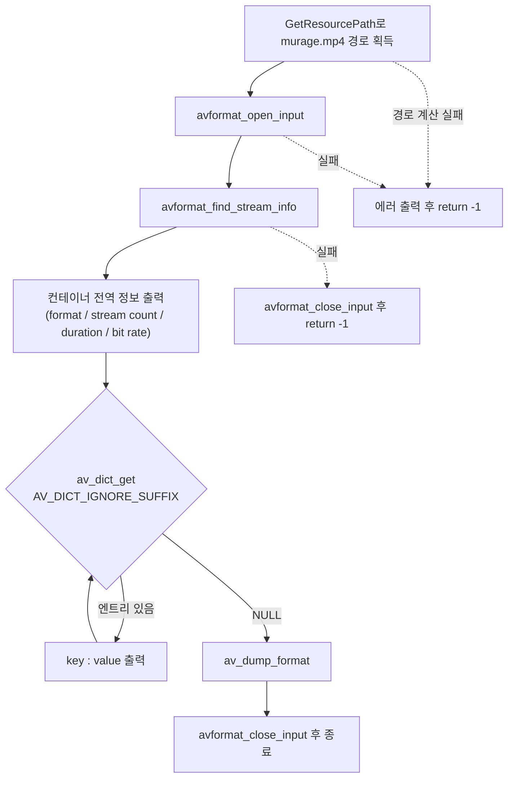

# 01. 파일 열기와 메타데이터

> 소스: `study-FFMPEG/01-open-file/main.c` · 타겟: `studyFFMPEG01OpenFile` · [← 트랙 개요](README.md)

## 학습 목표

FFmpeg 학습의 출발점. 미디어 컨테이너(mp4)를 열어 `AVFormatContext`를 얻고, 전체 재생 시간·비트레이트 같은 컨테이너 전역 정보와 메타데이터(AVDictionary)를 읽은 뒤 올바르게 닫는 전체 수명 주기를 익힌다.

## 핵심 개념

### AVFormatContext — 컨테이너의 대표 구조체

- **컨테이너(포맷)와 코덱은 다르다**: mp4/mkv/avi는 비디오·오디오 스트림을 담는 "그릇"(컨테이너)이고, h264/aac는 그 안의 데이터를 압축하는 방식(코덱)이다. `AVFormatContext`는 이 그릇을 대표하는 구조체다.
- **`avformat_open_input()`**: 파일 헤더만 읽어 `AVFormatContext`를 할당한다. 성공 시 0, 실패 시 음수 에러 코드를 반환한다.
- **`avformat_find_stream_info()`**: 일부 포맷은 헤더만으로 스트림 정보를 알 수 없어, 실제 패킷 몇 개를 읽어 codec/duration 등의 정보를 채운다.
- **`avformat_close_input()`**: `avformat_open_input()`으로 연 것은 반드시 이 함수로 닫는다. 내부에서 `AVFormatContext`까지 해제하고 포인터를 NULL로 만든다.

### duration과 AV_TIME_BASE

`AVFormatContext->duration`은 초 단위가 아니라 **AV_TIME_BASE(1,000,000) 단위의 마이크로초 값**이다. 초 단위로 보려면 `AV_TIME_BASE`로 나눈다. FFmpeg 전반에서 "시간 값은 반드시 단위(time base)와 함께 해석한다"는 원칙의 첫 사례다.

### 메타데이터 순회 — AV_DICT_IGNORE_SUFFIX

컨테이너 메타데이터는 `AVDictionary`(key-value 목록)에 들어 있다. `av_dict_get()`에 빈 키(`""`) + `AV_DICT_IGNORE_SUFFIX` 플래그를 주고, 이전 반환 엔트리를 세 번째 인자로 넘기면 모든 엔트리를 차례로 순회할 수 있다(이터레이터 패턴).

## 프로그램 흐름



## 핵심 API

| API / 구조체 | 역할 |
|---|---|
| `avformat_open_input()` | 컨테이너를 열어 `AVFormatContext`를 할당한다 (헤더만 읽음) |
| `avformat_find_stream_info()` | 패킷 몇 개를 읽어 스트림 정보(codec, duration 등)를 채운다 |
| `AVFormatContext->duration` | 전체 재생 시간. `AV_TIME_BASE`(1,000,000) 단위 |
| `AVFormatContext->bit_rate` | 컨테이너 전체 비트레이트 (bps) |
| `av_dict_get()` + `AV_DICT_IGNORE_SUFFIX` | 메타데이터(AVDictionary) 전체 엔트리 순회 |
| `av_dump_format()` | `ffmpeg -i`와 동일한 형태의 요약 덤프 출력 |
| `avformat_close_input()` | 컨테이너를 닫고 `AVFormatContext`를 해제한다 |

## 이전 레슨과의 차이

- 이 레슨은 study-FFMPEG 트랙의 **시작점**으로, 이전 레슨이 없다. 모든 FFmpeg 프로그램의 공통 골격인 "열기(`avformat_open_input`) → 정보 채우기(`avformat_find_stream_info`) → 닫기(`avformat_close_input`)"를 확립한다.
- 이후 레슨은 이 골격 위에 스트림 순회(02) → 패킷 추출(03) → 디코딩(04)을 차례로 쌓아 올린다.

## 실행 방법

```bash
# 빌드 (저장소 루트에서)
cmake --build cmake-build-debug --target studyFFMPEG01OpenFile
# 실행
./cmake-build-debug/study-FFMPEG/01-open-file/studyFFMPEG01OpenFile
```

- **입력: `resources/murage.mp4`** (실행 경로에서 `/cmake` 문자열 앞부분을 잘라 `resources/`를 붙이는 방식이므로 `cmake-build-*` 아래에서 실행해야 경로 계산이 성공한다)
- 출력물: 파일 생성 없음. 콘솔에 컨테이너 정보가 출력된다 — format `mov,mp4,m4a,3gp,3g2,mj2`, 스트림 2개, duration 약 12.78 sec, bit rate 약 8523 kbps. 이어서 메타데이터 목록과 `av_dump_format` 요약(Stream #0 h264 1280x720, Stream #1 aac 48000 Hz stereo)이 나온다.

---
→ 자세한 코드 해설: [코드 상세 해설](01-open-file-deep-dive.md)
