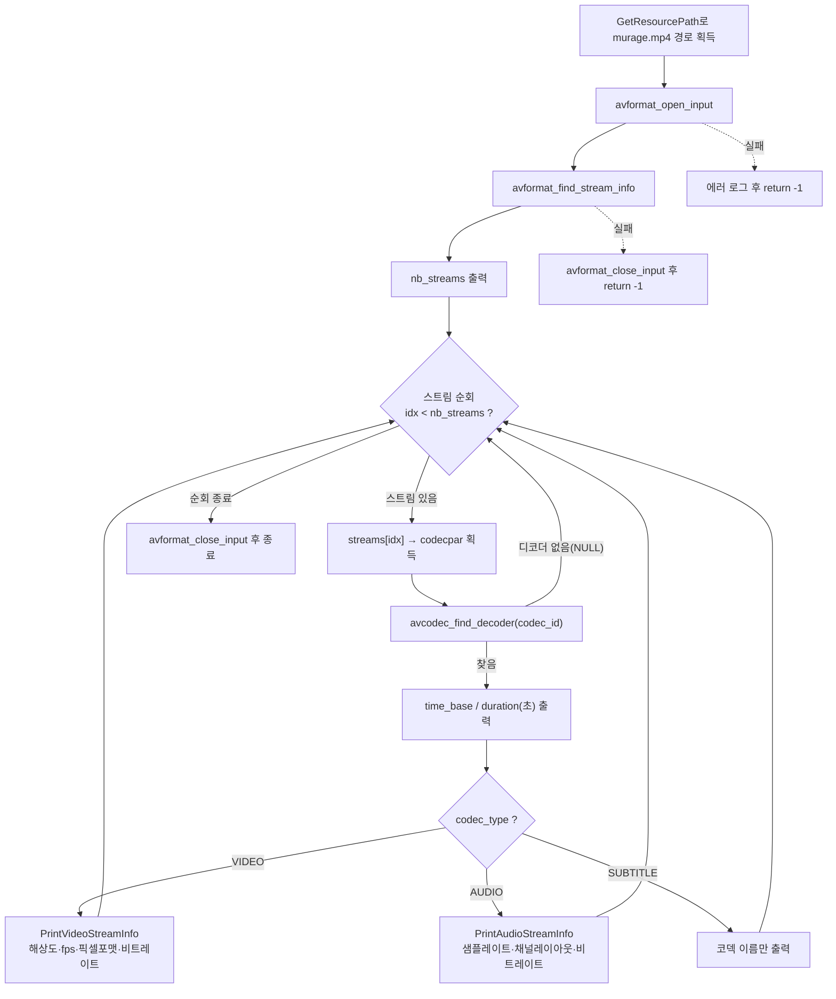

# 02. 스트림과 코덱 파라미터

> 소스: `study-FFMPEG/02-stream-info/main.c` · 타겟: `studyFFMPEG02StreamInfo` · [← 트랙 개요](README.md)

## 학습 목표

컨테이너 안의 모든 스트림(`AVStream`)을 순회하면서 각 스트림의 종류(비디오/오디오/자막), 코덱 파라미터(`AVCodecParameters`), time_base를 해석한다. `avcodec_find_decoder()`로 디코더를 찾고, 비디오는 해상도·프레임레이트·픽셀 포맷을, 오디오는 샘플레이트·채널 레이아웃(`AVChannelLayout`)을 읽는다.

## 핵심 개념

### AVStream과 AVCodecParameters

- **AVStream**: 컨테이너 안의 개별 트랙(비디오, 오디오, 자막 등). `pFormatContext->streams[idx]` 배열로 접근하고 개수는 `nb_streams`다.
- **AVCodecParameters**(`stream->codecpar`): 스트림 헤더에 기록된 "코덱 설정값"(codec_id, 해상도, 샘플레이트 등). **디코딩 자체는 못 한다** — 실제 디코딩은 이 파라미터로 `AVCodecContext`를 만들어서 한다(04 레슨).
- **`avcodec_find_decoder(codec_id)`**: codec_id에 해당하는 디코더(`const AVCodec *`)를 찾는다. 빌드에 해당 디코더가 없으면 NULL을 반환한다.

### time_base — FFmpeg 시간의 단위

`AVStream->time_base`는 이 스트림의 pts/dts/duration이 사용하는 시간 단위(분수, `AVRational`)다. 예를 들어 time_base가 1/15360이면 pts 1 = 1/15360초다. `av_q2d()`로 분수를 `double`로 바꿔 `duration * av_q2d(time_base)`처럼 초 단위 변환에 쓴다. murage.mp4는 비디오 1/15360, 오디오 1/48000으로 **스트림마다 time_base가 다르다**는 점이 중요하다.

### FFmpeg 7.x의 채널 레이아웃 — AVChannelLayout

과거의 `uint64_t channel_layout` 필드는 제거되었고, FFmpeg 7.x에서는 `AVChannelLayout` 구조체(`codecpar->ch_layout`)를 쓴다. `av_channel_layout_describe()`로 "stereo" 같은 설명 문자열을 얻고, 채널 수는 `ch_layout.nb_channels`로 읽는다.

### 비디오/오디오별 주요 파라미터

| 구분 | 필드 | 의미 (murage.mp4 값) |
|---|---|---|
| 비디오 | `width` x `height` | 해상도 (1280x720) |
| 비디오 | `avg_frame_rate` | 평균 프레임레이트, `av_q2d`로 변환 (30.08 fps) |
| 비디오 | `format` | 픽셀 포맷, `av_get_pix_fmt_name` (yuv420p) |
| 오디오 | `sample_rate` | 샘플레이트 (48000 Hz) |
| 오디오 | `ch_layout` | 채널 레이아웃 (2, stereo) |
| 공통 | `bit_rate` | 스트림별 비트레이트 |

## 프로그램 흐름



## 핵심 API

| API / 구조체 | 역할 |
|---|---|
| `AVFormatContext->streams[]` / `nb_streams` | 컨테이너의 스트림 배열과 개수 |
| `AVStream->codecpar` | 스트림 헤더의 코덱 파라미터 (`AVCodecParameters`) |
| `avcodec_find_decoder()` | codec_id로 디코더(`AVCodec`)를 찾는다 |
| `av_get_media_type_string()` | `AVMediaType`(video/audio/...)을 문자열로 변환 |
| `AVStream->time_base` / `av_q2d()` | 스트림 시간 단위(분수)와 double 변환 |
| `av_get_pix_fmt_name()` | 픽셀 포맷 enum을 이름(yuv420p 등)으로 변환 |
| `AVChannelLayout` / `av_channel_layout_describe()` | FFmpeg 7.x 채널 레이아웃 구조체와 설명 문자열 |

## 이전 레슨과의 차이

- 01에서는 컨테이너 **전역** 정보(전체 duration, 전체 bit_rate)만 봤다. 이번에는 한 단계 안으로 들어가 **스트림 단위** 정보를 직접 순회하며 읽는다.
- 01의 duration은 `AV_TIME_BASE`(고정 단위)였지만, 스트림 duration은 **각 스트림의 time_base 단위**라서 `av_q2d(time_base)`를 곱해 초로 변환해야 한다 — 같은 "duration"이라도 단위가 다르다.
- `avcodec_find_decoder()`가 처음 등장한다. 아직 디코더를 열지는 않고(04 레슨), 이름과 존재 여부만 확인한다.

## 실행 방법

```bash
# 빌드 (저장소 루트에서)
cmake --build cmake-build-debug --target studyFFMPEG02StreamInfo
# 실행
./cmake-build-debug/study-FFMPEG/02-stream-info/studyFFMPEG02StreamInfo
```

- **입력: `resources/murage.mp4`** (실행 경로에서 `/cmake` 문자열 앞부분을 잘라 `resources/`를 붙이는 방식이므로 `cmake-build-*` 아래에서 실행해야 경로 계산이 성공한다)
- 출력물: 파일 생성 없음. 콘솔에 스트림 2개의 정보가 출력된다 — Stream #0 video: h264, 1280x720, 30.08 fps, yuv420p, time_base 1/15360 / Stream #1 audio: aac, 48000 Hz, 2채널(stereo), time_base 1/48000.

---
→ 자세한 코드 해설: [코드 상세 해설](02-stream-info-deep-dive.md)
