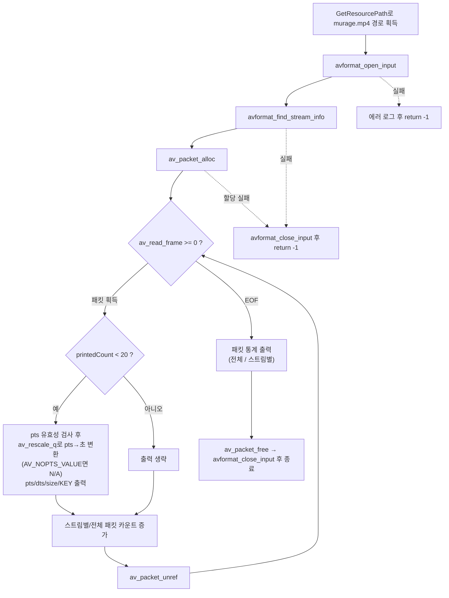

# 03. 디먹싱 — 패킷 추출

> 소스: `study-FFMPEG/03-demuxing-packets/main.c` · 타겟: `studyFFMPEG03DemuxingPackets` · [← 트랙 개요](README.md)

## 학습 목표

`av_read_frame()`으로 컨테이너에서 압축된 패킷(`AVPacket`)을 하나씩 꺼내는 **디먹싱**을 익힌다. 아직 디코딩은 하지 않고, 각 패킷의 pts/dts/size/키프레임 플래그(`AV_PKT_FLAG_KEY`)를 관찰하며 `av_rescale_q()`로 pts를 초 단위로 변환한다.

## 핵심 개념

### 디먹싱(Demuxing)이란

컨테이너 안에는 비디오 패킷과 오디오 패킷이 **한 줄로 섞여(interleaved)** 저장되어 있다. 디먹싱은 이 줄에서 패킷을 순서대로 꺼내는 작업이다. `av_read_frame()`은 이름과 달리 프레임이 아니라 **압축된 패킷 1개**를 반환하며, 성공 시 0 / EOF나 에러 시 음수를 반환한다. 패킷은 파일에 저장된 순서(= dts 순서)로 나온다.

### AVPacket의 재사용 패턴

`AVPacket` 구조체는 `av_packet_alloc()`으로 **한 번만** 할당하고, 매 루프에서 `av_packet_unref()`로 내부 데이터의 참조만 해제하며 재사용한다. unref를 빠뜨리면 패킷마다 메모리가 누적된다(누수). 프로그램 종료 시에는 `av_packet_free()`로 구조체 자체를 해제한다.

### pts / dts / 키프레임 플래그

- **pts**(presentation timestamp): 화면에 **표시**되어야 하는 시각. 스트림 time_base 단위.
- **dts**(decoding timestamp): **디코딩**되어야 하는 시각. B-프레임이 있으면 pts와 어긋난다(표시 순서 ≠ 디코딩 순서).
- **`AV_PKT_FLAG_KEY`**: 이 패킷이 키프레임(I-프레임)을 담고 있음을 나타내는 비트 플래그. `pPacket->flags & AV_PKT_FLAG_KEY`로 검사한다.

### av_rescale_q — 단위 변환의 정석

pts는 스트림 time_base 단위이므로 초로 보려면 변환이 필요하다. `av_rescale_q(값, 원래 단위, 바꿀 단위)`는 `값 x 원래단위 / 바꿀단위`를 **64비트 오버플로 없이** 계산한다. 이 예제는 스트림 time_base → `AV_TIME_BASE_Q`(1/1,000,000초)로 바꾼 뒤 `AV_TIME_BASE`로 나눠 초를 얻는다. `av_q2d()`를 곱하는 방법보다 정밀도 손실이 적어 실무에서 표준으로 쓰이는 방식이다.

단, 일부 컨테이너/코덱은 pts가 없는 패킷을 내놓는다(`AV_NOPTS_VALUE` = INT64_MIN). 이 값을 그대로 `av_rescale_q()`에 넣으면 오버플로된 쓰레기 값이 나오므로, 예제는 먼저 `pPacket->pts == AV_NOPTS_VALUE`를 검사해 해당 패킷의 pts를 `N/A`로 출력한다.

## 프로그램 흐름



## 핵심 API

| API / 구조체 | 역할 |
|---|---|
| `av_packet_alloc()` / `av_packet_free()` | AVPacket 구조체 할당 / 해제 |
| `av_read_frame()` | 컨테이너에서 압축 패킷 1개를 읽는다 (성공 0, EOF/에러 음수) |
| `AVPacket->stream_index` | 이 패킷이 속한 스트림 번호 |
| `AVPacket->pts` / `dts` / `size` | 표시 시각 / 디코딩 시각 / 압축 데이터 크기 |
| `AV_PKT_FLAG_KEY` | 키프레임 패킷 여부 비트 플래그 |
| `av_rescale_q()` | 오버플로 없는 time_base 단위 변환 (pts → 마이크로초) |
| `AV_TIME_BASE_Q` | 1/1,000,000초를 나타내는 `AVRational` 상수 |
| `av_packet_unref()` | 패킷 내부 데이터 참조 해제 (구조체는 재사용) |

## 이전 레슨과의 차이

- 01~02는 헤더 정보만 읽었다. 이번 레슨에서 처음으로 `av_read_frame()` 루프를 돌며 **실제 미디어 데이터(압축 패킷)** 를 끝까지 읽는다.
- 02에서 배운 time_base가 실전 투입된다. 같은 파일인데 비디오 패킷(1/15360 단위)과 오디오 패킷(1/48000 단위)의 pts 숫자 크기가 전혀 다르며, `av_rescale_q()`로 초로 환산해야 비로소 비교할 수 있다.
- 콘솔이 넘치지 않도록 상세 출력은 처음 `PRINT_PACKET_MAX`(20)개로 제한하고, 카운트는 전체에 대해 계속한다.

## 실행 방법

```bash
# 빌드 (저장소 루트에서)
cmake --build cmake-build-debug --target studyFFMPEG03DemuxingPackets
# 실행
./cmake-build-debug/study-FFMPEG/03-demuxing-packets/studyFFMPEG03DemuxingPackets
```

- **입력: `resources/murage.mp4`** (실행 경로에서 `/cmake` 문자열 앞부분을 잘라 `resources/`를 붙이는 방식이므로 `cmake-build-*` 아래에서 실행해야 경로 계산이 성공한다)
- 출력물: 파일 생성 없음. 처음 20개 패킷의 상세 정보와 통계가 출력된다 — 첫 비디오 패킷은 pts=0, KEY, 232504 bytes(키프레임이라 유난히 크다). 통계: **total packets 981** (stream #0 video 383, stream #1 audio 598).

---
→ 자세한 코드 해설: [코드 상세 해설](03-demuxing-packets-deep-dive.md)
