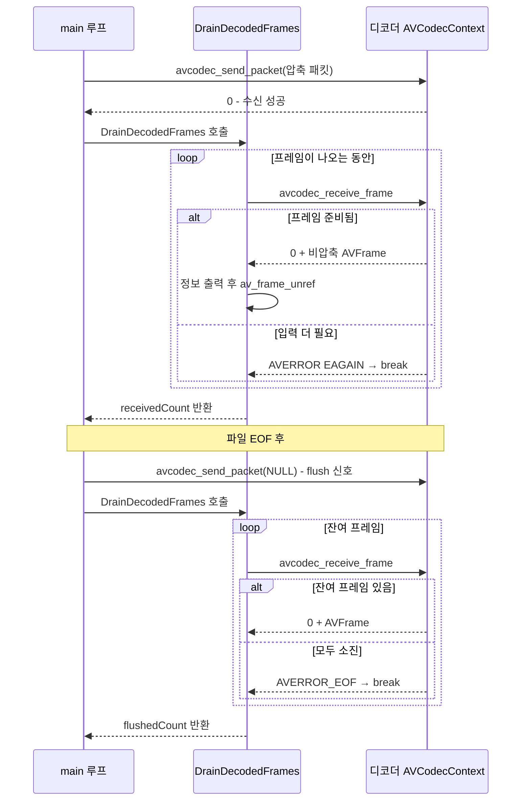

# 04. 비디오 디코딩 파이프라인 — 코드 상세 해설

> [← 기본 문서](04-decode-video.md)

## 전체 구조

| 함수 / 구간 | 역할 |
|---|---|
| `main()` | 열기 → 최적 스트림 탐색 → 디코더 준비 → 디먹싱+디코딩 루프 → flush → 해제 |
| `DrainDecodedFrames()` | 디코더에서 프레임을 모두 꺼내 정보 출력, 꺼낸 개수 반환 (send 후와 flush 시 공용) |
| `GetResourcePath()` | 실행 경로에서 `resources/` 경로를 역산하는 유틸 (01과 동일) |
| `PRINT_FRAME_MAX` | 상세 출력할 프레임 개수 상한 (10) |

```text
main
 ├─ GetResourcePath("murage.mp4", ...)
 ├─ avformat_open_input / avformat_find_stream_info
 ├─ av_find_best_stream(VIDEO) → videoStreamIdx + pVideoCodec
 ├─ 디코더 3단계: alloc_context3 → parameters_to_context → open2
 ├─ av_packet_alloc / av_frame_alloc
 ├─ while (av_read_frame >= 0)
 │    └─ 비디오 패킷 → send_packet → DrainDecodedFrames
 ├─ avcodec_send_packet(ctx, NULL) → DrainDecodedFrames   (flush)
 └─ ffmpeg_release: frame → packet → codec context → format 해제
```

## 코드 블록별 해설

### 1. 변수 선언 — -1 초기화

```c
int errorCode = -1;
/** 프로그램 종료 코드: 성공 경로 끝에서만 0으로 바뀐다 */
int exitStatus = -1;

AVFormatContext *pFormatContext = NULL;
AVPacket *pPacket = NULL;
AVFrame *pFrame = NULL;

const AVCodec *pVideoCodec = NULL;
AVCodecContext *pVideoCodecContext = NULL;
int videoStreamIdx = -1;
```

`videoStreamIdx = -1` 초기화가 눈에 띈다. chapter02의 09~11 레슨에서는 이 값이 `0`으로 초기화되어 있어 스트림을 못 찾아도 `if (videoStreamIdx < 0)` 검사가 절대 참이 되지 않는 버그가 있었다. 이 트랙은 "찾지 못함"을 표현하는 유효하지 않은 값 **-1**로 처음부터 바로잡았다. 모든 포인터를 NULL로 초기화하는 것도 중요한데, 어느 단계에서 실패하든 `goto ffmpeg_release`로 점프했을 때 `av_frame_free(&pFrame)` 등이 NULL에 대해 안전하게 no-op이 되기 때문이다.

`exitStatus`도 같은 원리다. **-1(실패)로 시작해 성공 경로의 맨 끝에서만 0으로 바뀐다.** 중간에 에러가 나서 `goto ffmpeg_release`로 점프하면 -1인 채로 남아, 프로그램이 0이 아닌 종료 코드로 끝난다.

### 2. av_find_best_stream — 스트림 탐색의 간결화

```c
/**
 * av_find_best_stream:
 * 원하는 타입의 "가장 적합한" 스트림을 찾아주고
 * 마지막에서 두 번째 인자로 디코더까지 함께 찾아준다.
 * (스트림을 직접 for문으로 순회하는 것보다 간결하다 — 02 레슨과 비교)
 */
videoStreamIdx = av_find_best_stream(pFormatContext, AVMEDIA_TYPE_VIDEO, -1, -1, &pVideoCodec, 0);
if (videoStreamIdx < 0) {
    av_log(NULL, AV_LOG_ERROR, "[FFMPEG ERROR](%d) Video Stream Found Failed...\r\n", videoStreamIdx);
    goto ffmpeg_release;
}
printf("video stream index : %d, codec : %s\r\n", videoStreamIdx, pVideoCodec->name);
```

02 레슨에서 for문 + `codec_type` 비교 + `avcodec_find_decoder()`로 하던 일을 한 번의 호출로 끝낸다. 인자는 순서대로 (컨텍스트, 원하는 미디어 타입, 원하는 스트림 인덱스(-1 = 자동), 연관 스트림(-1 = 없음), 디코더 출력 포인터, 플래그)다. "가장 적합한" 판단에는 디코더 존재 여부, 기본 스트림 지정(disposition) 등이 반영된다. 반환값이 스트림 인덱스이며 실패 시 `AVERROR_STREAM_NOT_FOUND` 같은 음수라서, 반환값 하나로 인덱스와 에러를 동시에 표현한다. murage.mp4에서는 `video stream index : 0, codec : h264`가 출력된다.

### 3. 디코더 준비 3단계

```c
/** 디코더 컨텍스트 생성 → 스트림 파라미터 복사 → 오픈 (3단계 필수 절차) */
pVideoCodecContext = avcodec_alloc_context3(pVideoCodec);
if (pVideoCodecContext == NULL) {
    av_log(NULL, AV_LOG_ERROR, "Failed Load Video Codec Context...\r\n");
    goto ffmpeg_release;
}

errorCode = avcodec_parameters_to_context(pVideoCodecContext,
                                          pFormatContext->streams[videoStreamIdx]->codecpar);
if (errorCode < 0) {
    av_log(NULL, AV_LOG_ERROR, "[FFMPEG ERROR](%d) Failed codec parameter copy to context...\r\n", errorCode);
    goto ffmpeg_release;
}

errorCode = avcodec_open2(pVideoCodecContext, pVideoCodec, NULL);
if (errorCode < 0) {
    av_log(NULL, AV_LOG_ERROR, "[FFMPEG ERROR](%d) Failed Open Video Codec...\r\n", errorCode);
    goto ffmpeg_release;
}
```

`할당 → 파라미터 복사 → 열기`는 FFmpeg 디코딩의 정석 패턴이다. `avcodec_parameters_to_context()`가 컨테이너 헤더의 정보(해상도, 픽셀 포맷, 그리고 h264의 SPS/PPS가 담긴 extradata)를 컨텍스트로 복사해야 `avcodec_open2()`에서 디코더가 올바르게 초기화된다. 이 단계를 건너뛰면 디코더가 스트림 형식을 몰라 첫 패킷부터 실패한다. 각 단계 실패 시 `goto ffmpeg_release`로 단일 정리 지점으로 점프한다 — C에서 자원 정리를 일원화하는 관용적 패턴이다.

### 4. 디먹싱 + 디코딩 루프

```c
/** 디먹싱 + 디코딩 루프 */
while (av_read_frame(pFormatContext, pPacket) >= 0) {
    if (pPacket->stream_index == videoStreamIdx) {
        /** 압축 패킷을 디코더에 공급 */
        errorCode = avcodec_send_packet(pVideoCodecContext, pPacket);
        if (errorCode < 0) {
            av_log(NULL, AV_LOG_ERROR, "[FFMPEG ERROR](%d) Sending packet to decoder\r\n", errorCode);
            av_packet_unref(pPacket);
            break;
        }
        /** 이번 패킷으로 나올 수 있는 프레임을 모두 꺼낸다 */
        decodedFrameCount += DrainDecodedFrames(pVideoCodecContext, pFrame, &printedCount);
    }
    av_packet_unref(pPacket);
}
```

03의 디먹싱 루프에 send/drain 두 줄이 얹힌 형태다. `stream_index`가 비디오가 아닌 패킷(오디오)은 그냥 unref만 하고 넘어간다. send 실패 시에도 **unref를 먼저 하고** break 하는 점에 주목 — 어떤 경로로 루프를 빠져나가든 패킷 참조가 남지 않는다.

### 5. DrainDecodedFrames — receive 루프 (핵심)

```c
int DrainDecodedFrames(AVCodecContext *pCodecContext, AVFrame *pFrame, int *pPrintedCount) {
    int receivedCount = 0;
    int errorCode = 0;

    while (errorCode >= 0) {
        errorCode = avcodec_receive_frame(pCodecContext, pFrame);
        /**
         * AVERROR(EAGAIN): 프레임을 내놓으려면 입력이 더 필요함 (에러 아님)
         * AVERROR_EOF   : flush 완료, 더 나올 프레임 없음
         */
        if (errorCode == AVERROR(EAGAIN) || errorCode == AVERROR_EOF) {
            break;
        } else if (errorCode < 0) {
            av_log(NULL, AV_LOG_ERROR, "[FFMPEG ERROR](%d) Receive frame\r\n", errorCode);
            break;
        }
```

receive 루프를 별도 함수로 분리한 것이 이 레슨의 구조적 개선점이다. "패킷 send 직후"와 "flush 시" 두 곳에서 완전히 같은 로직이 필요하기 때문이다(chapter02의 09 레슨은 이 로직이 함수 안에 섞여 있어 flush에 재사용할 수 없었다). 반환 코드 3분기 — `EAGAIN`/`EOF`는 정상 종료, 그 외 음수는 실제 에러로 로그를 남긴다.

```c
        if (*pPrintedCount < PRINT_FRAME_MAX) {
            printf("Frame %-4lld type=%c pts=%-8lld %dx%d key=%s\r\n",
                   pCodecContext->frame_num,
                   /** I/P/B 프레임 타입을 문자로 변환 */
                   av_get_picture_type_char(pFrame->pict_type),
                   pFrame->pts,
                   pFrame->width, pFrame->height,
                   /** FFmpeg 7.x: key_frame 필드 대신 flags의 AV_FRAME_FLAG_KEY를 본다 */
                   (pFrame->flags & AV_FRAME_FLAG_KEY) ? "KEY" : "-");
            (*pPrintedCount)++;
        }

        receivedCount++;
        /** 프레임이 참조하는 픽셀 버퍼 참조 해제 (구조체 자체는 재사용) */
        av_frame_unref(pFrame);
    }

    return receivedCount;
}
```

- 첫 프레임은 `Frame 1    type=I pts=0        1280x720 key=KEY`로 출력된다. 03에서 dts 순서로 뒤섞여 나오던 패킷과 달리, 디코딩된 프레임의 pts는 **표시 순서대로 단조 증가**한다 — 재정렬은 디코더가 해 준다.
- `frame_num`은 컨텍스트가 세는 누적 디코딩 프레임 수다. 출력 카운터(`pPrintedCount`)는 두 호출 지점에 걸쳐 이어져야 하므로 포인터로 전달한다.
- **FFmpeg 7.x**: `AVFrame->key_frame` 필드는 deprecated를 거쳐 제거되었고, `pFrame->flags & AV_FRAME_FLAG_KEY`로 판별한다.
- `av_frame_unref()`는 프레임이 참조하는 픽셀 버퍼만 놓아주고 구조체는 재사용한다 — 03의 `av_packet_unref()`와 정확히 같은 패턴이다.

### 6. 디코더 flush

```c
/**
 * 디코더 flush.
 * NULL 패킷을 보내면 "입력 끝"이라는 신호가 되어
 * 디코더 내부 버퍼(B-프레임 재정렬 대기 등)에 남아 있던
 * 마지막 프레임들까지 receive로 꺼낼 수 있게 된다.
 */
errorCode = avcodec_send_packet(pVideoCodecContext, NULL);
if (errorCode >= 0) {
    int flushedCount = DrainDecodedFrames(pVideoCodecContext, pFrame, &printedCount);
    printf("flushed frames : %d\r\n", flushedCount);
    decodedFrameCount += flushedCount;
}
```

`avcodec_send_packet(ctx, NULL)`은 디코더를 draining 모드로 전환한다. 이후 `avcodec_receive_frame()`은 내부에 남은 프레임을 차례로 내주다가 다 떨어지면 `AVERROR_EOF`를 반환한다(그래서 `DrainDecodedFrames`를 그대로 재사용할 수 있다). 실제 실행 결과는 `flushed frames : 0`, `total decoded frames : 383`이다 — 03에서 센 비디오 패킷 383개와 정확히 일치하며, 이 h264 스트림에서는 디코더가 지연 없이 스트림 내에서 프레임을 모두 반환했음을 뜻한다. 그렇더라도 flush는 스트림·디코더에 따라 프레임이 남는 경우가 흔하므로 **항상 수행해야 하는 필수 절차**다(chapter02의 09 레슨은 이를 생략해 마지막 프레임이 유실될 수 있었다).

### 7. goto 기반 자원 해제

```c
exitStatus = 0;

ffmpeg_release:
/** 해제는 할당의 역순 */
av_frame_free(&pFrame);
av_packet_free(&pPacket);
/** avcodec_free_context가 컨텍스트 close까지 처리한다 (FFmpeg 7.x에서 avcodec_close는 사용 금지) */
avcodec_free_context(&pVideoCodecContext);
avformat_close_input(&pFormatContext);
if (exitStatus == 0) {
    printf("Decode Video Done!\r\n");
} else {
    printf("Finished with error(s)...\r\n");
}
return exitStatus;
```

정상 경로와 모든 에러 경로가 이 한 지점으로 모인다. 해제는 할당의 역순 — frame → packet → codec context → format. `avcodec_free_context()`는 열려 있는 컨텍스트의 close까지 내부에서 처리하므로 별도 호출이 필요 없다(FFmpeg 7.x에서 `avcodec_close()`는 제거 대상 API라 사용 금지). chapter02의 09 레슨이 코덱 컨텍스트 해제를 누락해 메모리가 새던 것과 달리, 여기서는 네 자원이 모두 정리된다. 각 `*_free` 계열 함수는 NULL 포인터에 안전하므로, 준비 도중 실패해 일부 자원이 NULL이어도 문제없다.

레이블 직전의 `exitStatus = 0;`은 성공 경로가 끝까지 도달했을 때만 실행된다. 에러로 `goto ffmpeg_release`한 경우에는 -1인 채로 `return exitStatus;`가 실행되어 **실패 시 0이 아닌 종료 코드로 끝나므로 셸/CI에서 `$?`로 실패를 감지할 수 있다.** 성공/실패 메시지도 이 값으로 분기한다.

## 심화: send/receive 파이프라인 시퀀스



과거의 `avcodec_decode_video2()`는 "패킷 1개 입력 → 프레임 0~1개 출력"의 동기식 모델이었지만, send/receive 모델은 입력과 출력을 분리해 B-프레임 재정렬·멀티스레드 디코딩·하드웨어 가속에서 발생하는 지연(latency)을 자연스럽게 표현한다. 같은 구조가 인코딩에도 대칭으로 적용된다(`avcodec_send_frame()` / `avcodec_receive_packet()`).
