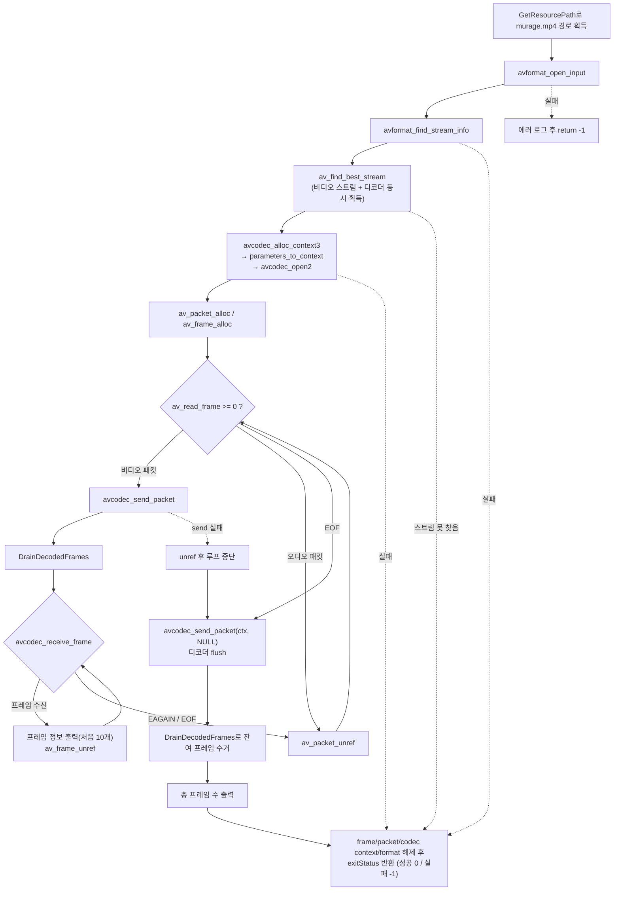

# 04. 비디오 디코딩 파이프라인

> 소스: `study-FFMPEG/04-decode-video/main.c` · 타겟: `studyFFMPEG04DecodeVideo` · [← 트랙 개요](README.md)

## 학습 목표

압축 패킷(`AVPacket`)을 디코더에 넣어 비압축 프레임(`AVFrame`)을 얻는 send/receive 디코딩 파이프라인을 완성한다. `av_find_best_stream()`으로 스트림과 디코더를 한 번에 찾고, `avcodec_send_packet()` / `avcodec_receive_frame()`의 `EAGAIN` / `AVERROR_EOF` 처리, 그리고 마지막 **NULL 패킷 flush**까지 다룬다.

## 핵심 개념

### 디코더는 큐처럼 동작한다

FFmpeg의 디코더는 입력과 출력이 분리된 큐 모델이다. `avcodec_send_packet()`으로 압축 패킷을 넣고, `avcodec_receive_frame()`으로 디코딩된 프레임을 꺼낸다. **1패킷 = 1프레임이 보장되지 않으므로**(B-프레임 재정렬, 디코더 지연 등) receive는 항상 루프로 돌려야 한다.

### 반환 코드의 의미

| 반환값 | 의미 | 대응 |
|---|---|---|
| `0` | 프레임 수신 성공 | 프레임 사용 후 `av_frame_unref()` |
| `AVERROR(EAGAIN)` | 프레임을 내놓으려면 입력이 더 필요함 (에러 아님) | 루프 탈출, 다음 패킷 send |
| `AVERROR_EOF` | flush 완료, 더 나올 프레임 없음 | 루프 탈출, 디코딩 종료 |
| 기타 음수 | 실제 에러 | 로그 후 중단 |

### NULL 패킷 flush

`av_read_frame()`이 EOF에 도달해도 디코더 내부 버퍼(B-프레임 재정렬 대기 등)에 프레임이 남아 있을 수 있다. `avcodec_send_packet(ctx, NULL)`을 보내면 "입력 끝" 신호가 되어 남은 프레임을 모두 receive로 꺼낼 수 있고, 다 꺼내면 `AVERROR_EOF`가 반환된다. murage.mp4의 h264 스트림은 디코더가 스트림 내에서 이미 모든 프레임을 반환해 flushed frames가 0이지만, **flush 절차 자체는 항상 필수**다.

### 디코더 준비 3단계와 FFmpeg 7.x 주의점

`avcodec_alloc_context3()` → `avcodec_parameters_to_context()` → `avcodec_open2()`의 3단계가 정석 절차다. 해제는 `avcodec_free_context()` 하나로 끝난다(컨텍스트 close까지 처리하며, FFmpeg 7.x에서 `avcodec_close()`는 사용 금지). 키프레임 판별도 7.x부터는 제거된 `key_frame` 필드 대신 `pFrame->flags & AV_FRAME_FLAG_KEY`를 사용한다.

## 프로그램 흐름



## 핵심 API

| API / 구조체 | 역할 |
|---|---|
| `av_find_best_stream()` | 원하는 타입의 최적 스트림을 찾고 디코더까지 함께 반환한다 |
| `avcodec_alloc_context3()` | 디코더 컨텍스트 할당 |
| `avcodec_parameters_to_context()` | 스트림의 codecpar를 컨텍스트로 복사 |
| `avcodec_open2()` | 디코더 열기 (이후 send/receive 가능) |
| `avcodec_send_packet()` | 압축 패킷을 디코더에 공급. NULL을 보내면 flush 시작 |
| `avcodec_receive_frame()` | 디코딩된 프레임을 꺼낸다. `EAGAIN`/`AVERROR_EOF`로 상태 통지 |
| `av_get_picture_type_char()` | `AVPictureType`(I/P/B)을 문자로 변환 |
| `AV_FRAME_FLAG_KEY` | FFmpeg 7.x 키프레임 플래그 (`key_frame` 필드 대체) |
| `av_frame_unref()` / `av_frame_free()` | 프레임 버퍼 참조 해제 / 구조체 해제 |
| `avcodec_free_context()` | 컨텍스트 close + 해제 (7.x에서 `avcodec_close` 대체) |

## 이전 레슨과의 차이

- 03에서는 압축 패킷을 **읽기만** 했다. 이번에는 패킷을 디코더에 넣어 실제 픽셀 데이터를 가진 `AVFrame`을 얻는다.
- 02에서 for문으로 스트림을 직접 순회하며 찾던 것을 **`av_find_best_stream()` 한 번의 호출**로 대체했다. 스트림 인덱스와 디코더(`&pVideoCodec`)를 동시에 얻어 코드가 크게 간결해진다.
- 파일 끝에서 **NULL 패킷을 보내 디코더를 flush하는 단계**가 추가되었다. chapter02의 09~11 레슨에는 없던 절차다.
- `videoStreamIdx`를 **-1로 초기화**한다 — chapter02에서 0으로 초기화해 `if (videoStreamIdx < 0)` 검사가 무력화되던 알려진 버그를 이 트랙에서는 처음부터 바로잡은 것이다.
- 에러 경로를 `goto ffmpeg_release`로 일원화해 어느 단계에서 실패해도 자원이 정리된다.

## 실행 방법

```bash
# 빌드 (저장소 루트에서)
cmake --build cmake-build-debug --target studyFFMPEG04DecodeVideo
# 실행
./cmake-build-debug/study-FFMPEG/04-decode-video/studyFFMPEG04DecodeVideo
```

- **입력: `resources/murage.mp4`** (실행 경로에서 `/cmake` 문자열 앞부분을 잘라 `resources/`를 붙이는 방식이므로 `cmake-build-*` 아래에서 실행해야 경로 계산이 성공한다)
- 출력물: 파일 생성 없음. 처음 10개 프레임 정보가 `Frame 1    type=I pts=0        1280x720 key=KEY` 형태로 출력되고, 마지막에 `flushed frames : 0`, `total decoded frames : 383`이 나온다(383 = 03에서 센 비디오 패킷 수와 일치. 이 h264 스트림은 디코더가 스트림 내에서 이미 모든 프레임을 반환해 flush분이 0이다).

---
→ 자세한 코드 해설: [코드 상세 해설](04-decode-video-deep-dive.md)
