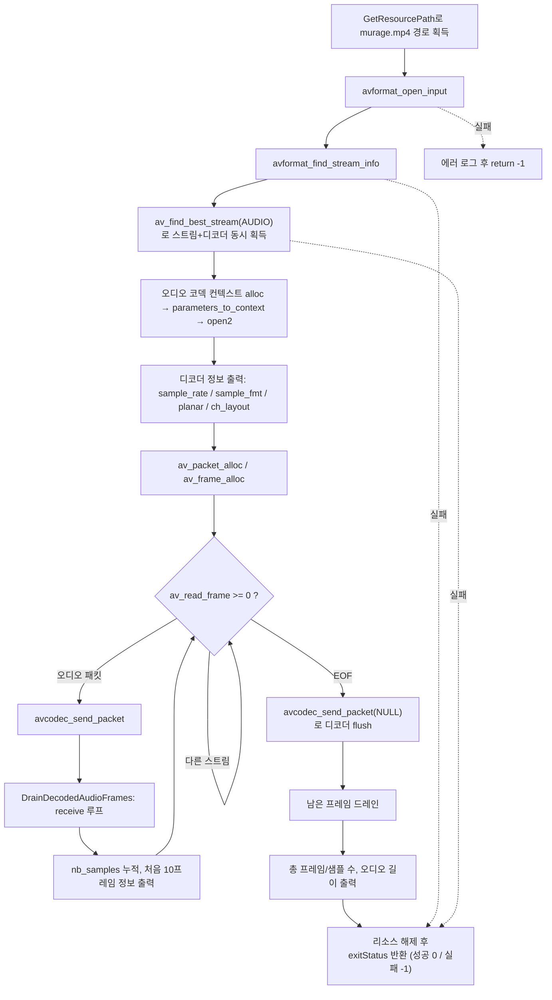

# 05. 오디오 디코딩과 샘플 포맷

> 소스: `study-FFMPEG/05-decode-audio/main.c` · 타겟: `studyFFMPEG05DecodeAudio` · [← 트랙 개요](README.md)

## 학습 목표

04에서 익힌 send/receive 디코딩 파이프라인을 그대로 사용해 이번에는 **오디오 스트림**을 디코딩한다. 디코딩된 오디오 `AVFrame`에서 비디오와는 다른 필드들 — `nb_samples`, `sample_fmt`(planar vs interleaved), FFmpeg 7.x의 `AVChannelLayout`(`ch_layout`) — 을 읽는 방법을 익히고, 총 샘플 수로 실제 오디오 길이를 계산해 본다.

## 핵심 개념

### 오디오 프레임은 "샘플 묶음"이다

비디오 프레임 1개 = 그림 1장이지만, 오디오 프레임 1개는 **채널당 샘플 여러 개의 묶음**이다. AAC는 보통 프레임당 1024샘플을 담는다. `AVFrame->nb_samples`가 이 값이며, `총 샘플 수 ÷ sample_rate = 오디오 길이(초)`가 성립한다.

### 샘플 포맷: planar vs interleaved

`sample_fmt`는 각 샘플이 메모리에 어떻게 저장되는지를 나타낸다. 이름 끝의 `p`가 planar를 뜻한다.

| 방식 | 예시 포맷 | 메모리 배치 | data 배열 사용 |
|---|---|---|---|
| planar | `fltp`, `s16p` | 채널별로 분리: `data[0]`=L 전체, `data[1]`=R 전체 (LLLL... RRRR...) | 채널 수만큼 사용 |
| interleaved | `flt`, `s16` | 한 버퍼에 교차 저장: LRLRLR... | `data[0]`만 사용 |

AAC 디코더는 `fltp`(float planar)를 출력하므로, `data[0]`을 `float *`로 캐스팅하면 첫 번째 채널의 샘플 배열을 그대로 읽을 수 있다. `av_sample_fmt_is_planar()`로 판별한다.

### FFmpeg 7.x의 AVChannelLayout

과거의 `channels` / `channel_layout`(uint64 비트마스크) 필드는 제거되었고, FFmpeg 7.x에서는 `AVCodecContext->ch_layout`(`AVChannelLayout` 구조체) 하나로 통합되었다.

| 항목 | 사용법 |
|---|---|
| 채널 수 | `ch_layout.nb_channels` |
| 사람이 읽을 수 있는 이름 | `av_channel_layout_describe()` → "stereo" 등 |

## 프로그램 흐름



## 핵심 API

| API / 구조체 | 역할 |
|---|---|
| `av_find_best_stream()` | 타입별 최적 스트림을 찾으면서 디코더(`AVCodec`)까지 한 번에 얻는다 |
| `AVFrame->nb_samples` | 이 프레임에 담긴 **채널당** 샘플 수 (AAC는 보통 1024) |
| `AVFrame->format` / `sample_fmt` | 샘플 포맷 (`fltp` = float planar) |
| `av_get_sample_fmt_name()` | 샘플 포맷 enum을 문자열로 변환 |
| `av_sample_fmt_is_planar()` | planar 포맷 여부 판별 |
| `AVCodecContext->ch_layout` | FFmpeg 7.x 채널 레이아웃 구조체 (`AVChannelLayout`) |
| `av_channel_layout_describe()` | 채널 레이아웃을 "stereo" 같은 문자열로 변환 |
| `avcodec_send_packet(ctx, NULL)` | 디코더 flush 시작 — 내부에 남은 프레임을 모두 내보내게 한다 |

## 이전 레슨과의 차이

- 04(비디오 디코딩)와 **파이프라인 구조가 완전히 동일**하다. `av_read_frame → avcodec_send_packet → avcodec_receive_frame` 골격은 그대로이고, 대상 스트림만 `AVMEDIA_TYPE_VIDEO` → `AVMEDIA_TYPE_AUDIO`로 바뀌었다.
- 프레임에서 읽는 정보가 다르다: 비디오는 `width`/`height`/`pict_type`을 봤지만, 오디오는 `nb_samples`/`sample_fmt`/`ch_layout`을 본다.
- receive 루프를 `DrainDecodedAudioFrames()` 함수로 분리해 본 루프와 flush 뒤 드레인에서 재사용한다.

## 실행 방법

```bash
# 빌드 (저장소 루트에서)
cmake --build cmake-build-debug --target studyFFMPEG05DecodeAudio
# 실행 (빌드 트리 안에서 실행해야 리소스 경로 계산이 성공한다)
./cmake-build-debug/study-FFMPEG/05-decode-audio/studyFFMPEG05DecodeAudio
```

- **입력: `resources/murage.mp4`** (AAC 48kHz stereo fltp, 12.78초)
- 출력물: 파일 생성 없음. 디코더 정보와 처음 10개 프레임의 `pts`/`nb_samples`/`fmt`/첫 샘플 값을 콘솔에 출력한다.
- 실행 결과: **총 598프레임, 채널당 612,352샘플** 디코딩 → `612352 ÷ 48000 = 12.76초`. 각 프레임은 `fmt=fltp`, `nb_samples=1024`로 컨테이너 duration(12.78초)과 거의 일치하는 것을 확인할 수 있다.

---
→ 자세한 코드 해설: [코드 상세 해설](05-decode-audio-deep-dive.md)
