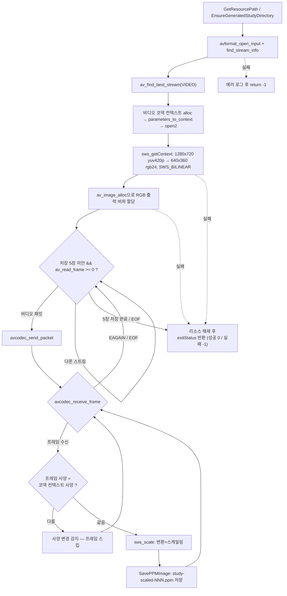

# 06. swscale: 픽셀 포맷 변환과 스케일링

> 소스: `study-FFMPEG/06-scaling-video/main.c` · 타겟: `studyFFMPEG06ScalingVideo` · [← 트랙 개요](README.md)

## 학습 목표

디코딩된 YUV420P 프레임을 libswscale(`SwsContext`) 하나로 **픽셀 포맷 변환(YUV420P → RGB24)** 과 **크기 변경(1280x720 → 640x360)** 을 동시에 처리한다. 변환 결과를 PPM(P6) 이미지 파일로 저장해 눈으로 확인하고, stride(linesize)가 왜 `width × 3`과 다를 수 있는지 이해한다.

## 핵심 개념

### 왜 변환이 필요한가

디코더가 내놓는 프레임은 보통 YUV420P다. 사람 눈이 밝기(Y)에 민감하고 색(U/V)에 둔감한 점을 이용해 색차 정보를 1/4로 줄인 포맷이라 코덱에는 최적이지만, 화면 표시나 이미지 저장에는 픽셀당 RGB 값이 필요하다. libswscale은 이 변환과 크기 조절을 한 번의 `sws_scale()` 호출로 처리한다.

### SwsContext 생성 파라미터

`sws_getContext()`에 (입력 크기/포맷) + (출력 크기/포맷) + (보간 알고리즘)을 지정한다. 입력과 출력 크기가 다르면 자동으로 스케일링까지 수행된다.

컨텍스트는 코덱 컨텍스트의 **초기 사양**으로 한 번만 만들기 때문에, 스트림 중간에 해상도/포맷이 바뀌는 경우(H.264에서 합법)에 대비해 `sws_scale()` 호출 전에 실제 프레임의 `width`/`height`/`format`이 컨텍스트와 같은지 검사하고, 다르면 그 프레임은 건너뛴다.

| 보간 알고리즘 | 특징 |
|---|---|
| `SWS_FAST_BILINEAR` | 가장 빠르지만 품질 낮음 |
| `SWS_BILINEAR` | 속도/품질 균형 — 이 레슨의 선택 |
| `SWS_BICUBIC` | 더 부드럽지만 느림 |
| `SWS_LANCZOS` | 고품질 다운스케일에 적합 |

### stride(linesize)와 픽셀 데이터

`av_image_alloc()`은 포맷에 맞는 평면 포인터(`data[4]`)와 각 평면의 한 줄 바이트 수(`linesize[4]`)를 채워준다. 정렬(alignment) 때문에 **stride가 `width × 픽셀크기`보다 클 수 있으므로**, 픽셀을 다룰 때는 항상 "한 줄 = stride 바이트, 그중 유효한 것은 width×3 바이트"로 취급해야 한다. RGB24는 단일 평면이라 `data[0]`/`linesize[0]`만 쓴다.

### PPM(P6) 포맷

텍스트 헤더(`P6\n너비 높이\n255\n`) 뒤에 RGB 바이트가 그대로 이어지는 가장 단순한 이미지 포맷이다. 라이브러리 없이 `fwrite`만으로 저장할 수 있어 변환 결과 확인용으로 안성맞춤이다.

## 프로그램 흐름



## 핵심 API

| API / 구조체 | 역할 |
|---|---|
| `sws_getContext()` | 변환 컨텍스트 생성 — 입/출력 크기·포맷과 보간 알고리즘 지정 |
| `sws_scale()` | 실제 픽셀 포맷 변환 + 스케일링 수행 |
| `av_image_alloc()` | 픽셀 포맷에 맞는 평면 버퍼와 stride를 한 번에 할당 |
| `AVFrame->data` / `linesize` | 입력 프레임의 평면 포인터와 stride — `sws_scale()`의 입력 |
| `av_get_pix_fmt_name()` | 픽셀 포맷 enum을 문자열로 변환 |
| `sws_freeContext()` | SwsContext 해제 |
| `av_freep(&rgbData[0])` | `av_image_alloc` 버퍼 해제 — 첫 평면 포인터만 해제하면 된다 |

## 이전 레슨과의 차이

- 04~05는 디코딩된 프레임의 **정보를 출력**하기만 했다. 이 레슨에서 처음으로 프레임 픽셀 데이터를 가공해 **눈으로 볼 수 있는 출력물(PPM 이미지)** 을 만든다.
- 새 라이브러리 **libswscale**이 등장한다. 디코더가 주는 포맷(YUV420P)과 우리가 원하는 포맷(RGB24) 사이의 다리 역할이다.
- 출력물을 담을 `resources/GeneratedStudy/` 디렉터리를 `EnsureGeneratedStudyDirectory()`(mkdir)로 프로그램이 직접 만든다 — 이후 레슨들도 이 패턴을 쓴다.

## 실행 방법

```bash
# 빌드 (저장소 루트에서)
cmake --build cmake-build-debug --target studyFFMPEG06ScalingVideo
# 실행 (빌드 트리 안에서 실행해야 리소스 경로 계산이 성공한다)
./cmake-build-debug/study-FFMPEG/06-scaling-video/studyFFMPEG06ScalingVideo
```

- **입력: `resources/murage.mp4`** (H.264 1280x720 yuv420p 30fps)
- **출력: `resources/GeneratedStudy/study-scaled-000.ppm` ~ `study-scaled-004.ppm`** — 640x360 RGB24 PPM 5장 (각 691,215바이트). macOS 미리보기나 `ffplay study-scaled-000.ppm`으로 열어 확인할 수 있다.
- `GeneratedStudy/` 디렉터리는 프로그램이 자동으로 생성한다.

---
→ 자세한 코드 해설: [코드 상세 해설](06-scaling-video-deep-dive.md)
