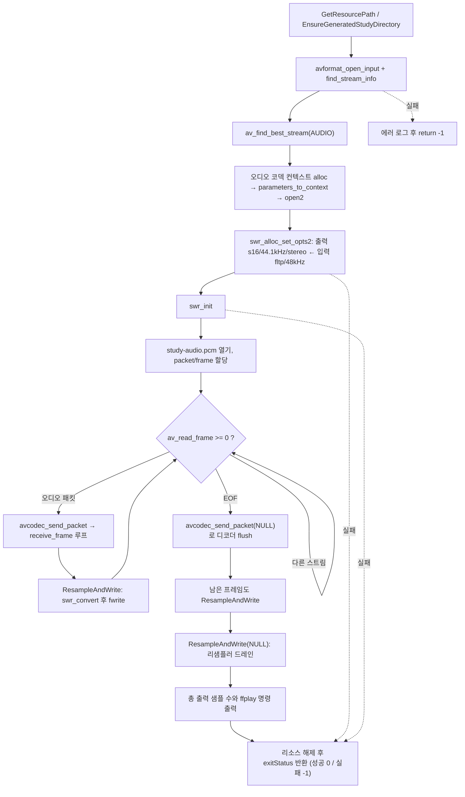

# 07. swresample: 오디오 리샘플링

> 소스: `study-FFMPEG/07-resampling-audio/main.c` · 타겟: `studyFFMPEG07ResamplingAudio` · [← 트랙 개요](README.md)

## 학습 목표

디코딩된 오디오(fltp, 48kHz)를 libswresample(`SwrContext`)로 **샘플 포맷(fltp → s16)**, **샘플레이트(48kHz → 44.1kHz)**, **채널 레이아웃(→ stereo)** 세 가지를 한 번에 변환한다. `swr_get_delay()` + `av_rescale_rnd()`로 출력 버퍼 크기를 계산하는 방법과, NULL 입력으로 리샘플러에 남은 지연 샘플을 드레인하는 방법을 익힌다. 결과는 raw PCM 파일로 저장해 `ffplay`로 재생한다.

## 핵심 개념

### 비디오의 swscale = 오디오의 swresample

06에서 swscale이 "디코더 출력 포맷 → 표시용 포맷"의 다리였다면, swresample은 오디오에서 정확히 같은 역할을 한다.

| 변환 항목 | 이 레슨의 입력 | 이 레슨의 출력 |
|---|---|---|
| 샘플 포맷 | `fltp` (float planar) | `s16` (16bit 정수, interleaved) |
| 샘플레이트 | 48,000 Hz | 44,100 Hz |
| 채널 레이아웃 | stereo | stereo (`AV_CHANNEL_LAYOUT_STEREO`) |

### 출력 샘플 수 계산 — swr_get_delay + av_rescale_rnd

샘플레이트 변환은 입력 N샘플이 출력 M샘플로 1:1 대응하지 않는다(48000→44100이면 대략 0.919배). 게다가 리샘플러는 보간을 위해 **내부에 샘플을 지연시켜 쌓아둔다**. 따라서 출력 버퍼는 다음처럼 여유 있게 계산한다.

```
maxOutputSamples = av_rescale_rnd(swr_get_delay(swr, in_rate) + in_samples,
                                  out_rate, in_rate, AV_ROUND_UP)
```

`av_rescale_rnd(a, b, c, r)`는 `a × b / c`를 64비트 오버플로 없이 지정한 반올림 방식으로 계산하는 유틸이다.

### 드레인(drain)

입력이 끝나도 리샘플러 내부에는 지연된 샘플이 남아 있다. `swr_convert()`에 입력을 NULL로 주면 남은 샘플을 모두 뱉어낸다. 디코더 flush(NULL 패킷)와 같은 개념이 리샘플러에도 있는 것이다.

### raw PCM 파일

출력 파일에는 헤더 없이 s16 interleaved 샘플만 이어진다. 그래서 재생할 때 포맷/샘플레이트/채널을 직접 알려줘야 한다 (`ffplay -f s16le -ar 44100 -ch_layout stereo`).

## 프로그램 흐름



## 핵심 API

| API / 구조체 | 역할 |
|---|---|
| `swr_alloc_set_opts2()` | FFmpeg 7.x 방식의 SwrContext 생성+옵션 설정 (출력 사양 → 입력 사양 순) |
| `swr_init()` | 옵션 설정이 끝난 SwrContext를 초기화 — 변환 전 필수 |
| `swr_convert()` | 실제 변환. 입력 NULL이면 내부에 남은 샘플만 뱉는 드레인 동작 |
| `swr_get_delay()` | 리샘플러 내부에 쌓인 지연 샘플 수 (입력 샘플레이트 기준) |
| `av_rescale_rnd()` | `a × b / c`를 오버플로 없이 반올림 방식 지정 계산 — 출력 샘플 수 환산 |
| `av_samples_alloc()` | 채널 수/샘플 수/포맷에 맞는 오디오 버퍼 할당 |
| `AV_CHANNEL_LAYOUT_STEREO` | FFmpeg 7.x `AVChannelLayout` 초기화 매크로 |
| `swr_free()` | SwrContext 해제 |

## 이전 레슨과의 차이

- 06(swscale)이 비디오 프레임을 "쓸 수 있는 포맷"으로 바꿨다면, 이 레슨은 **정확히 대응하는 오디오 버전**이다: SwsContext ↔ SwrContext, 픽셀 포맷/해상도 ↔ 샘플 포맷/샘플레이트/채널 레이아웃.
- 05에서 관찰만 했던 fltp(planar) 데이터를 실제로 재생 가능한 s16 interleaved PCM으로 만든다.
- 비디오와 달리 리샘플러에는 **내부 지연**이 있어 출력 크기 계산(`swr_get_delay`)과 마지막 드레인(NULL 입력)이 추가로 필요하다.

## 실행 방법

```bash
# 빌드 (저장소 루트에서)
cmake --build cmake-build-debug --target studyFFMPEG07ResamplingAudio
# 실행 (빌드 트리 안에서 실행해야 리소스 경로 계산이 성공한다)
./cmake-build-debug/study-FFMPEG/07-resampling-audio/studyFFMPEG07ResamplingAudio
```

- **입력: `resources/murage.mp4`** (AAC 48kHz stereo fltp)
- **출력: `resources/GeneratedStudy/study-audio.pcm`** — s16 interleaved 44.1kHz stereo raw PCM. 총 562,598샘플 = `562598 ÷ 44100 = 12.76초` (05에서 확인한 오디오 길이와 일치).
- 재생 확인 (raw PCM은 헤더가 없어 사양을 직접 지정해야 한다):

```bash
ffplay -f s16le -ar 44100 -ch_layout stereo resources/GeneratedStudy/study-audio.pcm
```

---
→ 자세한 코드 해설: [코드 상세 해설](07-resampling-audio-deep-dive.md)
