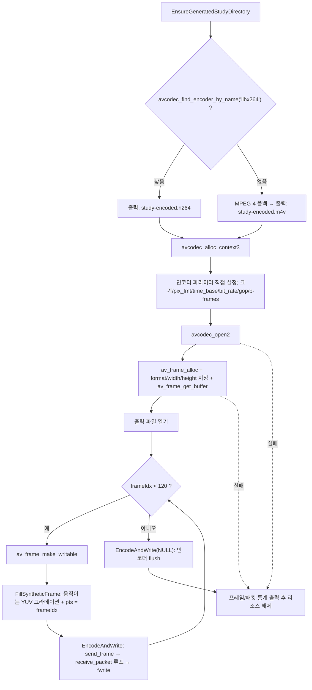

# 08. 비디오 인코딩

> 소스: `study-FFMPEG/08-encode-video/main.c` · 타겟: `studyFFMPEG08EncodeVideo` · [← 트랙 개요](README.md)

## 학습 목표

지금까지 해 온 디코딩의 **정확한 반대 방향** 파이프라인을 구현한다. 입력 파일 없이 합성 YUV420P 프레임 120장을 직접 만들어 `avcodec_send_frame()` / `avcodec_receive_packet()`으로 압축하고, raw 비트스트림 파일로 저장한다. 인코더를 이름으로 찾는 이유, 인코더 파라미터를 직접 설정하는 방법, `av_frame_get_buffer()` / `av_frame_make_writable()`의 필요성, NULL 프레임 flush를 익힌다.

## 핵심 개념

### 디코딩의 거울상

| 방향 | 넣는 것 | 꺼내는 것 | API |
|---|---|---|---|
| 디코딩 (04~05) | 압축 `AVPacket` | 비압축 `AVFrame` | `avcodec_send_packet` / `avcodec_receive_frame` |
| 인코딩 (이번) | 비압축 `AVFrame` | 압축 `AVPacket` | `avcodec_send_frame` / `avcodec_receive_packet` |

`EAGAIN`/`AVERROR_EOF` 의미, NULL 입력 = flush 시작이라는 규칙까지 완전히 대칭이다.

### 인코더는 이름으로 찾는다

디코더는 스트림의 `codec_id`로 찾으면 충분하지만, H.264 **인코더**는 libx264, h264_videotoolbox(하드웨어) 등 구현이 여럿이다. 그래서 `avcodec_find_encoder_by_name("libx264")`처럼 이름으로 특정 구현을 고르는 경우가 많다. 이 프로그램은 libx264가 없으면 FFmpeg 내장 MPEG-4 인코더로 폴백한다.

### 인코더 파라미터는 직접 정한다

디코딩 때는 `avcodec_parameters_to_context()`로 파일에 적힌 파라미터를 복사했지만, 인코딩은 **우리가 출력 사양을 결정**해야 한다.

| 파라미터 | 이 레슨의 값 | 의미 |
|---|---|---|
| `width` / `height` | 640 x 360 | 출력 해상도 |
| `pix_fmt` | `AV_PIX_FMT_YUV420P` | 인코더가 받을 픽셀 포맷 |
| `time_base` | 1/25 | pts 1 증가 = 1/25초 (프레임 번호 = pts) |
| `framerate` | 25/1 | 프레임레이트 |
| `bit_rate` | 1,000,000 | 목표 비트레이트 (1Mbps) |
| `gop_size` | 25 | 키프레임 간격 (1초마다 I-프레임) |
| `max_b_frames` | 2 | B-프레임 최대 2장 허용 |

### 인코딩용 프레임 버퍼는 직접 할당한다

디코딩 때는 디코더가 프레임 버퍼를 채워줬지만, 인코딩용 프레임은 `format`/`width`/`height`를 지정한 뒤 `av_frame_get_buffer()`로 픽셀 버퍼를 직접 할당한다. 또한 인코더가 이전 프레임 버퍼를 아직 참조 중일 수 있으므로, 매 프레임 쓰기 전에 `av_frame_make_writable()`로 안전하게 만들어야 한다(참조 중이면 내부 복사 발생).

## 프로그램 흐름



## 핵심 API

| API / 구조체 | 역할 |
|---|---|
| `avcodec_find_encoder_by_name()` | 이름으로 특정 인코더 구현을 찾는다 ("libx264" 등) |
| `avcodec_find_encoder()` | codec_id로 인코더를 찾는다 (폴백용 `AV_CODEC_ID_MPEG4`) |
| `av_opt_set(ctx->priv_data, ...)` | 코덱 전용 옵션(libx264의 preset 등)을 문자열로 설정 |
| `av_frame_get_buffer()` | format/width/height에 맞는 픽셀 버퍼를 프레임에 할당 |
| `av_frame_make_writable()` | 버퍼가 공유 중이면 복사해 안전하게 쓸 수 있는 상태로 만든다 |
| `avcodec_send_frame()` | 비압축 프레임을 인코더에 공급 (NULL = flush 시작) |
| `avcodec_receive_packet()` | 인코더에서 압축 패킷을 꺼낸다 (`EAGAIN`/`AVERROR_EOF` 처리 동일) |
| `AVCodecContext->time_base` | 인코딩 pts의 시간 단위 — 1/fps로 두면 프레임 번호가 곧 pts |

## 이전 레슨과의 차이

- 04~07이 모두 "파일을 읽어 푸는" 방향이었다면, 이 레슨은 **디코딩의 역방향(압축하는 방향)** 이다. send/receive 파이프라인의 대칭 구조를 그대로 재사용한다.
- 트랙에서 처음으로 **입력 파일이 없다**. `AVFormatContext`/`av_read_frame`이 아예 등장하지 않고, `FillSyntheticFrame()`이 픽셀을 직접 만들어낸다.
- 코덱 파라미터를 파일에서 복사하는 대신 **직접 설계**하고, 프레임 버퍼도 디코더 대신 **우리가 할당**한다.

## ⚠️ 알아두기

- **이 저장소의 vcpkg ffmpeg 빌드에는 libx264가 포함되어 있지 않다.** 따라서 실제 실행하면 `libx264 not found → fallback to MPEG-4 encoder`가 출력되고 결과물은 `study-encoded.m4v`(MPEG-4 raw 비트스트림)가 된다. libx264가 있는 환경이라면 `study-encoded.h264`가 생성된다. 어느 쪽이든 학습 내용(파이프라인)은 동일하다.
- 출력은 컨테이너(mp4 등)가 아닌 **raw 비트스트림**이다. 패킷 데이터를 그대로 이어 쓴 것뿐이라 탐색(seek)이나 정확한 타임스탬프 재생은 불가능하다. 컨테이너에 담는 방법(muxing)은 11번 레슨에서 다룬다.
- `gop_size=25`, `max_b_frames=2` 설정 덕분에 출력 스트림에 I/P/B 프레임이 섞인다. B-프레임 때문에 인코더에도 지연이 있어 마지막 flush가 없으면 끝부분 패킷이 유실된다.

## 실행 방법

```bash
# 빌드 (저장소 루트에서)
cmake --build cmake-build-debug --target studyFFMPEG08EncodeVideo
# 실행 (빌드 트리 안에서 실행해야 리소스 경로 계산이 성공한다)
./cmake-build-debug/study-FFMPEG/08-encode-video/studyFFMPEG08EncodeVideo
```

- **입력: 없음** (합성 프레임 120장을 프로그램이 직접 생성)
- **출력: `resources/GeneratedStudy/study-encoded.m4v`** — 이 저장소 환경 기준 MPEG-4 폴백 결과. 120프레임 → 120패킷이 기록된다. `GeneratedStudy/` 디렉터리는 자동 생성된다.
- 재생 확인 — 움직이는 대각선 그라데이션이 보이면 성공:

```bash
ffplay resources/GeneratedStudy/study-encoded.m4v
```

---
→ 자세한 코드 해설: [코드 상세 해설](08-encode-video-deep-dive.md)
