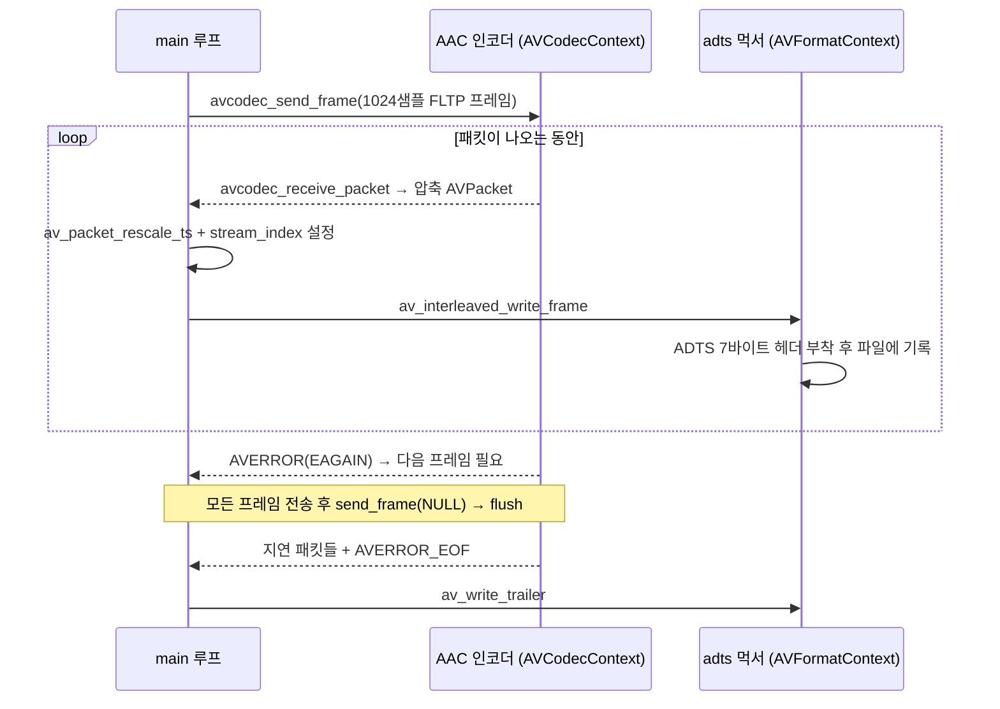

# 09. 오디오 인코딩 (AAC) — 코드 상세 해설

> [← 기본 문서](09-encode-audio.md)

## 전체 구조

| 구간 | 하는 일 |
|---|---|
| 상수 정의 | 44.1kHz / 2초 / 440Hz 사인파 사양 |
| `main` 전반부 | AAC 인코더 탐색 → 컨텍스트 설정 → open (frame_size 확정) |
| `main` 중반부 | ADTS 먹서 준비: 출력 컨텍스트 → 스트림 → 파일 열기 → 헤더 |
| `main` 후반부 | 프레임 버퍼 준비 → 사인파 생성/인코딩 루프 → flush → 트레일러 |
| `EncodeAndMux()` | send/receive 인코딩 파이프라인 + 먹서 쓰기 (핵심 함수) |
| `EnsureGeneratedStudyDirectory()` / `GetResourcePath()` | 출력 디렉터리 생성 / 경로 계산 유틸 |

```text
main
 ├─ EnsureGeneratedStudyDirectory / GetResourcePath
 ├─ avcodec_find_encoder(AAC) → alloc_context3 → 사양 설정 → open2
 ├─ avformat_alloc_output_context2("adts") → new_stream → parameters_from_context
 ├─ avio_open → avformat_write_header
 ├─ av_frame_alloc (nb_samples = frame_size) → av_frame_get_buffer
 ├─ while (nextPts < 44100*2)
 │    └─ 사인파 채움 → pts 설정 → EncodeAndMux()
 ├─ EncodeAndMux(NULL)  ← 인코더 flush
 ├─ av_write_trailer
 └─ ffmpeg_release: packet/frame/avio/format/codec context 해제
```

## 코드 블록별 해설

### 1. 출력 사양 상수

```c
#define OUTPUT_SAMPLE_RATE          44100
#define OUTPUT_DURATION_SEC         2
#define SINE_FREQUENCY              440.0
```

44.1kHz는 CD 오디오의 표준 샘플레이트, 440Hz는 조율 기준음 A4다. 2초 분량이므로 총 88,200 샘플(채널당)을 생성하게 된다.

### 2. AAC 인코더 탐색과 컨텍스트 설정

```c
pEncoder = avcodec_find_encoder(AV_CODEC_ID_AAC);
...
pEncoderContext = avcodec_alloc_context3(pEncoder);
...
/** 인코더 출력 사양 설정 */
pEncoderContext->sample_rate = OUTPUT_SAMPLE_RATE;
pEncoderContext->sample_fmt = AV_SAMPLE_FMT_FLTP;
pEncoderContext->bit_rate = 128000;
/** time_base = 1/샘플레이트 → pts 단위가 "샘플 번호"가 된다 */
pEncoderContext->time_base = (AVRational) {1, OUTPUT_SAMPLE_RATE};
/** FFmpeg 7.x: AVChannelLayout은 대입이 아니라 copy 함수로 설정 */
errorCode = av_channel_layout_copy(&pEncoderContext->ch_layout, &stereoLayout);
```

- 비디오(08)에서는 `width`/`height`/`pix_fmt`을 설정했다면, 오디오에서는 `sample_rate`/`sample_fmt`/`ch_layout`이 그 자리를 대신한다.
- `sample_fmt`은 반드시 `AV_SAMPLE_FMT_FLTP`. 내장 AAC 인코더는 다른 포맷을 주면 `avcodec_open2()`가 실패한다.
- `ch_layout`은 FFmpeg 7.x에서 구조체(`AVChannelLayout`)로 바뀌었고 내부에 동적 할당 멤버를 가질 수 있어, `stereoLayout` 지역 변수를 `av_channel_layout_copy()`로 복사해 넣는다. `pEncoderContext->ch_layout = stereoLayout;` 같은 대입은 소유권 문제를 일으킬 수 있다.
- `time_base = {1, 44100}`으로 두면 pts 1이 정확히 샘플 1개에 해당한다.

### 3. open 후에 frame_size를 읽는 이유

```c
errorCode = avcodec_open2(pEncoderContext, pEncoder, NULL);
...
/** AAC는 프레임 크기가 고정 — 인코더가 정한 값을 반드시 따른다 */
printf("encoder frame_size : %d samples\r\n", pEncoderContext->frame_size);
```

`frame_size`는 `avcodec_open2()`가 성공한 뒤에야 채워진다. AAC는 MDCT 변환 블록 크기 때문에 프레임당 샘플 수가 1024로 고정이며, 실제 실행 시에도 `encoder frame_size : 1024 samples`가 출력된다. 이후 만드는 모든 `AVFrame`은 이 값에 맞춰야 한다(마지막 프레임 제외 — 이 코드는 2초가 1024의 배수가 아니어도 항상 1024짜리 프레임을 보내므로 실제로는 2초보다 약간 길게 인코딩된다).

### 4. ADTS 먹서 준비 — 컨테이너 쓰기의 최소 형태

```c
/** ADTS 먹서 준비 (컨테이너 쓰기의 최소 형태) */
errorCode = avformat_alloc_output_context2(&pOutputContext, NULL, "adts", outputPath);
...
pStream = avformat_new_stream(pOutputContext, NULL);
...
/** 인코더 설정 → 스트림 파라미터로 복사 (13/10 레슨의 parameters_copy와 방향이 다름에 주의) */
errorCode = avcodec_parameters_from_context(pStream->codecpar, pEncoderContext);
...
pStream->time_base = pEncoderContext->time_base;
```

- `avformat_alloc_output_context2()`의 세 번째 인자에 `"adts"`를 명시해 먹서를 직접 지정했다(10 레슨에서는 NULL을 주고 확장자로 추론시킨다).
- `avformat_new_stream()`으로 컨테이너에 스트림 슬롯을 만들고, `avcodec_parameters_from_context()`로 **인코더의 설정을 스트림 codecpar로** 복사한다. 먹서는 이 codecpar를 보고 헤더를 구성한다.
- 함수 이름 주의: `..._from_context`(인코더→스트림, 인코딩/먹싱용)와 `avcodec_parameters_copy`(스트림→스트림, 리먹싱용), `..._to_context`(스트림→디코더, 디코딩용)는 모두 방향이 다르다.

```c
/** 출력 파일 열기 + 헤더 쓰기 */
errorCode = avio_open(&pOutputContext->pb, outputPath, AVIO_FLAG_WRITE);
...
errorCode = avformat_write_header(pOutputContext, NULL);
```

`avio_open()`이 실제 파일 I/O 핸들(`pb`)을 연다. `avformat_write_header()`는 먹서를 초기화하는데, ADTS는 파일 선두 헤더가 없는 스트리밍 포맷이라 이 시점에 실제로 쓰이는 바이트는 없지만 **호출 자체는 필수**다(먹서 내부 상태 초기화).

### 5. 프레임 버퍼 준비 — 사양은 인코더를 따른다

```c
/** 프레임 사양은 인코더가 정한 frame_size에 맞춘다 */
pFrame->format = pEncoderContext->sample_fmt;
pFrame->sample_rate = pEncoderContext->sample_rate;
pFrame->nb_samples = pEncoderContext->frame_size;
errorCode = av_channel_layout_copy(&pFrame->ch_layout, &pEncoderContext->ch_layout);
...
errorCode = av_frame_get_buffer(pFrame, 0);
```

`format`/`sample_rate`/`nb_samples`/`ch_layout` 네 가지를 채운 뒤 `av_frame_get_buffer()`를 호출하면 planar 스테레오이므로 `data[0]`(L), `data[1]`(R) 두 개의 float 버퍼가 각각 1024 샘플 크기로 할당된다.

### 6. 사인파 생성 루프

```c
/** 사인파 생성 → 인코딩 루프 */
while (nextPts < (int64_t) OUTPUT_SAMPLE_RATE * OUTPUT_DURATION_SEC) {
    errorCode = av_frame_make_writable(pFrame);
    ...
    for (int sampleIdx = 0; sampleIdx < pFrame->nb_samples; ++sampleIdx) {
        float sampleValue = (float) (0.3 * sin(sinePhase));
        ((float *) pFrame->data[0])[sampleIdx] = sampleValue;
        ((float *) pFrame->data[1])[sampleIdx] = sampleValue;
        sinePhase += 2.0 * M_PI * SINE_FREQUENCY / OUTPUT_SAMPLE_RATE;
    }

    /** pts = 지금까지 보낸 샘플 수 (time_base가 1/샘플레이트이므로) */
    pFrame->pts = nextPts;
    nextPts += pFrame->nb_samples;

    totalFrameCount += EncodeAndMux(pEncoderContext, pOutputContext, pStream, pFrame, pPacket);
}
```

- `av_frame_make_writable()`: 인코더가 이전 프레임 버퍼를 아직 참조 중일 수 있으므로(참조 카운팅), 쓰기 전에 필요하면 버퍼를 복사해 단독 소유로 만든다. 프레임을 재사용하는 루프에서는 필수 관례다.
- FLTP는 planar이므로 `data[0]`과 `data[1]`에 **채널별로** 값을 넣는다. interleaved 포맷(`FLT`)이었다면 `data[0]`에 LRLR... 순서로 넣었을 것이다.
- 위상(`sinePhase`)을 프레임 경계에서 리셋하지 않고 계속 누적하므로 프레임 간 파형이 끊기지 않는다.
- 진폭 0.3: float 오디오의 유효 범위는 [-1.0, 1.0]이며, 1.0에 가까우면 인코딩/재생 단계에서 클리핑이 생길 수 있어 여유를 둔다.

### 7. EncodeAndMux — 인코딩 파이프라인 + 먹서 쓰기 (핵심)

```c
int EncodeAndMux(AVCodecContext *pCodecContext, AVFormatContext *pOutputContext,
                 AVStream *pStream, AVFrame *pFrame, AVPacket *pPacket) {
    int writtenCount = 0;
    int errorCode = 0;

    errorCode = avcodec_send_frame(pCodecContext, pFrame);
    if (errorCode < 0) {
        av_log(NULL, AV_LOG_ERROR, "[FFMPEG ERROR](%d) Sending frame to encoder\r\n", errorCode);
        return 0;
    }

    while (errorCode >= 0) {
        errorCode = avcodec_receive_packet(pCodecContext, pPacket);
        if (errorCode == AVERROR(EAGAIN) || errorCode == AVERROR_EOF) {
            break;
        } else if (errorCode < 0) {
            av_log(NULL, AV_LOG_ERROR, "[FFMPEG ERROR](%d) Receive packet\r\n", errorCode);
            break;
        }

        /** 인코더 time_base → 스트림 time_base로 타임스탬프 변환 */
        av_packet_rescale_ts(pPacket, pCodecContext->time_base, pStream->time_base);
        pPacket->stream_index = pStream->index;

        /** 먹서를 통해 쓰기 (raw fwrite가 아니라 ADTS 헤더가 자동으로 붙는다) */
        errorCode = av_interleaved_write_frame(pOutputContext, pPacket);
        ...
        writtenCount++;
    }

    return writtenCount;
}
```

- 디코딩의 `send_packet`/`receive_frame`을 뒤집은 **인코딩 파이프라인**이다: 비압축 `AVFrame`을 보내고 압축 `AVPacket`을 받는다.
- `pFrame == NULL`이면 flush 모드 진입: 인코더가 내부에 쌓아둔 지연 패킷을 모두 내보낸 뒤 `AVERROR_EOF`를 반환한다. AAC는 lookahead 지연이 있어 flush 없이는 마지막 프레임들이 유실된다.
- `av_packet_rescale_ts()`: 인코더 time_base(`1/44100`)와 스트림 time_base가 다를 수 있으므로 항상 변환한다. 먹서가 `avformat_write_header()` 시점에 스트림 time_base를 바꿔놓았을 수 있기 때문에, 설령 같아 보여도 이 호출을 생략하면 안 된다.
- `av_interleaved_write_frame()`은 스트림이 하나뿐이라 인터리빙 효과는 없지만, 08의 `fwrite()`와 달리 **먹서가 패킷마다 ADTS 헤더를 자동으로 붙여준다**. 이것이 이 레슨에서 먹서를 쓰는 이유다.

### 8. flush → 트레일러 → 해제

```c
/** 인코더 flush */
totalFrameCount += EncodeAndMux(pEncoderContext, pOutputContext, pStream, NULL, pPacket);

/** 트레일러(파일 마무리) 쓰기 */
errorCode = av_write_trailer(pOutputContext);
```

```c
exitStatus = 0;

ffmpeg_release:
av_packet_free(&pPacket);
av_frame_free(&pFrame);
if (pOutputContext != NULL && pOutputContext->pb != NULL) {
    avio_closep(&pOutputContext->pb);
}
avformat_free_context(pOutputContext);
avcodec_free_context(&pEncoderContext);
if (exitStatus == 0) {
    printf("Encode Audio Done!\r\n");
} else {
    printf("Finished with error(s)...\r\n");
}
return exitStatus;
```

- `av_write_trailer()`는 `avformat_write_header()`와 반드시 쌍으로 호출한다. ADTS는 트레일러에 쓸 내용이 없지만 먹서 내부 버퍼 flush를 위해 필요하다.
- 출력 컨텍스트는 입력(`avformat_close_input`)과 달리 `avio_closep()`(파일 핸들) + `avformat_free_context()`(구조체) 두 단계로 해제한다.
- `exitStatus`는 `-1`로 시작해 성공 경로 끝에서만 `0`으로 바뀐다. 에러로 `goto ffmpeg_release`를 타면 `-1`인 채 0이 아닌 종료 코드로 끝나므로 셸/CI에서 실패를 감지할 수 있다.
- 최종 출력: `written packets : 88` — 86개(2초÷1024샘플, 올림) + flush로 나온 지연 패킷 2개.

## 심화: 인코딩 파이프라인과 먹서의 관계



## ⚠️ 코드 특이점 상세

1. **2초가 frame_size의 배수가 아니다**
   88,200 샘플 ÷ 1024 = 86.13...이므로 마지막 루프에서 nextPts가 88,200을 살짝 넘는다(87 × 1024 = 89,088 샘플 ≈ 2.02초). 학습용으로는 무시할 수준이지만, 정확한 길이가 필요하면 마지막 프레임의 `nb_samples`를 줄여야 한다(AAC 인코더는 마지막 프레임에 한해 작은 `nb_samples`를 허용한다).

2. **`avcodec_send_frame` 실패 시 0을 반환하고 계속 진행**
   에러여도 main 루프는 멈추지 않는다. 학습 코드라 단순화했지만 실전에서는 에러 전파가 필요하다.

3. **`pStream->time_base` 설정은 힌트일 뿐**
   먹서는 `avformat_write_header()`에서 time_base를 바꿀 수 있다. 그래서 `EncodeAndMux()`에서 매 패킷 `av_packet_rescale_ts()`를 호출하는 것이 안전한 패턴이다.

4. **`FFMPEG_ERROR` 매크로는 정의만 되고 이 파일에서는 사용되지 않는다.**
